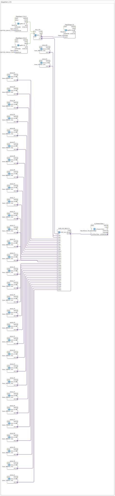

# Uebung_080f_AX: Beispiel für E_CTU

Dieser Artikel beschreibt die 4diac IDE Subapplikation Uebung_080f_AX (Beispiel für E_CTU).

----

## Ziel der Übung

Das Ziel dieser Übung ist die Umsetzung folgender Anforderung: **Beispiel für E_CTU**

-----

## Beschreibung und Komponenten

Die Übung besteht aus der Subapplikation Uebung_080f_AX.SUB, welche die folgende Bausteinstruktur verwendet:

### Verwendete Funktionsbausteine (FBs)

- **DigitalOutput_Q1**: Instanz des Typs logiBUS::io::DQ::logiBUS_QXA.
  - Parameter QI = TRUE
  - Parameter Output = Output_Q1
- **DigitalInput_CLK_I1**: Instanz des Typs logiBUS::io::DI::logiBUS_IE.
  - Parameter QI = TRUE
  - Parameter Input = Input_I1
  - Parameter InputEvent = BUTTON_SINGLE_CLICK
- **AUI_CTU**: Instanz des Typs adapter::events::unidirectional::AUI_CTU.
- **DigitalInput_CLK_I2**: Instanz des Typs logiBUS::io::DI::logiBUS_IE.
  - Parameter QI = TRUE
  - Parameter Input = Input_I2
  - Parameter InputEvent = BUTTON_SINGLE_CLICK
- **initval_00**: Instanz des Typs adapter::types::unidirectional::AUDI::initval::initval_AUDI.
  - Parameter INIT_VAL = frame_00
- **initval_01**: Instanz des Typs adapter::types::unidirectional::AUDI::initval::initval_AUDI.
  - Parameter INIT_VAL = frame_01
- **initval_02**: Instanz des Typs adapter::types::unidirectional::AUDI::initval::initval_AUDI.
  - Parameter INIT_VAL = frame_02
- **initval_03**: Instanz des Typs adapter::types::unidirectional::AUDI::initval::initval_AUDI.
  - Parameter INIT_VAL = frame_03
- **initval_04**: Instanz des Typs adapter::types::unidirectional::AUDI::initval::initval_AUDI.
  - Parameter INIT_VAL = frame_04
- **initval_05**: Instanz des Typs adapter::types::unidirectional::AUDI::initval::initval_AUDI.
  - Parameter INIT_VAL = frame_05
- **initval_06**: Instanz des Typs adapter::types::unidirectional::AUDI::initval::initval_AUDI.
  - Parameter INIT_VAL = frame_06
- **initval_07**: Instanz des Typs adapter::types::unidirectional::AUDI::initval::initval_AUDI.
  - Parameter INIT_VAL = frame_07
- **initval_08**: Instanz des Typs adapter::types::unidirectional::AUDI::initval::initval_AUDI.
  - Parameter INIT_VAL = frame_08
- **initval_09**: Instanz des Typs adapter::types::unidirectional::AUDI::initval::initval_AUDI.
  - Parameter INIT_VAL = frame_09
- **initval_10**: Instanz des Typs adapter::types::unidirectional::AUDI::initval::initval_AUDI.
  - Parameter INIT_VAL = frame_10
- **initval_11**: Instanz des Typs adapter::types::unidirectional::AUDI::initval::initval_AUDI.
  - Parameter INIT_VAL = frame_11
- **initval_12**: Instanz des Typs adapter::types::unidirectional::AUDI::initval::initval_AUDI.
  - Parameter INIT_VAL = frame_12
- **initval_13**: Instanz des Typs adapter::types::unidirectional::AUDI::initval::initval_AUDI.
  - Parameter INIT_VAL = frame_13
- **initval_14**: Instanz des Typs adapter::types::unidirectional::AUDI::initval::initval_AUDI.
  - Parameter INIT_VAL = frame_14
- **initval_15**: Instanz des Typs adapter::types::unidirectional::AUDI::initval::initval_AUDI.
  - Parameter INIT_VAL = frame_15
- **initval_16**: Instanz des Typs adapter::types::unidirectional::AUDI::initval::initval_AUDI.
  - Parameter INIT_VAL = frame_16
- **initval_17**: Instanz des Typs adapter::types::unidirectional::AUDI::initval::initval_AUDI.
  - Parameter INIT_VAL = frame_17
- **initval_18**: Instanz des Typs adapter::types::unidirectional::AUDI::initval::initval_AUDI.
  - Parameter INIT_VAL = frame_18
- **initval_19**: Instanz des Typs adapter::types::unidirectional::AUDI::initval::initval_AUDI.
  - Parameter INIT_VAL = frame_19
- **initval_20**: Instanz des Typs adapter::types::unidirectional::AUDI::initval::initval_AUDI.
  - Parameter INIT_VAL = frame_20
- **initval_21**: Instanz des Typs adapter::types::unidirectional::AUDI::initval::initval_AUDI.
  - Parameter INIT_VAL = frame_21
- **initval_22**: Instanz des Typs adapter::types::unidirectional::AUDI::initval::initval_AUDI.
  - Parameter INIT_VAL = frame_22
- **initval_23**: Instanz des Typs adapter::types::unidirectional::AUDI::initval::initval_AUDI.
  - Parameter INIT_VAL = frame_23
- **initval_24**: Instanz des Typs adapter::types::unidirectional::AUDI::initval::initval_AUDI.
  - Parameter INIT_VAL = frame_24
- **initval_25**: Instanz des Typs adapter::types::unidirectional::AUDI::initval::initval_AUDI.
  - Parameter INIT_VAL = frame_25
- **initval_26**: Instanz des Typs adapter::types::unidirectional::AUDI::initval::initval_AUDI.
  - Parameter INIT_VAL = frame_26
- **initval_27**: Instanz des Typs adapter::types::unidirectional::AUDI::initval::initval_AUDI.
  - Parameter INIT_VAL = frame_27
- **initval_28**: Instanz des Typs adapter::types::unidirectional::AUDI::initval::initval_AUDI.
  - Parameter INIT_VAL = frame_28
- **initval_29**: Instanz des Typs adapter::types::unidirectional::AUDI::initval::initval_AUDI.
  - Parameter INIT_VAL = frame_29
- **initval_30**: Instanz des Typs adapter::types::unidirectional::AUDI::initval::initval_AUDI.
  - Parameter INIT_VAL = frame_30
- **initval_31**: Instanz des Typs adapter::types::unidirectional::AUDI::initval::initval_AUDI.
  - Parameter INIT_VAL = frame_31
- **AUDI_AUI_MUX_32**: Instanz des Typs adapter::selection::unidirectional::AUDI_AUI_MUX_32.
- **Q_NumericValue_1**: Instanz des Typs isobus::UT::Q::Q_NumericValue_AUDI.
  - Parameter u16ObjId = ObjectPointer_Horse

### Verbindungen und Schnittstellen

**Adapterverbindungen:**

- AUI_CTU.Q -> DigitalOutput_Q1.OUT
- AUI_CTU.CV -> AUDI_AUI_MUX_32.K
- initval_00.OUT -> AUDI_AUI_MUX_32.IN1
- initval_01.OUT -> AUDI_AUI_MUX_32.IN2
- initval_02.OUT -> AUDI_AUI_MUX_32.IN3
- initval_03.OUT -> AUDI_AUI_MUX_32.IN4
- initval_04.OUT -> AUDI_AUI_MUX_32.IN5
- initval_05.OUT -> AUDI_AUI_MUX_32.IN6
- initval_06.OUT -> AUDI_AUI_MUX_32.IN7
- initval_07.OUT -> AUDI_AUI_MUX_32.IN8
- initval_08.OUT -> AUDI_AUI_MUX_32.IN9
- initval_09.OUT -> AUDI_AUI_MUX_32.IN10
- initval_10.OUT -> AUDI_AUI_MUX_32.IN11
- initval_11.OUT -> AUDI_AUI_MUX_32.IN12
- initval_12.OUT -> AUDI_AUI_MUX_32.IN13
- initval_13.OUT -> AUDI_AUI_MUX_32.IN14
- initval_14.OUT -> AUDI_AUI_MUX_32.IN15
- initval_15.OUT -> AUDI_AUI_MUX_32.IN16
- initval_16.OUT -> AUDI_AUI_MUX_32.IN17
- initval_17.OUT -> AUDI_AUI_MUX_32.IN18
- initval_18.OUT -> AUDI_AUI_MUX_32.IN19
- initval_19.OUT -> AUDI_AUI_MUX_32.IN20
- initval_20.OUT -> AUDI_AUI_MUX_32.IN21
- initval_21.OUT -> AUDI_AUI_MUX_32.IN22
- initval_22.OUT -> AUDI_AUI_MUX_32.IN23
- initval_23.OUT -> AUDI_AUI_MUX_32.IN24
- initval_24.OUT -> AUDI_AUI_MUX_32.IN25
- initval_25.OUT -> AUDI_AUI_MUX_32.IN26
- initval_26.OUT -> AUDI_AUI_MUX_32.IN27
- initval_27.OUT -> AUDI_AUI_MUX_32.IN28
- initval_28.OUT -> AUDI_AUI_MUX_32.IN29
- initval_29.OUT -> AUDI_AUI_MUX_32.IN30
- initval_30.OUT -> AUDI_AUI_MUX_32.IN31
- initval_31.OUT -> AUDI_AUI_MUX_32.IN32
- AUDI_AUI_MUX_32.OUT -> Q_NumericValue_1.u32NewValue

**Ereignisverbindungen:**

- DigitalInput_CLK_I1.IND -> AUI_CTU.CU
- DigitalInput_CLK_I2.IND -> AUI_CTU.R

-----

## Programmablauf und Funktionsweise

1. **Initialisierung**: Beim Systemstart werden alle beteiligten Bausteine initialisiert.
2. **Ereignis- und Signalverarbeitung**: Zustandsänderungen an den Eingängen erzeugen Ereignisse, die über die definierten Verbindungen an die nachgelagerten Bausteine weitergeleitet werden.
3. **Ausgangsaktualisierung**: Die Zielbausteine verarbeiten die empfangenen Signale und aktualisieren entsprechend die Ausgänge.

-----

## Zusammenfassung

Die Übung Uebung_080f_AX demonstriert anschaulich die modulare IEC 61499 Architektur in 4diac IDE.
