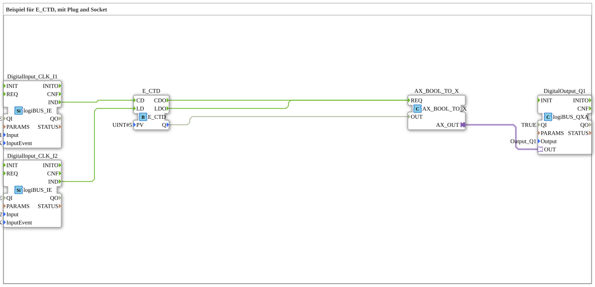

# Uebung_081_AX: Beispiel für E_CTD, mit Plug and Socket

Dieser Artikel beschreibt die 4diac IDE Subapplikation Uebung_081_AX (Beispiel für E_CTD, mit Plug and Socket).

----

## Ziel der Übung

Das Ziel dieser Übung ist die Umsetzung folgender Anforderung: **Beispiel für E_CTD, mit Plug and Socket**

-----

## Beschreibung und Komponenten

Die Übung besteht aus der Subapplikation Uebung_081_AX.SUB, welche die folgende Bausteinstruktur verwendet:

### Verwendete Funktionsbausteine (FBs)

- **DigitalOutput_Q1**: Instanz des Typs logiBUS::io::DQ::logiBUS_QXA.
  - Parameter QI = TRUE
  - Parameter Output = Output_Q1
- **DigitalInput_CLK_I1**: Instanz des Typs logiBUS::io::DI::logiBUS_IE.
  - Parameter QI = TRUE
  - Parameter Input = Input_I1
  - Parameter InputEvent = BUTTON_SINGLE_CLICK
- **E_CTD**: Instanz des Typs iec61499::events::E_CTD.
  - Parameter PV = UINT#5
- **DigitalInput_CLK_I2**: Instanz des Typs logiBUS::io::DI::logiBUS_IE.
  - Parameter QI = TRUE
  - Parameter Input = Input_I2
  - Parameter InputEvent = BUTTON_SINGLE_CLICK
- **AX_BOOL_TO_X**: Instanz des Typs adapter::conversion::unidirectional::AX_BOOL_TO_X.

### Verbindungen und Schnittstellen

**Adapterverbindungen:**
- AX_BOOL_TO_X.AX_OUT -> DigitalOutput_Q1.OUT

**Ereignisverbindungen:**
- DigitalInput_CLK_I1.IND -> E_CTD.CD
- E_CTD.CDO -> AX_BOOL_TO_X.REQ
- E_CTD.LDO -> AX_BOOL_TO_X.REQ
- DigitalInput_CLK_I2.IND -> E_CTD.LD

**Datenverbindungen:**
- E_CTD.Q -> AX_BOOL_TO_X.OUT

-----

## Programmablauf und Funktionsweise

1. **Initialisierung**: Beim Systemstart werden alle beteiligten Bausteine initialisiert.
2. **Ereignis- und Signalverarbeitung**: Zustandsänderungen an den Eingängen erzeugen Ereignisse, die über die definierten Verbindungen an die nachgelagerten Bausteine weitergeleitet werden.
3. **Ausgangsaktualisierung**: Die Zielbausteine verarbeiten die empfangenen Signale und aktualisieren entsprechend die Ausgänge.

-----

## Zusammenfassung

Die Übung Uebung_081_AX demonstriert anschaulich die modulare IEC 61499 Architektur in 4diac IDE.
