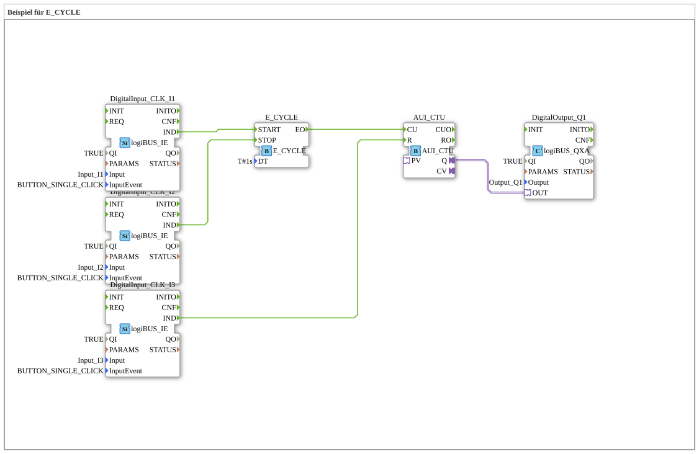

# Uebung_084_AX: Beispiel für E_CYCLE

Dieser Artikel beschreibt die 4diac IDE Subapplikation Uebung_084_AX (Beispiel für E_CYCLE).

----

## Ziel der Übung

Das Ziel dieser Übung ist die Umsetzung folgender Anforderung: **Beispiel für E_CYCLE**

-----

## Beschreibung und Komponenten

Die Übung besteht aus der Subapplikation Uebung_084_AX.SUB, welche die folgende Bausteinstruktur verwendet:

### Verwendete Funktionsbausteine (FBs)

- **DigitalOutput_Q1**: Instanz des Typs logiBUS::io::DQ::logiBUS_QXA.
  - Parameter QI = TRUE
  - Parameter Output = Output_Q1
- **AUI_CTU**: Instanz des Typs adapter::events::unidirectional::AUI_CTU.
- **E_CYCLE**: Instanz des Typs iec61499::events::E_CYCLE.
  - Parameter DT = T#1s
- **DigitalInput_CLK_I2**: Instanz des Typs logiBUS::io::DI::logiBUS_IE.
  - Parameter QI = TRUE
  - Parameter Input = Input_I2
  - Parameter InputEvent = BUTTON_SINGLE_CLICK
- **DigitalInput_CLK_I3**: Instanz des Typs logiBUS::io::DI::logiBUS_IE.
  - Parameter QI = TRUE
  - Parameter Input = Input_I3
  - Parameter InputEvent = BUTTON_SINGLE_CLICK
- **DigitalInput_CLK_I1**: Instanz des Typs logiBUS::io::DI::logiBUS_IE.
  - Parameter QI = TRUE
  - Parameter Input = Input_I1
  - Parameter InputEvent = BUTTON_SINGLE_CLICK

### Verbindungen und Schnittstellen

**Adapterverbindungen:**
- AUI_CTU.Q -> DigitalOutput_Q1.OUT

**Ereignisverbindungen:**
- E_CYCLE.EO -> AUI_CTU.CU
- DigitalInput_CLK_I1.IND -> E_CYCLE.START
- DigitalInput_CLK_I2.IND -> E_CYCLE.STOP
- DigitalInput_CLK_I3.IND -> AUI_CTU.R

-----

## Programmablauf und Funktionsweise

1. **Initialisierung**: Beim Systemstart werden alle beteiligten Bausteine initialisiert.
2. **Ereignis- und Signalverarbeitung**: Zustandsänderungen an den Eingängen erzeugen Ereignisse, die über die definierten Verbindungen an die nachgelagerten Bausteine weitergeleitet werden.
3. **Ausgangsaktualisierung**: Die Zielbausteine verarbeiten die empfangenen Signale und aktualisieren entsprechend die Ausgänge.

-----

## Zusammenfassung

Die Übung Uebung_084_AX demonstriert anschaulich die modulare IEC 61499 Architektur in 4diac IDE.
