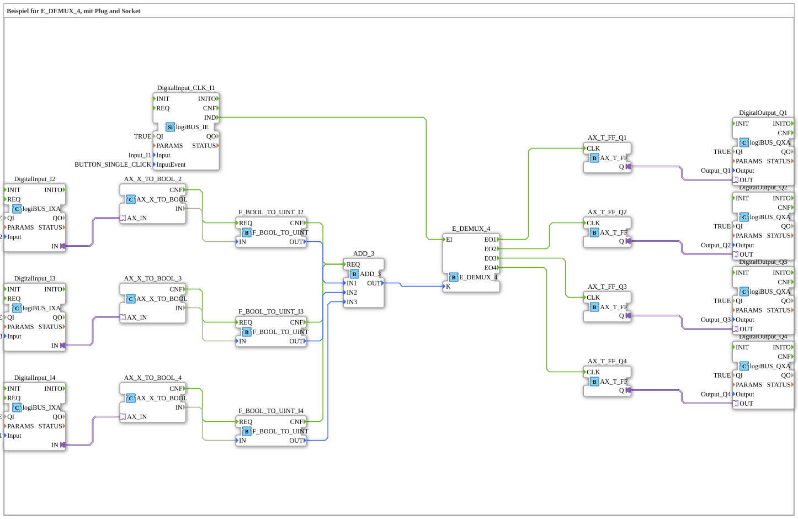

# Uebung_087a1_AX: Beispiel für E_DEMUX_4, mit Plug and Socket

Dieser Artikel beschreibt die 4diac IDE Subapplikation Uebung_087a1_AX (Beispiel für E_DEMUX_4, mit Plug and Socket).

----

## Ziel der Übung

Das Ziel dieser Übung ist die Umsetzung folgender Anforderung: **Beispiel für E_DEMUX_4, mit Plug and Socket**

-----

## Beschreibung und Komponenten

Die Übung besteht aus der Subapplikation Uebung_087a1_AX.SUB, welche die folgende Bausteinstruktur verwendet:

### Verwendete Funktionsbausteine (FBs)

- **E_DEMUX_4**: Instanz des Typs iec61499::events::E_DEMUX_4.
- **ADD_3**: Instanz des Typs iec61131::arithmetic::ADD_3.
- **DigitalInput_I2**: Instanz des Typs logiBUS::io::DI::logiBUS_IXA.
  - Parameter QI = TRUE
  - Parameter Input = Input_I2
- **DigitalInput_I3**: Instanz des Typs logiBUS::io::DI::logiBUS_IXA.
  - Parameter QI = TRUE
  - Parameter Input = Input_I3
- **DigitalInput_I4**: Instanz des Typs logiBUS::io::DI::logiBUS_IXA.
  - Parameter QI = TRUE
  - Parameter Input = Input_I1
- **AX_X_TO_BOOL_2**: Instanz des Typs adapter::conversion::unidirectional::AX_X_TO_BOOL.
- **AX_X_TO_BOOL_3**: Instanz des Typs adapter::conversion::unidirectional::AX_X_TO_BOOL.
- **AX_X_TO_BOOL_4**: Instanz des Typs adapter::conversion::unidirectional::AX_X_TO_BOOL.
- **F_BOOL_TO_UINT_I2**: Instanz des Typs iec61131::conversion::F_BOOL_TO_UINT.
- **F_BOOL_TO_UINT_I3**: Instanz des Typs iec61131::conversion::F_BOOL_TO_UINT.
- **F_BOOL_TO_UINT_I4**: Instanz des Typs iec61131::conversion::F_BOOL_TO_UINT.
- **DigitalOutput_Q2**: Instanz des Typs logiBUS::io::DQ::logiBUS_QXA.
  - Parameter QI = TRUE
  - Parameter Output = Output_Q2
- **DigitalOutput_Q1**: Instanz des Typs logiBUS::io::DQ::logiBUS_QXA.
  - Parameter QI = TRUE
  - Parameter Output = Output_Q1
- **DigitalOutput_Q4**: Instanz des Typs logiBUS::io::DQ::logiBUS_QXA.
  - Parameter QI = TRUE
  - Parameter Output = Output_Q4
- **DigitalOutput_Q3**: Instanz des Typs logiBUS::io::DQ::logiBUS_QXA.
  - Parameter QI = TRUE
  - Parameter Output = Output_Q3
- **AX_T_FF_Q1**: Instanz des Typs adapter::events::unidirectional::AX_T_FF.
- **AX_T_FF_Q2**: Instanz des Typs adapter::events::unidirectional::AX_T_FF.
- **AX_T_FF_Q3**: Instanz des Typs adapter::events::unidirectional::AX_T_FF.
- **AX_T_FF_Q4**: Instanz des Typs adapter::events::unidirectional::AX_T_FF.
- **DigitalInput_CLK_I1**: Instanz des Typs logiBUS::io::DI::logiBUS_IE.
  - Parameter QI = TRUE
  - Parameter Input = Input_I1
  - Parameter InputEvent = BUTTON_SINGLE_CLICK

### Verbindungen und Schnittstellen

**Adapterverbindungen:**

- DigitalInput_I2.IN -> AX_X_TO_BOOL_2.AX_IN
- DigitalInput_I3.IN -> AX_X_TO_BOOL_3.AX_IN
- DigitalInput_I4.IN -> AX_X_TO_BOOL_4.AX_IN
- AX_T_FF_Q1.Q -> DigitalOutput_Q1.OUT
- AX_T_FF_Q2.Q -> DigitalOutput_Q2.OUT
- AX_T_FF_Q3.Q -> DigitalOutput_Q3.OUT
- AX_T_FF_Q4.Q -> DigitalOutput_Q4.OUT

**Ereignisverbindungen:**

- AX_X_TO_BOOL_2.CNF -> F_BOOL_TO_UINT_I2.REQ
- AX_X_TO_BOOL_3.CNF -> F_BOOL_TO_UINT_I3.REQ
- AX_X_TO_BOOL_4.CNF -> F_BOOL_TO_UINT_I4.REQ
- F_BOOL_TO_UINT_I4.CNF -> ADD_3.REQ
- F_BOOL_TO_UINT_I3.CNF -> ADD_3.REQ
- F_BOOL_TO_UINT_I2.CNF -> ADD_3.REQ
- E_DEMUX_4.EO1 -> AX_T_FF_Q1.CLK
- E_DEMUX_4.EO2 -> AX_T_FF_Q2.CLK
- E_DEMUX_4.EO3 -> AX_T_FF_Q3.CLK
- E_DEMUX_4.EO4 -> AX_T_FF_Q4.CLK
- DigitalInput_CLK_I1.IND -> E_DEMUX_4.EI

**Datenverbindungen:**

- AX_X_TO_BOOL_2.IN -> F_BOOL_TO_UINT_I2.IN
- AX_X_TO_BOOL_3.IN -> F_BOOL_TO_UINT_I3.IN
- AX_X_TO_BOOL_4.IN -> F_BOOL_TO_UINT_I4.IN
- F_BOOL_TO_UINT_I2.OUT -> ADD_3.IN1
- F_BOOL_TO_UINT_I3.OUT -> ADD_3.IN2
- F_BOOL_TO_UINT_I4.OUT -> ADD_3.IN3
- ADD_3.OUT -> E_DEMUX_4.K

### Hinweise aus dem Modell

> Diese Taste schaltet ein oder aus
> Die Anzahl der restlichen Tasten bestimmt den Ausgang: 
Keine --> Q1
Eine --> Q2
Zwei --> Q3
Drei --> Q4

-----

## Programmablauf und Funktionsweise

1. **Initialisierung**: Beim Systemstart werden alle beteiligten Bausteine initialisiert.
2. **Ereignis- und Signalverarbeitung**: Zustandsänderungen an den Eingängen erzeugen Ereignisse, die über die definierten Verbindungen an die nachgelagerten Bausteine weitergeleitet werden.
3. **Ausgangsaktualisierung**: Die Zielbausteine verarbeiten die empfangenen Signale und aktualisieren entsprechend die Ausgänge.

-----

## Zusammenfassung

Die Übung Uebung_087a1_AX demonstriert anschaulich die modulare IEC 61499 Architektur in 4diac IDE.
