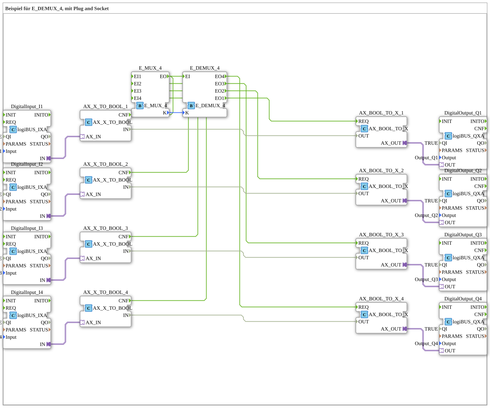

# Uebung_087a2_AX: Beispiel für E_DEMUX_4, mit Plug and Socket

Dieser Artikel beschreibt die 4diac IDE Subapplikation Uebung_087a2_AX (Beispiel für E_DEMUX_4, mit Plug and Socket).

----

## Ziel der Übung

Das Ziel dieser Übung ist die Umsetzung folgender Anforderung: **Beispiel für E_DEMUX_4, mit Plug and Socket**

-----

## Beschreibung und Komponenten

Die Übung besteht aus der Subapplikation Uebung_087a2_AX.SUB, welche die folgende Bausteinstruktur verwendet:

### Verwendete Funktionsbausteine (FBs)

- **DigitalOutput_Q1**: Instanz des Typs logiBUS::io::DQ::logiBUS_QXA.
  - Parameter QI = TRUE
  - Parameter Output = Output_Q1
- **DigitalInput_I1**: Instanz des Typs logiBUS::io::DI::logiBUS_IXA.
  - Parameter QI = TRUE
  - Parameter Input = Input_I1
- **DigitalOutput_Q2**: Instanz des Typs logiBUS::io::DQ::logiBUS_QXA.
  - Parameter QI = TRUE
  - Parameter Output = Output_Q2
- **DigitalInput_I2**: Instanz des Typs logiBUS::io::DI::logiBUS_IXA.
  - Parameter QI = TRUE
  - Parameter Input = Input_I2
- **DigitalOutput_Q3**: Instanz des Typs logiBUS::io::DQ::logiBUS_QXA.
  - Parameter QI = TRUE
  - Parameter Output = Output_Q3
- **DigitalInput_I3**: Instanz des Typs logiBUS::io::DI::logiBUS_IXA.
  - Parameter QI = TRUE
  - Parameter Input = Input_I3
- **DigitalOutput_Q4**: Instanz des Typs logiBUS::io::DQ::logiBUS_QXA.
  - Parameter QI = TRUE
  - Parameter Output = Output_Q4
- **DigitalInput_I4**: Instanz des Typs logiBUS::io::DI::logiBUS_IXA.
  - Parameter QI = TRUE
  - Parameter Input = Input_I4
- **E_DEMUX_4**: Instanz des Typs iec61499::events::E_DEMUX_4.
- **E_MUX_4**: Instanz des Typs iec61499::events::E_MUX_4.
- **AX_X_TO_BOOL_1**: Instanz des Typs adapter::conversion::unidirectional::AX_X_TO_BOOL.
- **AX_X_TO_BOOL_2**: Instanz des Typs adapter::conversion::unidirectional::AX_X_TO_BOOL.
- **AX_X_TO_BOOL_3**: Instanz des Typs adapter::conversion::unidirectional::AX_X_TO_BOOL.
- **AX_X_TO_BOOL_4**: Instanz des Typs adapter::conversion::unidirectional::AX_X_TO_BOOL.
- **AX_BOOL_TO_X_1**: Instanz des Typs adapter::conversion::unidirectional::AX_BOOL_TO_X.
- **AX_BOOL_TO_X_2**: Instanz des Typs adapter::conversion::unidirectional::AX_BOOL_TO_X.
- **AX_BOOL_TO_X_3**: Instanz des Typs adapter::conversion::unidirectional::AX_BOOL_TO_X.
- **AX_BOOL_TO_X_4**: Instanz des Typs adapter::conversion::unidirectional::AX_BOOL_TO_X.

### Verbindungen und Schnittstellen

**Adapterverbindungen:**
- DigitalInput_I1.IN -> AX_X_TO_BOOL_1.AX_IN
- DigitalInput_I2.IN -> AX_X_TO_BOOL_2.AX_IN
- DigitalInput_I3.IN -> AX_X_TO_BOOL_3.AX_IN
- DigitalInput_I4.IN -> AX_X_TO_BOOL_4.AX_IN
- AX_BOOL_TO_X_1.AX_OUT -> DigitalOutput_Q1.OUT
- AX_BOOL_TO_X_2.AX_OUT -> DigitalOutput_Q2.OUT
- AX_BOOL_TO_X_3.AX_OUT -> DigitalOutput_Q3.OUT
- AX_BOOL_TO_X_4.AX_OUT -> DigitalOutput_Q4.OUT

**Ereignisverbindungen:**
- E_MUX_4.EO -> E_DEMUX_4.EI
- AX_X_TO_BOOL_1.CNF -> E_MUX_4.EI1
- AX_X_TO_BOOL_2.CNF -> E_MUX_4.EI2
- AX_X_TO_BOOL_3.CNF -> E_MUX_4.EI3
- AX_X_TO_BOOL_4.CNF -> E_MUX_4.EI4
- E_DEMUX_4.EO4 -> AX_BOOL_TO_X_4.REQ
- E_DEMUX_4.EO3 -> AX_BOOL_TO_X_3.REQ
- E_DEMUX_4.EO2 -> AX_BOOL_TO_X_2.REQ
- E_DEMUX_4.EO1 -> AX_BOOL_TO_X_1.REQ

**Datenverbindungen:**
- E_MUX_4.K -> E_DEMUX_4.K
- AX_X_TO_BOOL_1.IN -> AX_BOOL_TO_X_1.OUT
- AX_X_TO_BOOL_2.IN -> AX_BOOL_TO_X_2.OUT
- AX_X_TO_BOOL_3.IN -> AX_BOOL_TO_X_3.OUT
- AX_X_TO_BOOL_4.IN -> AX_BOOL_TO_X_4.OUT

-----

## Programmablauf und Funktionsweise

1. **Initialisierung**: Beim Systemstart werden alle beteiligten Bausteine initialisiert.
2. **Ereignis- und Signalverarbeitung**: Zustandsänderungen an den Eingängen erzeugen Ereignisse, die über die definierten Verbindungen an die nachgelagerten Bausteine weitergeleitet werden.
3. **Ausgangsaktualisierung**: Die Zielbausteine verarbeiten die empfangenen Signale und aktualisieren entsprechend die Ausgänge.

-----

## Zusammenfassung

Die Übung Uebung_087a2_AX demonstriert anschaulich die modulare IEC 61499 Architektur in 4diac IDE.
