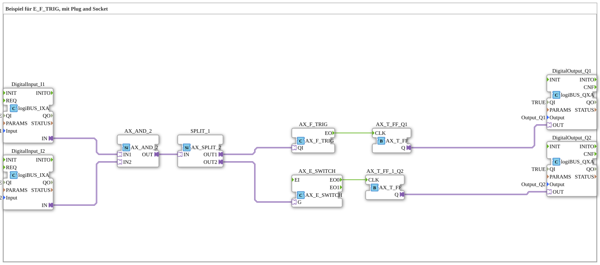

# Uebung_088_AX: Beispiel für E_F_TRIG, mit Plug and Socket

Dieser Artikel beschreibt die 4diac IDE Subapplikation Uebung_088_AX (Beispiel für E_F_TRIG, mit Plug and Socket).

----

## Ziel der Übung

Das Ziel dieser Übung ist die Umsetzung folgender Anforderung: **Beispiel für E_F_TRIG, mit Plug and Socket**

-----

## Beschreibung und Komponenten

Die Übung besteht aus der Subapplikation Uebung_088_AX.SUB, welche die folgende Bausteinstruktur verwendet:

### Verwendete Funktionsbausteine (FBs)

- **DigitalOutput_Q1**: Instanz des Typs logiBUS::io::DQ::logiBUS_QXA.
  - Parameter QI = TRUE
  - Parameter Output = Output_Q1
- **DigitalInput_I1**: Instanz des Typs logiBUS::io::DI::logiBUS_IXA.
  - Parameter QI = TRUE
  - Parameter Input = Input_I1
- **AX_AND_2**: Instanz des Typs adapter::booleanOperators::AX_AND_2.
- **DigitalInput_I2**: Instanz des Typs logiBUS::io::DI::logiBUS_IXA.
  - Parameter QI = TRUE
  - Parameter Input = Input_I2
- **AX_F_TRIG**: Instanz des Typs adapter::events::unidirectional::AX_F_TRIG.
- **AX_T_FF_Q1**: Instanz des Typs adapter::events::unidirectional::AX_T_FF.
- **DigitalOutput_Q2**: Instanz des Typs logiBUS::io::DQ::logiBUS_QXA.
  - Parameter QI = TRUE
  - Parameter Output = Output_Q2
- **AX_T_FF_1_Q2**: Instanz des Typs adapter::events::unidirectional::AX_T_FF.
- **AX_E_SWITCH**: Instanz des Typs adapter::events::unidirectional::AX_E_SWITCH.
- **SPLIT_1**: Instanz des Typs adapter::events::unidirectional::AX_SPLIT_2.

### Verbindungen und Schnittstellen

**Adapterverbindungen:**
- DigitalInput_I1.IN -> AX_AND_2.IN1
- DigitalInput_I2.IN -> AX_AND_2.IN2
- AX_T_FF_Q1.Q -> DigitalOutput_Q1.OUT
- AX_T_FF_1_Q2.Q -> DigitalOutput_Q2.OUT
- AX_AND_2.OUT -> SPLIT_1.IN
- SPLIT_1.OUT1 -> AX_F_TRIG.QI
- SPLIT_1.OUT2 -> AX_E_SWITCH.G

**Ereignisverbindungen:**
- AX_F_TRIG.EO -> AX_T_FF_Q1.CLK
- AX_E_SWITCH.EO0 -> AX_T_FF_1_Q2.CLK

### Hinweise aus dem Modell

> F_TRIG schaltet nur wenn wirklich fallende Flanke
> E_SWITCH schaltet auch, wenn anderweitig ein Event kommt.

-----

## Programmablauf und Funktionsweise

1. **Initialisierung**: Beim Systemstart werden alle beteiligten Bausteine initialisiert.
2. **Ereignis- und Signalverarbeitung**: Zustandsänderungen an den Eingängen erzeugen Ereignisse, die über die definierten Verbindungen an die nachgelagerten Bausteine weitergeleitet werden.
3. **Ausgangsaktualisierung**: Die Zielbausteine verarbeiten die empfangenen Signale und aktualisieren entsprechend die Ausgänge.

-----

## Zusammenfassung

Die Übung Uebung_088_AX demonstriert anschaulich die modulare IEC 61499 Architektur in 4diac IDE.
