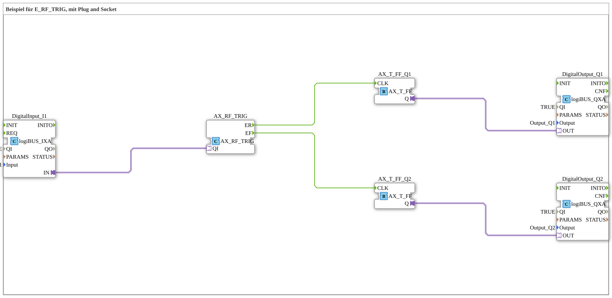

# Uebung_089a_AX: Beispiel für E_RF_TRIG, mit Plug and Socket

Dieser Artikel beschreibt die 4diac IDE Subapplikation Uebung_089a_AX (Beispiel für E_RF_TRIG, mit Plug and Socket).

----

## Ziel der Übung

Das Ziel dieser Übung ist die Umsetzung folgender Anforderung: **Beispiel für E_RF_TRIG, mit Plug and Socket**

-----

## Beschreibung und Komponenten

Die Übung besteht aus der Subapplikation Uebung_089a_AX.SUB, welche die folgende Bausteinstruktur verwendet:

### Verwendete Funktionsbausteine (FBs)

- **DigitalInput_I1**: Instanz des Typs logiBUS::io::DI::logiBUS_IXA.
  - Parameter QI = TRUE
  - Parameter Input = Input_I1
- **AX_RF_TRIG**: Instanz des Typs adapter::events::unidirectional::AX_RF_TRIG.
- **AX_T_FF_Q1**: Instanz des Typs adapter::events::unidirectional::AX_T_FF.
- **AX_T_FF_Q2**: Instanz des Typs adapter::events::unidirectional::AX_T_FF.
- **DigitalOutput_Q1**: Instanz des Typs logiBUS::io::DQ::logiBUS_QXA.
  - Parameter QI = TRUE
  - Parameter Output = Output_Q1
- **DigitalOutput_Q2**: Instanz des Typs logiBUS::io::DQ::logiBUS_QXA.
  - Parameter QI = TRUE
  - Parameter Output = Output_Q2

### Verbindungen und Schnittstellen

**Adapterverbindungen:**

- DigitalInput_I1.IN -> AX_RF_TRIG.QI
- AX_T_FF_Q1.Q -> DigitalOutput_Q1.OUT
- AX_T_FF_Q2.Q -> DigitalOutput_Q2.OUT

**Ereignisverbindungen:**

- AX_RF_TRIG.ER -> AX_T_FF_Q1.CLK
- AX_RF_TRIG.EF -> AX_T_FF_Q2.CLK

### Hinweise aus dem Modell

> Ein einziger Eingang, EIN Signal - AX_RF_TRIG liefert beide Flanken gleichzeitig (ER=steigend, EF=fallend). Q1 togglet bei steigender, Q2 bei fallender Flanke.

-----

## Programmablauf und Funktionsweise

1. **Initialisierung**: Beim Systemstart werden alle beteiligten Bausteine initialisiert.
2. **Ereignis- und Signalverarbeitung**: Zustandsänderungen an den Eingängen erzeugen Ereignisse, die über die definierten Verbindungen an die nachgelagerten Bausteine weitergeleitet werden.
3. **Ausgangsaktualisierung**: Die Zielbausteine verarbeiten die empfangenen Signale und aktualisieren entsprechend die Ausgänge.

-----

## Zusammenfassung

Die Übung Uebung_089a_AX demonstriert anschaulich die modulare IEC 61499 Architektur in 4diac IDE.
