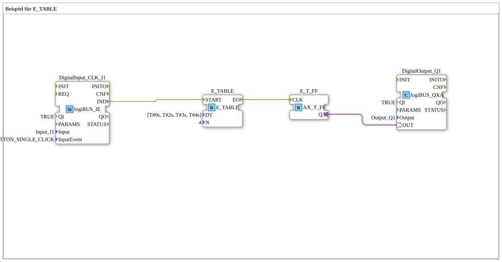

# Uebung_093_AX: Beispiel für E_TABLE

Dieser Artikel beschreibt die 4diac IDE Subapplikation Uebung_093_AX (Beispiel für E_TABLE).

----

## Ziel der Übung

Das Ziel dieser Übung ist die Umsetzung folgender Anforderung: **Beispiel für E_TABLE**

-----

## Beschreibung und Komponenten

Die Übung besteht aus der Subapplikation Uebung_093_AX.SUB, welche die folgende Bausteinstruktur verwendet:

### Verwendete Funktionsbausteine (FBs)

- **DigitalOutput_Q1**: Instanz des Typs logiBUS::io::DQ::logiBUS_QXA.
  - Parameter QI = TRUE
  - Parameter Output = Output_Q1
- **E_TABLE**: Instanz des Typs iec61499::events::E_TABLE.
  - Parameter DT = [T#0s, T#2s, T#3s, T#4s]
  - Parameter N = 4
- **DigitalInput_CLK_I1**: Instanz des Typs logiBUS::io::DI::logiBUS_IE.
  - Parameter QI = TRUE
  - Parameter Input = Input_I1
  - Parameter InputEvent = BUTTON_SINGLE_CLICK
- **E_T_FF**: Instanz des Typs adapter::events::unidirectional::AX_T_FF.

### Verbindungen und Schnittstellen

**Adapterverbindungen:**

- E_T_FF.Q -> DigitalOutput_Q1.OUT

**Ereignisverbindungen:**

- DigitalInput_CLK_I1.IND -> E_TABLE.START
- E_TABLE.EO -> E_T_FF.CLK

### Hinweise aus dem Modell

> E_TABLE wird 4 Events ausgeben, das erste sofort nach dem Click, das letzte 9s nach dem Click
[T#0s, T#2s, T#3s, T#4s]

-----

## Programmablauf und Funktionsweise

1. **Initialisierung**: Beim Systemstart werden alle beteiligten Bausteine initialisiert.
2. **Ereignis- und Signalverarbeitung**: Zustandsänderungen an den Eingängen erzeugen Ereignisse, die über die definierten Verbindungen an die nachgelagerten Bausteine weitergeleitet werden.
3. **Ausgangsaktualisierung**: Die Zielbausteine verarbeiten die empfangenen Signale und aktualisieren entsprechend die Ausgänge.

-----

## Zusammenfassung

Die Übung Uebung_093_AX demonstriert anschaulich die modulare IEC 61499 Architektur in 4diac IDE.
