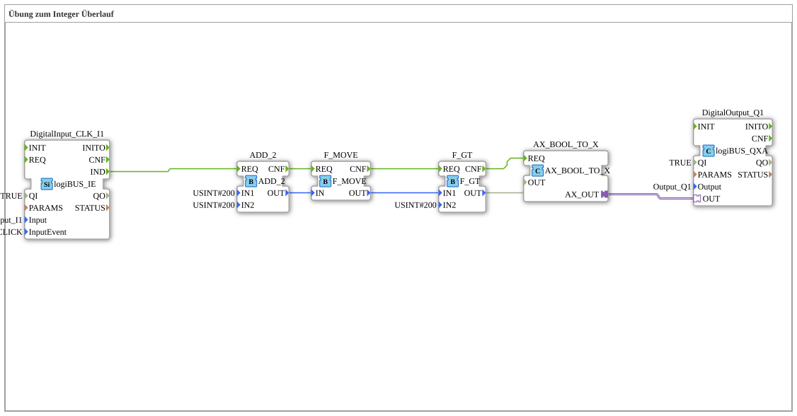

# Uebung_110_AX: Übung zum Integer Überlauf

Dieser Artikel beschreibt die 4diac IDE Subapplikation Uebung_110_AX (Übung zum Integer Überlauf).

----

## Ziel der Übung

Das Ziel dieser Übung ist die Umsetzung folgender Anforderung: **Übung zum Integer Überlauf**

-----

## Beschreibung und Komponenten

Die Übung besteht aus der Subapplikation Uebung_110_AX.SUB, welche die folgende Bausteinstruktur verwendet:

### Verwendete Funktionsbausteine (FBs)

- **DigitalOutput_Q1**: Instanz des Typs logiBUS::io::DQ::logiBUS_QXA.
  - Parameter QI = TRUE
  - Parameter Output = Output_Q1
- **ADD_2**: Instanz des Typs iec61131::arithmetic::ADD_2.
  - Parameter IN1 = USINT#200
  - Parameter IN2 = USINT#200
- **DigitalInput_CLK_I1**: Instanz des Typs logiBUS::io::DI::logiBUS_IE.
  - Parameter QI = TRUE
  - Parameter Input = Input_I1
  - Parameter InputEvent = BUTTON_SINGLE_CLICK
- **F_GT**: Instanz des Typs iec61131::comparison::F_GT.
  - Parameter IN2 = USINT#200
- **F_MOVE**: Instanz des Typs iec61131::selection::F_MOVE.
- **AX_BOOL_TO_X**: Instanz des Typs adapter::conversion::unidirectional::AX_BOOL_TO_X.

### Verbindungen und Schnittstellen

**Adapterverbindungen:**

- AX_BOOL_TO_X.AX_OUT -> DigitalOutput_Q1.OUT

**Ereignisverbindungen:**

- DigitalInput_CLK_I1.IND -> ADD_2.REQ
- F_MOVE.CNF -> F_GT.REQ
- F_GT.CNF -> AX_BOOL_TO_X.REQ
- ADD_2.CNF -> F_MOVE.REQ

**Datenverbindungen:**

- F_MOVE.OUT -> F_GT.IN1
- F_GT.OUT -> AX_BOOL_TO_X.OUT
- ADD_2.OUT -> F_MOVE.IN

### Hinweise aus dem Modell

> Arithmetischer Überlauf

https://de.wikipedia.org/wiki/Arithmetischer_%C3%9Cberlauf

https://www.youtube.com/watch?v=TLanGc-c9Ww

-----

## Programmablauf und Funktionsweise

1. **Initialisierung**: Beim Systemstart werden alle beteiligten Bausteine initialisiert.
2. **Ereignis- und Signalverarbeitung**: Zustandsänderungen an den Eingängen erzeugen Ereignisse, die über die definierten Verbindungen an die nachgelagerten Bausteine weitergeleitet werden.
3. **Ausgangsaktualisierung**: Die Zielbausteine verarbeiten die empfangenen Signale und aktualisieren entsprechend die Ausgänge.

-----

## Zusammenfassung

Die Übung Uebung_110_AX demonstriert anschaulich die modulare IEC 61499 Architektur in 4diac IDE.
