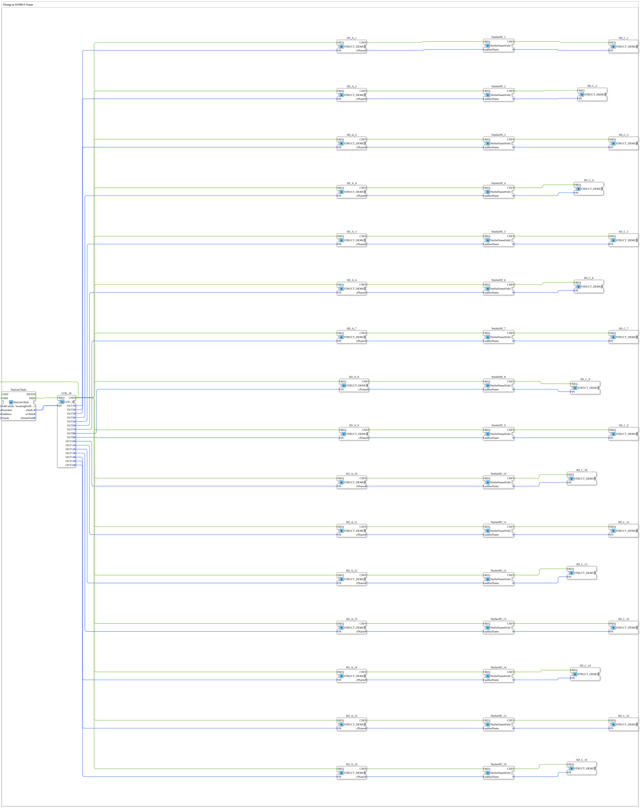

# Uebung_122_AX: Übung zu ISOBUS Name

Dieser Artikel beschreibt die 4diac IDE Subapplikation Uebung_122_AX (Übung zu ISOBUS Name).

----

## Ziel der Übung

Das Ziel dieser Übung ist die Umsetzung folgender Anforderung: **Übung zu ISOBUS Name**

-----

## Beschreibung und Komponenten

Die Übung besteht aus der Subapplikation Uebung_122_AX.SUB, welche die folgende Bausteinstruktur verwendet:

### Verwendete Funktionsbausteine (FBs)

- **NmGetCfInfo**: Instanz des Typs isobus::pgn::NmGetCfInfo.
  - Parameter u8CanIdx = NODE1
  - Parameter member = network
  - Parameter address = ADD_ALL_PASS
  - Parameter mask = FLT_ALL_PASS
- **LOG_16**: Instanz des Typs logiBUS::utils::logging::LOG_16.
- **SD_A_1**: Instanz des Typs eclipse4diac::convert::STRUCT_DEMUX.
- **SD_A_2**: Instanz des Typs eclipse4diac::convert::STRUCT_DEMUX.
- **SD_A_3**: Instanz des Typs eclipse4diac::convert::STRUCT_DEMUX.
- **SD_A_4**: Instanz des Typs eclipse4diac::convert::STRUCT_DEMUX.
- **SD_A_5**: Instanz des Typs eclipse4diac::convert::STRUCT_DEMUX.
- **SD_A_6**: Instanz des Typs eclipse4diac::convert::STRUCT_DEMUX.
- **SD_A_7**: Instanz des Typs eclipse4diac::convert::STRUCT_DEMUX.
- **SD_A_8**: Instanz des Typs eclipse4diac::convert::STRUCT_DEMUX.
- **SD_A_9**: Instanz des Typs eclipse4diac::convert::STRUCT_DEMUX.
- **SD_A_10**: Instanz des Typs eclipse4diac::convert::STRUCT_DEMUX.
- **SD_A_11**: Instanz des Typs eclipse4diac::convert::STRUCT_DEMUX.
- **SD_A_12**: Instanz des Typs eclipse4diac::convert::STRUCT_DEMUX.
- **SD_A_13**: Instanz des Typs eclipse4diac::convert::STRUCT_DEMUX.
- **SD_A_14**: Instanz des Typs eclipse4diac::convert::STRUCT_DEMUX.
- **SD_A_15**: Instanz des Typs eclipse4diac::convert::STRUCT_DEMUX.
- **SD_A_16**: Instanz des Typs eclipse4diac::convert::STRUCT_DEMUX.
- **NmSetNF_1**: Instanz des Typs isobus::pgn::NmSetNameField.
- **NmSetNF_2**: Instanz des Typs isobus::pgn::NmSetNameField.
- **NmSetNF_3**: Instanz des Typs isobus::pgn::NmSetNameField.
- **NmSetNF_4**: Instanz des Typs isobus::pgn::NmSetNameField.
- **NmSetNF_5**: Instanz des Typs isobus::pgn::NmSetNameField.
- **NmSetNF_6**: Instanz des Typs isobus::pgn::NmSetNameField.
- **NmSetNF_7**: Instanz des Typs isobus::pgn::NmSetNameField.
- **NmSetNF_8**: Instanz des Typs isobus::pgn::NmSetNameField.
- **NmSetNF_9**: Instanz des Typs isobus::pgn::NmSetNameField.
- **NmSetNF_10**: Instanz des Typs isobus::pgn::NmSetNameField.
- **NmSetNF_11**: Instanz des Typs isobus::pgn::NmSetNameField.
- **NmSetNF_12**: Instanz des Typs isobus::pgn::NmSetNameField.
- **NmSetNF_13**: Instanz des Typs isobus::pgn::NmSetNameField.
- **NmSetNF_14**: Instanz des Typs isobus::pgn::NmSetNameField.
- **NmSetNF_15**: Instanz des Typs isobus::pgn::NmSetNameField.
- **NmSetNF_16**: Instanz des Typs isobus::pgn::NmSetNameField.
- **SD_C_1**: Instanz des Typs eclipse4diac::convert::STRUCT_DEMUX.
- **SD_C_2**: Instanz des Typs eclipse4diac::convert::STRUCT_DEMUX.
- **SD_C_3**: Instanz des Typs eclipse4diac::convert::STRUCT_DEMUX.
- **SD_C_4**: Instanz des Typs eclipse4diac::convert::STRUCT_DEMUX.
- **SD_C_5**: Instanz des Typs eclipse4diac::convert::STRUCT_DEMUX.
- **SD_C_6**: Instanz des Typs eclipse4diac::convert::STRUCT_DEMUX.
- **SD_C_7**: Instanz des Typs eclipse4diac::convert::STRUCT_DEMUX.
- **SD_C_8**: Instanz des Typs eclipse4diac::convert::STRUCT_DEMUX.
- **SD_C_9**: Instanz des Typs eclipse4diac::convert::STRUCT_DEMUX.
- **SD_C_10**: Instanz des Typs eclipse4diac::convert::STRUCT_DEMUX.
- **SD_C_11**: Instanz des Typs eclipse4diac::convert::STRUCT_DEMUX.
- **SD_C_12**: Instanz des Typs eclipse4diac::convert::STRUCT_DEMUX.
- **SD_C_13**: Instanz des Typs eclipse4diac::convert::STRUCT_DEMUX.
- **SD_C_14**: Instanz des Typs eclipse4diac::convert::STRUCT_DEMUX.
- **SD_C_15**: Instanz des Typs eclipse4diac::convert::STRUCT_DEMUX.
- **SD_C_16**: Instanz des Typs eclipse4diac::convert::STRUCT_DEMUX.

### Verbindungen und Schnittstellen

**Ereignisverbindungen:**

- NmGetCfInfo.IND -> LOG_16.REQ
- LOG_16.CNF -> SD_A_1.REQ
- LOG_16.CNF -> SD_A_2.REQ
- LOG_16.CNF -> SD_A_3.REQ
- LOG_16.CNF -> SD_A_4.REQ
- LOG_16.CNF -> SD_A_5.REQ
- LOG_16.CNF -> SD_A_6.REQ
- LOG_16.CNF -> SD_A_7.REQ
- LOG_16.CNF -> SD_A_8.REQ
- LOG_16.CNF -> SD_A_9.REQ
- LOG_16.CNF -> SD_A_10.REQ
- LOG_16.CNF -> SD_A_11.REQ
- LOG_16.CNF -> SD_A_12.REQ
- LOG_16.CNF -> SD_A_13.REQ
- LOG_16.CNF -> SD_A_14.REQ
- LOG_16.CNF -> SD_A_15.REQ
- LOG_16.CNF -> SD_A_16.REQ
- SD_A_1.CNF -> NmSetNF_1.REQ
- NmSetNF_1.CNF -> SD_C_1.REQ
- SD_A_2.CNF -> NmSetNF_2.REQ
- NmSetNF_2.CNF -> SD_C_2.REQ
- SD_A_3.CNF -> NmSetNF_3.REQ
- NmSetNF_3.CNF -> SD_C_3.REQ
- SD_A_4.CNF -> NmSetNF_4.REQ
- NmSetNF_4.CNF -> SD_C_4.REQ
- SD_A_5.CNF -> NmSetNF_5.REQ
- NmSetNF_5.CNF -> SD_C_5.REQ
- SD_A_6.CNF -> NmSetNF_6.REQ
- NmSetNF_6.CNF -> SD_C_6.REQ
- SD_A_7.CNF -> NmSetNF_7.REQ
- NmSetNF_7.CNF -> SD_C_7.REQ
- SD_A_8.CNF -> NmSetNF_8.REQ
- NmSetNF_8.CNF -> SD_C_8.REQ
- SD_A_9.CNF -> NmSetNF_9.REQ
- NmSetNF_9.CNF -> SD_C_9.REQ
- SD_A_10.CNF -> NmSetNF_10.REQ
- NmSetNF_10.CNF -> SD_C_10.REQ
- SD_A_11.CNF -> NmSetNF_11.REQ
- NmSetNF_11.CNF -> SD_C_11.REQ
- SD_A_12.CNF -> NmSetNF_12.REQ
- NmSetNF_12.CNF -> SD_C_12.REQ
- SD_A_13.CNF -> NmSetNF_13.REQ
- NmSetNF_13.CNF -> SD_C_13.REQ
- SD_A_14.CNF -> NmSetNF_14.REQ
- NmSetNF_14.CNF -> SD_C_14.REQ
- SD_A_15.CNF -> NmSetNF_15.REQ
- NmSetNF_15.CNF -> SD_C_15.REQ
- SD_A_16.CNF -> NmSetNF_16.REQ
- NmSetNF_16.CNF -> SD_C_16.REQ
- LOG_16.CNF -> NmGetCfInfo.RSP

**Datenverbindungen:**

- NmGetCfInfo.sNetEv -> LOG_16.IN
- LOG_16.OUT1 -> SD_A_1.IN
- LOG_16.OUT2 -> SD_A_2.IN
- LOG_16.OUT3 -> SD_A_3.IN
- LOG_16.OUT4 -> SD_A_4.IN
- LOG_16.OUT5 -> SD_A_5.IN
- LOG_16.OUT6 -> SD_A_6.IN
- LOG_16.OUT7 -> SD_A_7.IN
- LOG_16.OUT8 -> SD_A_8.IN
- LOG_16.OUT9 -> SD_A_9.IN
- LOG_16.OUT10 -> SD_A_10.IN
- LOG_16.OUT11 -> SD_A_11.IN
- LOG_16.OUT12 -> SD_A_12.IN
- LOG_16.OUT13 -> SD_A_13.IN
- LOG_16.OUT14 -> SD_A_14.IN
- LOG_16.OUT15 -> SD_A_15.IN
- LOG_16.OUT16 -> SD_A_16.IN
- SD_A_1.cfName -> NmSetNF_1.au8IsoName
- SD_A_2.cfName -> NmSetNF_2.au8IsoName
- SD_A_3.cfName -> NmSetNF_3.au8IsoName
- SD_A_4.cfName -> NmSetNF_4.au8IsoName
- SD_A_5.cfName -> NmSetNF_5.au8IsoName
- SD_A_6.cfName -> NmSetNF_6.au8IsoName
- SD_A_7.cfName -> NmSetNF_7.au8IsoName
- SD_A_8.cfName -> NmSetNF_8.au8IsoName
- SD_A_9.cfName -> NmSetNF_9.au8IsoName
- SD_A_10.cfName -> NmSetNF_10.au8IsoName
- SD_A_11.cfName -> NmSetNF_11.au8IsoName
- SD_A_12.cfName -> NmSetNF_12.au8IsoName
- SD_A_13.cfName -> NmSetNF_13.au8IsoName
- SD_A_14.cfName -> NmSetNF_14.au8IsoName
- SD_A_15.cfName -> NmSetNF_15.au8IsoName
- SD_A_16.cfName -> NmSetNF_16.au8IsoName
- NmSetNF_1. -> SD_C_1.IN
- NmSetNF_2. -> SD_C_2.IN
- NmSetNF_3. -> SD_C_3.IN
- NmSetNF_4. -> SD_C_4.IN
- NmSetNF_5. -> SD_C_5.IN
- NmSetNF_6. -> SD_C_6.IN
- NmSetNF_7. -> SD_C_7.IN
- NmSetNF_8. -> SD_C_8.IN
- NmSetNF_9. -> SD_C_9.IN
- NmSetNF_10. -> SD_C_10.IN
- NmSetNF_11. -> SD_C_11.IN
- NmSetNF_12. -> SD_C_12.IN
- NmSetNF_13. -> SD_C_13.IN
- NmSetNF_14. -> SD_C_14.IN
- NmSetNF_15. -> SD_C_15.IN
- NmSetNF_16. -> SD_C_16.IN

-----

## Programmablauf und Funktionsweise

1. **Initialisierung**: Beim Systemstart werden alle beteiligten Bausteine initialisiert.
2. **Ereignis- und Signalverarbeitung**: Zustandsänderungen an den Eingängen erzeugen Ereignisse, die über die definierten Verbindungen an die nachgelagerten Bausteine weitergeleitet werden.
3. **Ausgangsaktualisierung**: Die Zielbausteine verarbeiten die empfangenen Signale und aktualisieren entsprechend die Ausgänge.

-----

## Zusammenfassung

Die Übung Uebung_122_AX demonstriert anschaulich die modulare IEC 61499 Architektur in 4diac IDE.
