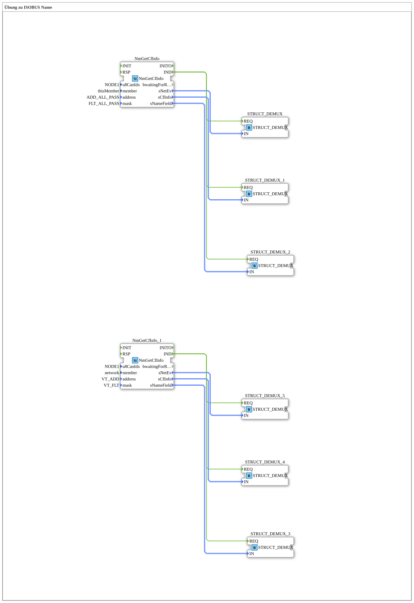

# Uebung_123_AX: Übung zu ISOBUS Name

Dieser Artikel beschreibt die 4diac IDE Subapplikation Uebung_123_AX (Übung zu ISOBUS Name).

----

## Ziel der Übung

Das Ziel dieser Übung ist die Umsetzung folgender Anforderung: **Übung zu ISOBUS Name**

-----

## Beschreibung und Komponenten

Die Übung besteht aus der Subapplikation Uebung_123_AX.SUB, welche die folgende Bausteinstruktur verwendet:

### Verwendete Funktionsbausteine (FBs)

- **NmGetCfInfo**: Instanz des Typs isobus::pgn::NmGetCfInfo.
  - Parameter u8CanIdx = NODE1
  - Parameter member = thisMember
  - Parameter address = ADD_ALL_PASS
  - Parameter mask = FLT_ALL_PASS
- **STRUCT_DEMUX**: Instanz des Typs eclipse4diac::convert::STRUCT_DEMUX.
- **STRUCT_DEMUX_1**: Instanz des Typs eclipse4diac::convert::STRUCT_DEMUX.
- **STRUCT_DEMUX_2**: Instanz des Typs eclipse4diac::convert::STRUCT_DEMUX.
- **STRUCT_DEMUX_3**: Instanz des Typs eclipse4diac::convert::STRUCT_DEMUX.
- **NmGetCfInfo_1**: Instanz des Typs isobus::pgn::NmGetCfInfo.
  - Parameter u8CanIdx = NODE1
  - Parameter member = network
  - Parameter address = VT_ADD
  - Parameter mask = VT_FLT
- **STRUCT_DEMUX_4**: Instanz des Typs eclipse4diac::convert::STRUCT_DEMUX.
- **STRUCT_DEMUX_5**: Instanz des Typs eclipse4diac::convert::STRUCT_DEMUX.

### Verbindungen und Schnittstellen

**Ereignisverbindungen:**
- NmGetCfInfo.IND -> STRUCT_DEMUX.REQ
- NmGetCfInfo.IND -> STRUCT_DEMUX_1.REQ
- NmGetCfInfo.IND -> STRUCT_DEMUX_2.REQ
- NmGetCfInfo_1.IND -> STRUCT_DEMUX_3.REQ
- NmGetCfInfo_1.IND -> STRUCT_DEMUX_4.REQ
- NmGetCfInfo_1.IND -> STRUCT_DEMUX_5.REQ

**Datenverbindungen:**
- NmGetCfInfo.sNetEv -> STRUCT_DEMUX.IN
- NmGetCfInfo.sCfInfo -> STRUCT_DEMUX_1.IN
- NmGetCfInfo.sNameField -> STRUCT_DEMUX_2.IN
- NmGetCfInfo_1.sNameField -> STRUCT_DEMUX_3.IN
- NmGetCfInfo_1.sNetEv -> STRUCT_DEMUX_5.IN
- NmGetCfInfo_1.sCfInfo -> STRUCT_DEMUX_4.IN

-----

## Programmablauf und Funktionsweise

1. **Initialisierung**: Beim Systemstart werden alle beteiligten Bausteine initialisiert.
2. **Ereignis- und Signalverarbeitung**: Zustandsänderungen an den Eingängen erzeugen Ereignisse, die über die definierten Verbindungen an die nachgelagerten Bausteine weitergeleitet werden.
3. **Ausgangsaktualisierung**: Die Zielbausteine verarbeiten die empfangenen Signale und aktualisieren entsprechend die Ausgänge.

-----

## Zusammenfassung

Die Übung Uebung_123_AX demonstriert anschaulich die modulare IEC 61499 Architektur in 4diac IDE.
