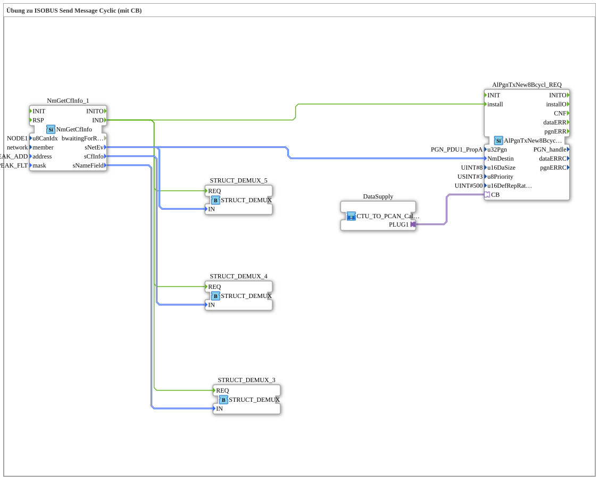

# Uebung_126_AX: Übung zu ISOBUS Send Message Cyclic (mit CB)

Dieser Artikel beschreibt die 4diac IDE Subapplikation Uebung_126_AX (Übung zu ISOBUS Send Message Cyclic (mit CB)).

----

## Ziel der Übung

Das Ziel dieser Übung ist die Umsetzung folgender Anforderung: **Übung zu ISOBUS Send Message Cyclic (mit CB)**

-----

## Beschreibung und Komponenten

Die Übung besteht aus der Subapplikation Uebung_126_AX.SUB, welche die folgende Bausteinstruktur verwendet:

### Verwendete Funktionsbausteine (FBs)

- **STRUCT_DEMUX_3**: Instanz des Typs eclipse4diac::convert::STRUCT_DEMUX.
- **NmGetCfInfo_1**: Instanz des Typs isobus::pgn::NmGetCfInfo.
  - Parameter u8CanIdx = NODE1
  - Parameter member = network
  - Parameter address = PEAK_ADD
  - Parameter mask = PEAK_FLT
- **STRUCT_DEMUX_4**: Instanz des Typs eclipse4diac::convert::STRUCT_DEMUX.
- **STRUCT_DEMUX_5**: Instanz des Typs eclipse4diac::convert::STRUCT_DEMUX.
- **AlPgnTxNew8Bcycl_REQ**: Instanz des Typs isobus::pgn::tx::AlPgnTxNew8Bcycl_REQ.
  - Parameter u32Pgn = PGN_PDU1_PropA
  - Parameter u16DaSize = 8
  - Parameter u8Priority = 3
  - Parameter u16DefRepRate = 500

### Verbindungen und Schnittstellen

**Adapterverbindungen:**

- DataSupply.PLUG1 -> AlPgnTxNew8Bcycl_REQ.CB

**Ereignisverbindungen:**

- NmGetCfInfo_1.IND -> STRUCT_DEMUX_3.REQ
- NmGetCfInfo_1.IND -> STRUCT_DEMUX_4.REQ
- NmGetCfInfo_1.IND -> STRUCT_DEMUX_5.REQ
- NmGetCfInfo_1.IND -> AlPgnTxNew8Bcycl_REQ.install

**Datenverbindungen:**

- NmGetCfInfo_1.sNameField -> STRUCT_DEMUX_3.IN
- NmGetCfInfo_1.sNetEv -> STRUCT_DEMUX_5.IN
- NmGetCfInfo_1.sCfInfo -> STRUCT_DEMUX_4.IN
- NmGetCfInfo_1.sNetEv -> AlPgnTxNew8Bcycl_REQ.NmDestin

-----

## Programmablauf und Funktionsweise

1. **Initialisierung**: Beim Systemstart werden alle beteiligten Bausteine initialisiert.
2. **Ereignis- und Signalverarbeitung**: Zustandsänderungen an den Eingängen erzeugen Ereignisse, die über die definierten Verbindungen an die nachgelagerten Bausteine weitergeleitet werden.
3. **Ausgangsaktualisierung**: Die Zielbausteine verarbeiten die empfangenen Signale und aktualisieren entsprechend die Ausgänge.

-----

## Zusammenfassung

Die Übung Uebung_126_AX demonstriert anschaulich die modulare IEC 61499 Architektur in 4diac IDE.
