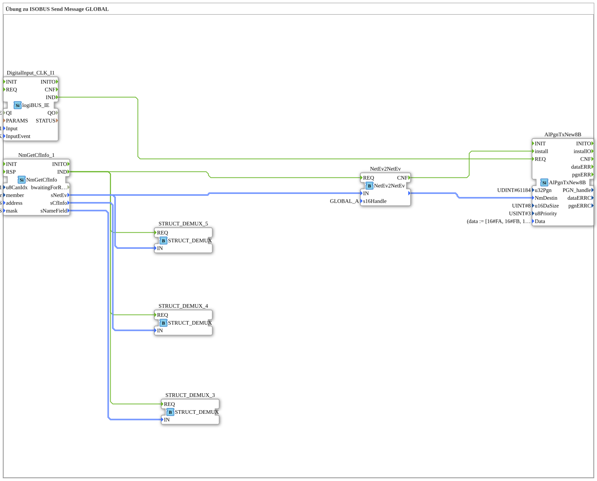

# Uebung_128_AX: Übung zu ISOBUS Send Message GLOBAL

Dieser Artikel beschreibt die 4diac IDE Subapplikation Uebung_128_AX (Übung zu ISOBUS Send Message GLOBAL).

----

## Ziel der Übung

Das Ziel dieser Übung ist die Umsetzung folgender Anforderung: **Übung zu ISOBUS Send Message GLOBAL**

-----

## Beschreibung und Komponenten

Die Übung besteht aus der Subapplikation Uebung_128_AX.SUB, welche die folgende Bausteinstruktur verwendet:

### Verwendete Funktionsbausteine (FBs)

- **STRUCT_DEMUX_3**: Instanz des Typs eclipse4diac::convert::STRUCT_DEMUX.
- **NmGetCfInfo_1**: Instanz des Typs isobus::pgn::NmGetCfInfo.
  - Parameter u8CanIdx = NODE1
  - Parameter member = thisMember
  - Parameter address = ADD_ALL_PASS
  - Parameter mask = FLT_ALL_PASS
- **STRUCT_DEMUX_4**: Instanz des Typs eclipse4diac::convert::STRUCT_DEMUX.
- **STRUCT_DEMUX_5**: Instanz des Typs eclipse4diac::convert::STRUCT_DEMUX.
- **AlPgnTxNew8B**: Instanz des Typs isobus::pgn::tx::AlPgnTxNew8B.
  - Parameter u32Pgn = 61184
  - Parameter u16DaSize = 8
  - Parameter u8Priority = 3
  - Parameter Data = (data := [16#FA, 16#FB, 16#FC, 16#FD, 16#FE, 16#FF, 16#F1, 16#F2])
- **DigitalInput_CLK_I1**: Instanz des Typs logiBUS::io::DI::logiBUS_IE.
  - Parameter QI = TRUE
  - Parameter Input = Input_I1
  - Parameter InputEvent = BUTTON_SINGLE_CLICK
- **NetEv2NetEv**: Instanz des Typs isobus::pgn::NetEv2NetEv.
  - Parameter s16Handle = GLOBAL_A

### Verbindungen und Schnittstellen

**Ereignisverbindungen:**

- NmGetCfInfo_1.IND -> STRUCT_DEMUX_3.REQ
- NmGetCfInfo_1.IND -> STRUCT_DEMUX_4.REQ
- NmGetCfInfo_1.IND -> STRUCT_DEMUX_5.REQ
- NmGetCfInfo_1.IND -> NetEv2NetEv.REQ
- DigitalInput_CLK_I1.IND -> AlPgnTxNew8B.REQ
- NetEv2NetEv.CNF -> AlPgnTxNew8B.install

**Datenverbindungen:**

- NmGetCfInfo_1.sNameField -> STRUCT_DEMUX_3.IN
- NmGetCfInfo_1.sNetEv -> STRUCT_DEMUX_5.IN
- NmGetCfInfo_1.sCfInfo -> STRUCT_DEMUX_4.IN
- NmGetCfInfo_1.sNetEv -> NetEv2NetEv.IN
- NetEv2NetEv. -> AlPgnTxNew8B.NmDestin

-----

## Programmablauf und Funktionsweise

1. **Initialisierung**: Beim Systemstart werden alle beteiligten Bausteine initialisiert.
2. **Ereignis- und Signalverarbeitung**: Zustandsänderungen an den Eingängen erzeugen Ereignisse, die über die definierten Verbindungen an die nachgelagerten Bausteine weitergeleitet werden.
3. **Ausgangsaktualisierung**: Die Zielbausteine verarbeiten die empfangenen Signale und aktualisieren entsprechend die Ausgänge.

-----

## Zusammenfassung

Die Übung Uebung_128_AX demonstriert anschaulich die modulare IEC 61499 Architektur in 4diac IDE.
