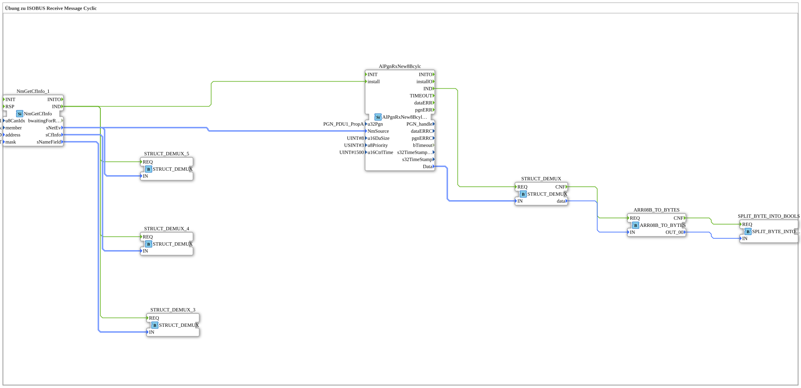

# Uebung_131_AX: Übung zu ISOBUS Receive Message Cyclic

Dieser Artikel beschreibt die 4diac IDE Subapplikation Uebung_131_AX (Übung zu ISOBUS Receive Message Cyclic).

----

## Ziel der Übung

Das Ziel dieser Übung ist die Umsetzung folgender Anforderung: **Übung zu ISOBUS Receive Message Cyclic**

-----

## Beschreibung und Komponenten

Die Übung besteht aus der Subapplikation Uebung_131_AX.SUB, welche die folgende Bausteinstruktur verwendet:

### Verwendete Funktionsbausteine (FBs)

- **STRUCT_DEMUX_3**: Instanz des Typs eclipse4diac::convert::STRUCT_DEMUX.
- **NmGetCfInfo_1**: Instanz des Typs isobus::pgn::NmGetCfInfo.
  - Parameter u8CanIdx = NODE1
  - Parameter member = network
  - Parameter address = PEAK_ADD
  - Parameter mask = PEAK_FLT
- **STRUCT_DEMUX_4**: Instanz des Typs eclipse4diac::convert::STRUCT_DEMUX.
- **STRUCT_DEMUX_5**: Instanz des Typs eclipse4diac::convert::STRUCT_DEMUX.
- **AlPgnRxNew8Bcylc**: Instanz des Typs isobus::pgn::rx::AlPgnRxNew8Bcylc.
  - Parameter u32Pgn = PGN_PDU1_PropA
  - Parameter u16DaSize = 8
  - Parameter u8Priority = 3
  - Parameter u16CtrlTime = 1500
- **STRUCT_DEMUX**: Instanz des Typs eclipse4diac::convert::STRUCT_DEMUX.
- **ARR08B_TO_BYTES**: Instanz des Typs logiBUS::utils::conversion::arr::forwarding::ARR08B_TO_BYTES.
- **SPLIT_BYTE_INTO_BOOLS**: Instanz des Typs eclipse4diac::utils::splitting::SPLIT_BYTE_INTO_BOOLS.

### Verbindungen und Schnittstellen

**Ereignisverbindungen:**
- NmGetCfInfo_1.IND -> STRUCT_DEMUX_3.REQ
- NmGetCfInfo_1.IND -> STRUCT_DEMUX_4.REQ
- NmGetCfInfo_1.IND -> STRUCT_DEMUX_5.REQ
- NmGetCfInfo_1.IND -> AlPgnRxNew8Bcylc.install
- AlPgnRxNew8Bcylc.IND -> STRUCT_DEMUX.REQ
- STRUCT_DEMUX.CNF -> ARR08B_TO_BYTES.REQ
- ARR08B_TO_BYTES.CNF -> SPLIT_BYTE_INTO_BOOLS.REQ

**Datenverbindungen:**
- NmGetCfInfo_1.sNameField -> STRUCT_DEMUX_3.IN
- NmGetCfInfo_1.sNetEv -> STRUCT_DEMUX_5.IN
- NmGetCfInfo_1.sCfInfo -> STRUCT_DEMUX_4.IN
- NmGetCfInfo_1.sNetEv -> AlPgnRxNew8Bcylc.NmSource
- AlPgnRxNew8Bcylc.Data -> STRUCT_DEMUX.IN
- STRUCT_DEMUX.data -> ARR08B_TO_BYTES.IN
- ARR08B_TO_BYTES.OUT_00 -> SPLIT_BYTE_INTO_BOOLS.IN

-----

## Programmablauf und Funktionsweise

1. **Initialisierung**: Beim Systemstart werden alle beteiligten Bausteine initialisiert.
2. **Ereignis- und Signalverarbeitung**: Zustandsänderungen an den Eingängen erzeugen Ereignisse, die über die definierten Verbindungen an die nachgelagerten Bausteine weitergeleitet werden.
3. **Ausgangsaktualisierung**: Die Zielbausteine verarbeiten die empfangenen Signale und aktualisieren entsprechend die Ausgänge.

-----

## Zusammenfassung

Die Übung Uebung_131_AX demonstriert anschaulich die modulare IEC 61499 Architektur in 4diac IDE.
