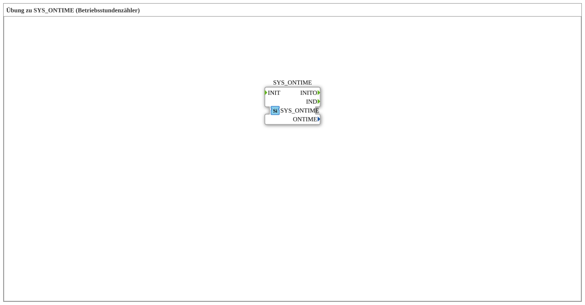

# Uebung_140_AX: Übung zu SYS_ONTIME (Betriebsstundenzähler)

Dieser Artikel beschreibt die 4diac IDE Subapplikation Uebung_140_AX (Übung zu SYS_ONTIME (Betriebsstundenzähler)).

----

## Ziel der Übung

Das Ziel dieser Übung ist die Umsetzung folgender Anforderung: **Übung zu SYS_ONTIME (Betriebsstundenzähler)**

-----

## Beschreibung und Komponenten

Die Übung besteht aus der Subapplikation Uebung_140_AX.SUB, welche die folgende Bausteinstruktur verwendet:

### Verwendete Funktionsbausteine (FBs)

- **SYS_ONTIME**: Instanz des Typs logiBUS::signalprocessing::measurement::SYS_ONTIME.

-----

## Programmablauf und Funktionsweise

1. **Initialisierung**: Beim Systemstart werden alle beteiligten Bausteine initialisiert.
2. **Signalweiterleitung**: Die Bausteine verarbeiten Daten- und Steuersignale gemäß ihrer Konfiguration.

-----

## Zusammenfassung

Die Übung Uebung_140_AX demonstriert anschaulich die modulare IEC 61499 Architektur in 4diac IDE.
