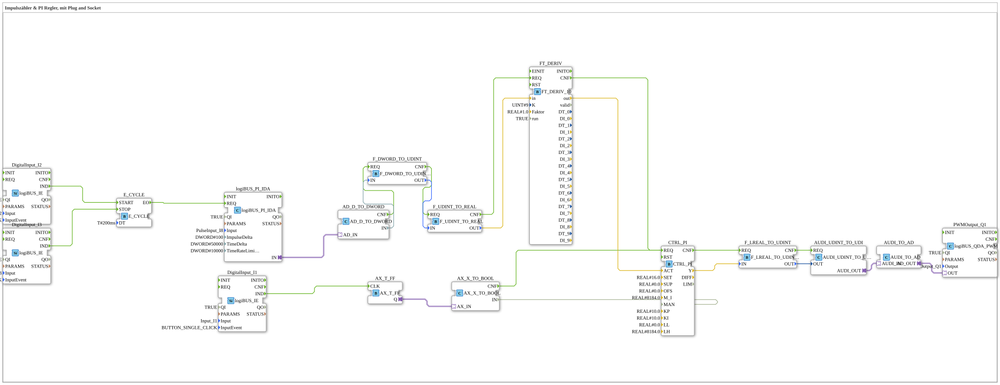

# Uebung_152_AX: Impulszähler & PI Regler, mit Plug and Socket

Dieser Artikel beschreibt die 4diac IDE Subapplikation Uebung_152_AX (Impulszähler & PI Regler, mit Plug and Socket).

----

## Ziel der Übung

Das Ziel dieser Übung ist die Umsetzung folgender Anforderung: **Impulszähler & PI Regler, mit Plug and Socket**

-----

## Beschreibung und Komponenten

Die Übung besteht aus der Subapplikation Uebung_152_AX.SUB, welche die folgende Bausteinstruktur verwendet:

### Verwendete Funktionsbausteine (FBs)

- **logiBUS_PI_IDA**: Instanz des Typs logiBUS::io::PI::logiBUS_PI_IDA.
  - Parameter QI = TRUE
  - Parameter Input = PulseInput_I8
  - Parameter ImpulseDelta = 100
  - Parameter TimeDelta = 50000
  - Parameter TimeRateLimit = 10000
- **AD_D_TO_DWORD**: Instanz des Typs adapter::conversion::unidirectional::AD_D_TO_DWORD.
- **FT_DERIV**: Instanz des Typs OSCAT::Basic::POUs::Engineering::Control::FT_DERIV_10.
  - Parameter K = 9
  - Parameter Faktor = 1.0
  - Parameter run = TRUE
- **F_DWORD_TO_UDINT**: Instanz des Typs iec61131::conversion::F_DWORD_TO_UDINT.
- **F_UDINT_TO_REAL**: Instanz des Typs iec61131::conversion::F_UDINT_TO_REAL.
- **PWMOutput_Q1**: Instanz des Typs logiBUS::io::DQ::logiBUS_QDA_PWM.
  - Parameter QI = TRUE
  - Parameter Output = Output_Q1
- **CTRL_PI**: Instanz des Typs OSCAT::Basic::POUs::Engineering::Control::CTRL_PI.
  - Parameter SET = 16.0
  - Parameter SUP = 0.0
  - Parameter OFS = 0.0
  - Parameter M_I = 8184.0
  - Parameter KP = 10.0
  - Parameter KI = 10.0
  - Parameter LL = 0.0
  - Parameter LH = 8184.0
- **DigitalInput_I1**: Instanz des Typs logiBUS::io::DI::logiBUS_IE.
  - Parameter QI = TRUE
  - Parameter Input = Input_I1
  - Parameter InputEvent = BUTTON_SINGLE_CLICK
- **AX_T_FF**: Instanz des Typs adapter::events::unidirectional::AX_T_FF.
- **AX_X_TO_BOOL**: Instanz des Typs adapter::conversion::unidirectional::AX_X_TO_BOOL.
- **F_LREAL_TO_UDINT**: Instanz des Typs iec61131::conversion::F_LREAL_TO_UDINT.
- **AUDI_UDINT_TO_UDI**: Instanz des Typs adapter::conversion::unidirectional::AUDI_UDINT_TO_UDI.
- **AUDI_TO_AD**: Instanz des Typs adapter::conversion::unidirectional::AUDI_TO_AD.
- **E_CYCLE**: Instanz des Typs iec61499::events::E_CYCLE.
  - Parameter DT = T#200ms
- **DigitalInput_I2**: Instanz des Typs logiBUS::io::DI::logiBUS_IE.
  - Parameter QI = TRUE
  - Parameter Input = Input_I2
  - Parameter InputEvent = BUTTON_SINGLE_CLICK
- **DigitalInput_I3**: Instanz des Typs logiBUS::io::DI::logiBUS_IE.
  - Parameter QI = TRUE
  - Parameter Input = Input_I3
  - Parameter InputEvent = BUTTON_SINGLE_CLICK

### Verbindungen und Schnittstellen

**Adapterverbindungen:**

- logiBUS_PI_IDA.IN -> AD_D_TO_DWORD.AD_IN
- AX_T_FF.Q -> AX_X_TO_BOOL.AX_IN
- AUDI_UDINT_TO_UDI.AUDI_OUT -> AUDI_TO_AD.AUDI_IN
- AUDI_TO_AD.AD_OUT -> PWMOutput_Q1.OUT

**Ereignisverbindungen:**

- AD_D_TO_DWORD.CNF -> F_DWORD_TO_UDINT.REQ
- F_DWORD_TO_UDINT.CNF -> F_UDINT_TO_REAL.REQ
- F_UDINT_TO_REAL.CNF -> FT_DERIV.REQ
- FT_DERIV.CNF -> CTRL_PI.REQ
- DigitalInput_I1.IND -> AX_T_FF.CLK
- AX_X_TO_BOOL.CNF -> CTRL_PI.REQ
- CTRL_PI.CNF -> F_LREAL_TO_UDINT.REQ
- F_LREAL_TO_UDINT.CNF -> AUDI_UDINT_TO_UDI.REQ
- DigitalInput_I2.IND -> E_CYCLE.START
- DigitalInput_I3.IND -> E_CYCLE.STOP
- E_CYCLE.EO -> logiBUS_PI_IDA.REQ

**Datenverbindungen:**

- AD_D_TO_DWORD.IN -> F_DWORD_TO_UDINT.IN
- F_DWORD_TO_UDINT.OUT -> F_UDINT_TO_REAL.IN
- F_UDINT_TO_REAL.OUT -> FT_DERIV.in
- FT_DERIV.out -> CTRL_PI.ACT
- AX_X_TO_BOOL.IN -> CTRL_PI.MAN
- CTRL_PI.Y -> F_LREAL_TO_UDINT.IN
- F_LREAL_TO_UDINT.OUT -> AUDI_UDINT_TO_UDI.OUT

-----

## Programmablauf und Funktionsweise

1. **Initialisierung**: Beim Systemstart werden alle beteiligten Bausteine initialisiert.
2. **Ereignis- und Signalverarbeitung**: Zustandsänderungen an den Eingängen erzeugen Ereignisse, die über die definierten Verbindungen an die nachgelagerten Bausteine weitergeleitet werden.
3. **Ausgangsaktualisierung**: Die Zielbausteine verarbeiten die empfangenen Signale und aktualisieren entsprechend die Ausgänge.

-----

## Zusammenfassung

Die Übung Uebung_152_AX demonstriert anschaulich die modulare IEC 61499 Architektur in 4diac IDE.
