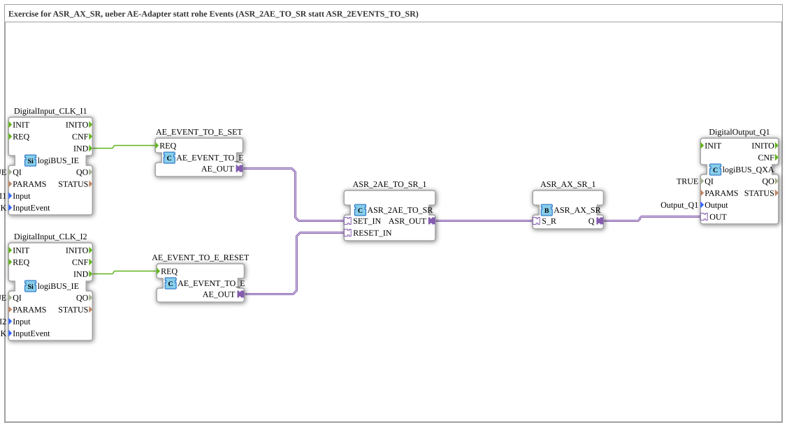

# Uebung_171b_ASR: SET/RESET-Latch über AE-Adapter statt rohe Events

* * * * * * * * * *

## Einleitung

Diese Übung realisiert dieselbe Funktion wie `Uebung_171_ASR` (Taster `I1` = SET-Klick, Taster `I2` = RESET-Klick, Verriegelung über `ASR_AX_SR`), verdrahtet den Weg von den beiden Klick-Events zum Latch jedoch bewusst über **AE-Adapter-Sockets** statt über rohe EventConnections. Sie zeigt damit, warum es den AE-Adapter-Typ überhaupt gibt: ein `AE`-Plug ist ein vollwertiger Adapter, der sich wie `AX`/`ASR`/`ASRT` mit generischen Bausteinen (z. B. `AE_SPLIT_2`) weiterverarbeiten lässt – ein rohes Event kann das nicht, es ist nur über EventConnections verdrahtbar.

## Verwendete Funktionsbausteine (FBs)

- **DigitalInput_CLK_I1**, **DigitalInput_CLK_I2**: logiBUS Klick-Eingänge (Typ: `logiBUS::io::DI::logiBUS_IE`)
    - **Parameter**: `QI = TRUE`, `Input = Input_I1` bzw. `Input_I2`, `InputEvent = BUTTON_SINGLE_CLICK`
    - **Erklärung**: Melden einen einzelnen Tasterklick als Ereignis (`IND`) am jeweiligen physischen Eingang.
- **AE_EVENT_TO_E_SET**, **AE_EVENT_TO_E_RESET**: Ereignis-zu-Adapter-Brücke (Typ: `adapter::conversion::unidirectional::AE_EVENT_TO_E`)
    - **Parameter**: keine
    - **Erklärung**: Wandeln ein rohes Klick-Event (`REQ`) in einen getypten `AE`-Adapter-Ausgang (`AE_OUT`) um. Damit lässt sich das Ereignis wie ein Adapter weiterreichen statt nur als lose EventConnection.
- **ASR_2AE_TO_SR_1**: AE-zu-ASR-Konverter (Typ: `adapter::conversion::unidirectional::ASR_2AE_TO_SR`)
    - **Parameter**: keine
    - **Erklärung**: Nimmt zwei `AE`-Adapter-Eingänge (`SET_IN`, `RESET_IN`) entgegen und bündelt sie zu einem gemeinsamen `ASR`-Adapter-Ausgang (`ASR_OUT`).
- **ASR_AX_SR_1**: Set-Reset-Latch (Typ: `adapter::events::unidirectional::ASR_AX_SR`)
    - **Parameter**: keine
    - **Erklärung**: Verriegelt den gebündelten `S_R`-Eingang set-dominant: `S` schaltet `Q` EIN, `R` schaltet `Q` AUS.
- **DigitalOutput_Q1**: logiBUS Digitalausgang (Typ: `logiBUS::io::DQ::logiBUS_QXA`)
    - **Parameter**: `QI = TRUE`, `Output = Output_Q1`
    - **Erklärung**: Gibt den Latch-Zustand `Q` als physisches Ausgangssignal aus.

### Sub-Bausteine: keine

Die Übung verwendet keine weiteren Unterbausteine, alle FBs sind direkt auf der obersten Ebene der SubApp angeordnet.

## Programmablauf und Verbindungen

1. **Klick an I1 (SET)**: `DigitalInput_CLK_I1.IND` löst über eine EventConnection `AE_EVENT_TO_E_SET.REQ` aus. Dieser wandelt das rohe Event in einen `AE`-Adapter-Ausgang (`AE_OUT`) um.
2. **Klick an I2 (RESET)**: analog löst `DigitalInput_CLK_I2.IND` `AE_EVENT_TO_E_RESET.REQ` aus, dessen `AE_OUT` den Reset-Zweig bedient.
3. **Bündeln zu ASR**: `AE_EVENT_TO_E_SET.AE_OUT` geht über eine AdapterConnection auf `ASR_2AE_TO_SR_1.SET_IN`, `AE_EVENT_TO_E_RESET.AE_OUT` auf `ASR_2AE_TO_SR_1.RESET_IN`. Der Baustein fasst beide zu einem gemeinsamen `ASR_OUT` zusammen.
4. **Verriegeln**: `ASR_2AE_TO_SR_1.ASR_OUT` wird auf `ASR_AX_SR_1.S_R` geführt. Das Latch schaltet bei SET auf `Q = TRUE`, bei RESET auf `Q = FALSE`.
5. **Ausgabe**: `ASR_AX_SR_1.Q` treibt direkt `DigitalOutput_Q1.OUT`.

## Zusammenfassung

Die Übung 171b demonstriert denselben SET/RESET-Latch wie Übung 171, verdrahtet aber bewusst über AE-Adapter-Sockets statt rohe Events: `AE_EVENT_TO_E` baut je Kanal die Brücke vom Klick-Event zum getypten `AE`-Plug, `ASR_2AE_TO_SR` bündelt beide zu einem `ASR`-Signal für das Latch `ASR_AX_SR`. Der Mehraufwand gegenüber der rohen Event-Variante lohnt sich, sobald das Signal selbst wie ein Adapter weiterverarbeitet werden soll (z. B. mit `AE_SPLIT_2` vervielfältigt) – etwas, das mit einem rohen Event nicht möglich wäre.

---

### 🌐 Passende Themen-Unterseiten auf ms-muc-docs.de

- [🌐 Eclipse 4diac IDE & Farb-Referenz auf ms-muc-docs.de](https://www.ms-muc-docs.de/iec-61499/eclipse-4diac/)
