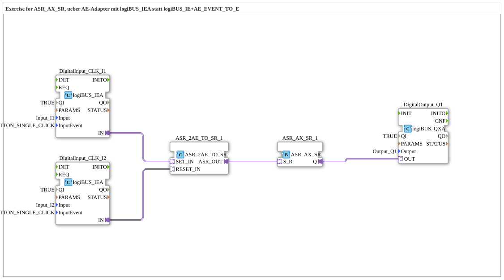

# Uebung_171c_ASR: SET/RESET-Latch mit logiBUS_IEA (AE-Adapter bereits eingebaut)

* * * * * * * * * *

## Einleitung

Diese Übung realisiert dieselbe Funktion wie `Uebung_171b_ASR` (Taster `I1` = SET-Klick, Taster `I2` = RESET-Klick, Verriegelung über `ASR_AX_SR`), spart sich aber die dort noch von Hand verdrahtete `AE_EVENT_TO_E`-Brücke pro Kanal: der Eingangsbaustein `logiBUS_IEA` liefert den `AE`-Adapter-Plug bereits eingebaut, genau wie `logiBUS_IX` → `logiBUS_IXA` für Pegelsignale, nur für Event-Eingänge.

## Verwendete Funktionsbausteine (FBs)

- **DigitalInput_CLK_I1**, **DigitalInput_CLK_I2**: logiBUS Klick-Eingänge mit eingebautem AE-Adapter (Typ: `logiBUS::io::DI::logiBUS_IEA`)
    - **Parameter**: `QI = TRUE`, `Input = Input_I1` bzw. `Input_I2`, `InputEvent = BUTTON_SINGLE_CLICK`
    - **Erklärung**: Kapseln intern einen `logiBUS_IE` und leiten dessen Klick-Event direkt auf einen eigenen `AE`-Adapter-Ausgang (`IN`) um – die Brücke, die in `Uebung_171b_ASR` noch als separater `AE_EVENT_TO_E`-Baustein nötig war, steckt hier bereits im Eingangsbaustein selbst.
- **ASR_2AE_TO_SR_1**: AE-zu-ASR-Konverter (Typ: `adapter::conversion::unidirectional::ASR_2AE_TO_SR`)
    - **Parameter**: keine
    - **Erklärung**: Nimmt zwei `AE`-Adapter-Eingänge (`SET_IN`, `RESET_IN`) entgegen und bündelt sie zu einem gemeinsamen `ASR`-Adapter-Ausgang (`ASR_OUT`).
- **ASR_AX_SR_1**: Set-Reset-Latch (Typ: `adapter::events::unidirectional::ASR_AX_SR`)
    - **Parameter**: keine
    - **Erklärung**: Verriegelt den gebündelten `S_R`-Eingang set-dominant: `S` schaltet `Q` EIN, `R` schaltet `Q` AUS.
- **DigitalOutput_Q1**: logiBUS Digitalausgang (Typ: `logiBUS::io::DQ::logiBUS_QXA`)
    - **Parameter**: `QI = TRUE`, `Output = Output_Q1`
    - **Erklärung**: Gibt den Latch-Zustand `Q` als physisches Ausgangssignal aus.

### Sub-Bausteine: keine

Die Übung verwendet keine weiteren Unterbausteine, alle FBs sind direkt auf der obersten Ebene der SubApp angeordnet.

## Programmablauf und Verbindungen

1. **Klick an I1 (SET)**: `DigitalInput_CLK_I1` (`logiBUS_IEA`) erkennt den Klick intern und stellt ihn direkt als `AE`-Adapter-Ausgang (`IN`) bereit – ohne separaten Zwischenbaustein.
2. **Klick an I2 (RESET)**: analog liefert `DigitalInput_CLK_I2.IN` den Reset-Zweig als `AE`-Adapter.
3. **Bündeln zu ASR**: `DigitalInput_CLK_I1.IN` geht direkt auf `ASR_2AE_TO_SR_1.SET_IN`, `DigitalInput_CLK_I2.IN` auf `ASR_2AE_TO_SR_1.RESET_IN`. Der Baustein fasst beide zu `ASR_OUT` zusammen.
4. **Verriegeln**: `ASR_2AE_TO_SR_1.ASR_OUT` wird auf `ASR_AX_SR_1.S_R` geführt. Das Latch schaltet bei SET auf `Q = TRUE`, bei RESET auf `Q = FALSE`.
5. **Ausgabe**: `ASR_AX_SR_1.Q` treibt direkt `DigitalOutput_Q1.OUT`.

## Zusammenfassung

Übung 171c zeigt exakt dasselbe Latch-Verhalten wie Übung 171 und 171b, kommt aber mit den wenigsten Bausteinen aus: `logiBUS_IEA` ersetzt `logiBUS_IE` und liefert den `AE`-Adapter-Plug bereits eingebaut, sodass die in 171b noch nötigen `AE_EVENT_TO_E`-Bausteine entfallen. Im Vergleich der drei SubApps im 4diac-Editor zeigt sich derselbe funktionale Kern (Klick I1 → `Q1` EIN, Klick I2 → `Q1` AUS) mit schrittweise kompakterer Verdrahtung.

---

### 🌐 Passende Themen-Unterseiten auf ms-muc-docs.de

- [🌐 Eclipse 4diac IDE & Farb-Referenz auf ms-muc-docs.de](https://www.ms-muc-docs.de/iec-61499/eclipse-4diac/)
