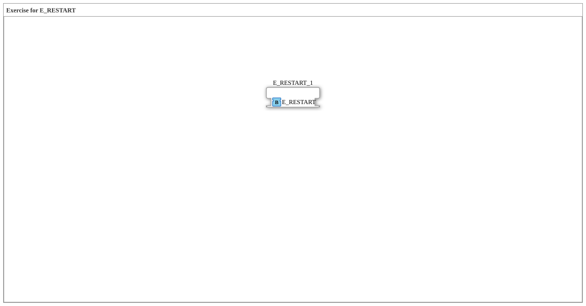

# Uebung_174_AX: Exercise for E_RESTART

Dieser Artikel beschreibt die 4diac IDE Subapplikation Uebung_174_AX (Exercise for E_RESTART).

----

## Ziel der Übung

Das Ziel dieser Übung ist die Umsetzung folgender Anforderung: **Exercise for E_RESTART**

-----

## Beschreibung und Komponenten

Die Übung besteht aus der Subapplikation Uebung_174_AX.SUB, welche die folgende Bausteinstruktur verwendet:

### Verwendete Funktionsbausteine (FBs)

- **E_RESTART_1**: Instanz des Typs iec61499::events::E_RESTART.

### Hinweise aus dem Modell

> TODO

-----

## Programmablauf und Funktionsweise

1. **Initialisierung**: Beim Systemstart werden alle beteiligten Bausteine initialisiert.
2. **Signalweiterleitung**: Die Bausteine verarbeiten Daten- und Steuersignale gemäß ihrer Konfiguration.

-----

## Zusammenfassung

Die Übung Uebung_174_AX demonstriert anschaulich die modulare IEC 61499 Architektur in 4diac IDE.
