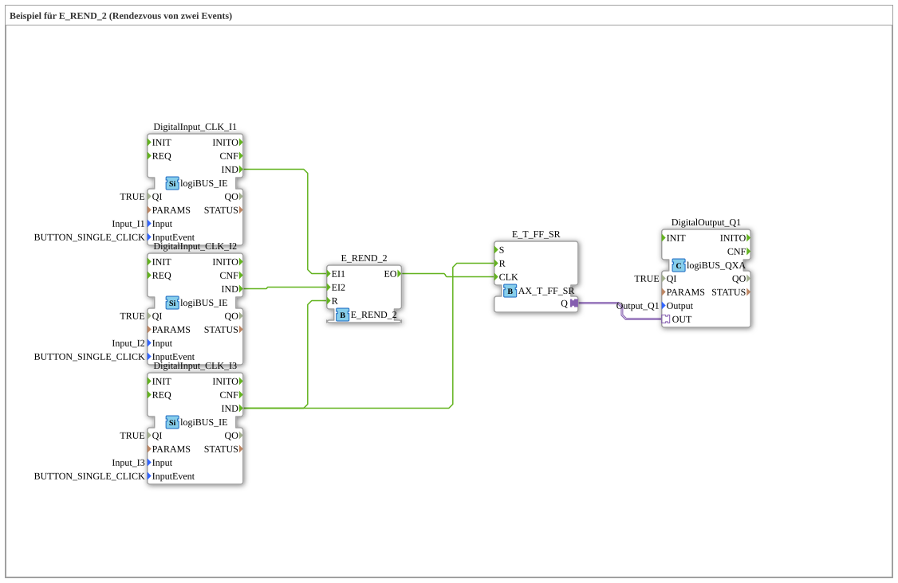

# Uebung_179_AX: Beispiel für E_REND_2 (Rendezvous von zwei Events)

Dieser Artikel beschreibt die 4diac IDE Subapplikation Uebung_179_AX (Beispiel für E_REND_2 (Rendezvous von zwei Events)).

----

## Ziel der Übung

Das Ziel dieser Übung ist die Umsetzung folgender Anforderung: **Beispiel für E_REND_2 (Rendezvous von zwei Events)**

-----

## Beschreibung und Komponenten

Die Übung besteht aus der Subapplikation Uebung_179_AX.SUB, welche die folgende Bausteinstruktur verwendet:

### Verwendete Funktionsbausteine (FBs)

- **DigitalOutput_Q1**: Instanz des Typs logiBUS::io::DQ::logiBUS_QXA.
  - Parameter QI = TRUE
  - Parameter Output = Output_Q1
- **DigitalInput_CLK_I1**: Instanz des Typs logiBUS::io::DI::logiBUS_IE.
  - Parameter QI = TRUE
  - Parameter Input = Input_I1
  - Parameter InputEvent = BUTTON_SINGLE_CLICK
- **E_T_FF_SR**: Instanz des Typs adapter::events::unidirectional::AX_T_FF_SR.
- **E_REND_2**: Instanz des Typs iec61499::events::E_REND_2.
- **DigitalInput_CLK_I2**: Instanz des Typs logiBUS::io::DI::logiBUS_IE.
  - Parameter QI = TRUE
  - Parameter Input = Input_I2
  - Parameter InputEvent = BUTTON_SINGLE_CLICK
- **DigitalInput_CLK_I3**: Instanz des Typs logiBUS::io::DI::logiBUS_IE.
  - Parameter QI = TRUE
  - Parameter Input = Input_I3
  - Parameter InputEvent = BUTTON_SINGLE_CLICK

### Verbindungen und Schnittstellen

**Adapterverbindungen:**

- E_T_FF_SR.Q -> DigitalOutput_Q1.OUT

**Ereignisverbindungen:**

- DigitalInput_CLK_I1.IND -> E_REND_2.EI1
- DigitalInput_CLK_I2.IND -> E_REND_2.EI2
- DigitalInput_CLK_I3.IND -> E_REND_2.R
- E_REND_2.EO -> E_T_FF_SR.CLK
- DigitalInput_CLK_I3.IND -> E_T_FF_SR.R

-----

## Programmablauf und Funktionsweise

1. **Initialisierung**: Beim Systemstart werden alle beteiligten Bausteine initialisiert.
2. **Ereignis- und Signalverarbeitung**: Zustandsänderungen an den Eingängen erzeugen Ereignisse, die über die definierten Verbindungen an die nachgelagerten Bausteine weitergeleitet werden.
3. **Ausgangsaktualisierung**: Die Zielbausteine verarbeiten die empfangenen Signale und aktualisieren entsprechend die Ausgänge.

-----

## Zusammenfassung

Die Übung Uebung_179_AX demonstriert anschaulich die modulare IEC 61499 Architektur in 4diac IDE.
