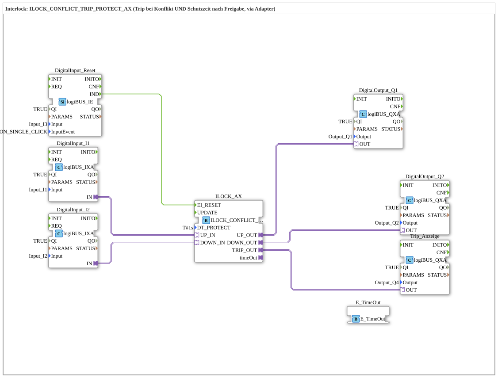

# Uebung_204c_AX: Interlock ILOCK_CONFLICT_TRIP_PROTECT_AX (Trip bei Konflikt UND Schutzzeit nach Freigabe, via Adapter)

* * * * * * * * * *

## Einleitung

Diese Übung erweitert `Uebung_204_AX` (die den einfachen `ILOCK_CONFLICT_TRIP_AX` ohne Schutzzeit verwendet) um eine zusätzliche Schutzzeit: Nach Freigabe des aktiven Eingangs wartet die Verriegelung `DT_PROTECT` (hier 1 Sekunde) ab, bevor sie eine neue Richtung übernimmt. Diese Wartezeit gilt ausschließlich für die Übernahme einer neuen Richtung – ein Konflikt, der auftritt, während der erste Eingang noch aktiv gehalten wird (also vor dessen Freigabe), löst weiterhin sofort einen TRIP aus, unabhängig von `DT_PROTECT` (unverändert gegenüber `ILOCK_CONFLICT_TRIP`). Ist nach Ablauf von `DT_PROTECT` jedoch immer noch (oder wieder) der jeweils andere Eingang aktiv, wird bei der dann fälligen Neubewertung statt der neuen Richtung erneut ein TRIP ausgelöst. Es handelt sich um dieselbe Schutzzeit-Logik wie bei `ILOCK_SWITCH_PROTECT_AX` (`Uebung_205_AX`), hier kombiniert mit der Konflikterkennung (TRIP) aus `Uebung_204_AX`.

## Verwendete Funktionsbausteine (FBs)

- **DigitalInput_I1**, **DigitalInput_I2**: logiBUS Digitaleingänge (Typ: `logiBUS::io::DI::logiBUS_IXA`)
    - **Parameter**: QI = TRUE, Input = Input_I1 bzw. Input_I2
    - **Erklärung**: Liefern die beiden sich gegenseitig ausschließenden Anforderungssignale (z. B. Auf/Ab) als AX-Adaptersignale an die Verriegelung.
- **DigitalInput_Reset**: logiBUS Ereigniseingang (Typ: `logiBUS::io::DI::logiBUS_IE`)
    - **Parameter**: QI = TRUE, Input = Input_I3, InputEvent = BUTTON_SINGLE_CLICK
    - **Erklärung**: Löst bei einem Tasterklick das Rücksetzen (`EI_RESET`) der Verriegelung aus, nachdem ein Konflikt (TRIP) aufgetreten ist.
- **ILOCK_AX**: Interlock-Baustein (Typ: `logiBUS::signalprocessing::interlock::ILOCK_CONFLICT_TRIP_PROTECT_AX`)
    - **Parameter**: DT_PROTECT = T#1s
    - **Erklärung**: Verriegelt die beiden Eingänge `UP_IN`/`DOWN_IN` gegenseitig. Sind beide gleichzeitig aktiv, während eine Richtung noch aktiv gehalten wird, erkennt der Baustein sofort einen Konflikt (TRIP) und setzt `TRIP_OUT` – unabhängig von `DT_PROTECT`. Nach Freigabe des zuvor aktiven Eingangs wartet er zusätzlich `DT_PROTECT` ab und bewertet danach die dann aktuelle Eingangslage neu: liegt nur noch eine Richtung an, wird sie übernommen; sind (wieder) beide Eingänge aktiv, wird stattdessen erneut ein TRIP ausgelöst.
- **DigitalOutput_Q1**: logiBUS Digitalausgang (Typ: `logiBUS::io::DQ::logiBUS_QXA`)
    - **Parameter**: QI = TRUE, Output = Output_Q1
    - **Erklärung**: Gibt das freigegebene `UP_OUT`-Signal an die Peripherie weiter.
- **DigitalOutput_Q2**: logiBUS Digitalausgang (Typ: `logiBUS::io::DQ::logiBUS_QXA`)
    - **Parameter**: QI = TRUE, Output = Output_Q2
    - **Erklärung**: Gibt das freigegebene `DOWN_OUT`-Signal an die Peripherie weiter.
- **Trip_Anzeige**: logiBUS Digitalausgang (Typ: `logiBUS::io::DQ::logiBUS_QXA`)
    - **Parameter**: QI = TRUE, Output = Output_Q4
    - **Erklärung**: Zeigt den Konfliktzustand (`TRIP_OUT`) an, z. B. über eine Meldeleuchte.
- **E_TimeOut**: Zeitgeber-Ereignisquelle (Typ: `iec61499::events::E_TimeOut`)
    - **Parameter**: keine
    - **Erklärung**: Empfängt über die Adapterverbindung `timeOut` das von `ILOCK_AX` gestartete Zeitsignal (`DT_PROTECT`/`START`), verarbeitet es und meldet den Ablauf über `timeOut.TimeOut` zurück.

### Sub-Bausteine: keine

Die Übung verwendet keine weiteren Unterbausteine, alle FBs sind direkt auf der obersten Ebene der SubApp angeordnet.

## Programmablauf und Verbindungen

1. `DigitalInput_I1.IN` → `ILOCK_AX.UP_IN` und `DigitalInput_I2.IN` → `ILOCK_AX.DOWN_IN`: Die beiden Anforderungssignale gelangen über AdapterConnections in die Verriegelung.
2. `DigitalInput_Reset.IND` → `ILOCK_AX.EI_RESET`: Ein Klick auf den Reset-Taster setzt einen ausgelösten Konflikt zurück.
3. `ILOCK_AX.timeOut` → `E_TimeOut.TimeOutSocket`: `ILOCK_AX` setzt darüber `DT_PROTECT` und startet den Timer; `E_TimeOut` verarbeitet das Zeitsignal und meldet den Ablauf zurück.
4. **Normalbetrieb**: Ist nur ein Eingang aktiv, wird `UP_OUT` bzw. `DOWN_OUT` freigegeben und über `Output_Q1`/`Output_Q2` ausgegeben.
5. **Konfliktfall (TRIP)**: Sind `UP_IN` und `DOWN_IN` gleichzeitig aktiv, setzt `ILOCK_AX.TRIP_OUT` → `Trip_Anzeige.OUT` und blockiert beide Ausgänge, bis über `DigitalInput_Reset` zurückgesetzt wird.
6. **Schutzzeit**: Wird der aktive Eingang losgelassen, wartet `ILOCK_AX` `DT_PROTECT` (1 s) ab und bewertet danach die dann aktuelle Eingangslage neu: liegt nur eine Richtung an, wird sie übernommen; sind beide Eingänge aktiv (weil der andere währenddessen aktiviert wurde und noch ansteht), wird stattdessen ein TRIP ausgelöst. Ein Konflikt, der auftritt, während der erste Eingang noch gehalten wird (also vor dessen Freigabe), löst dagegen weiterhin sofort TRIP aus, ohne auf `DT_PROTECT` zu warten.

## Zusammenfassung

Die Übung 204c_AX kombiniert die Konflikterkennung aus `Uebung_204_AX` mit einer Schutzzeit nach Freigabe des aktiven Eingangs, wie sie `Uebung_205_AX` für einfache Richtungswechsel einführt. `ILOCK_CONFLICT_TRIP_PROTECT_AX` verhindert dadurch nicht nur gleichzeitige, widersprüchliche Anforderungen, sondern auch ein zu schnelles Umschalten der Richtung unmittelbar nach Freigabe – eine typische Anforderung an robuste Verriegelungslogik in der Automatisierungstechnik.

---

### 🌐 Passende Themen-Unterseiten auf ms-muc-docs.de

- [🌐 Eclipse 4diac IDE & Farb-Referenz auf ms-muc-docs.de](https://www.ms-muc-docs.de/iec-61499/eclipse-4diac/)
