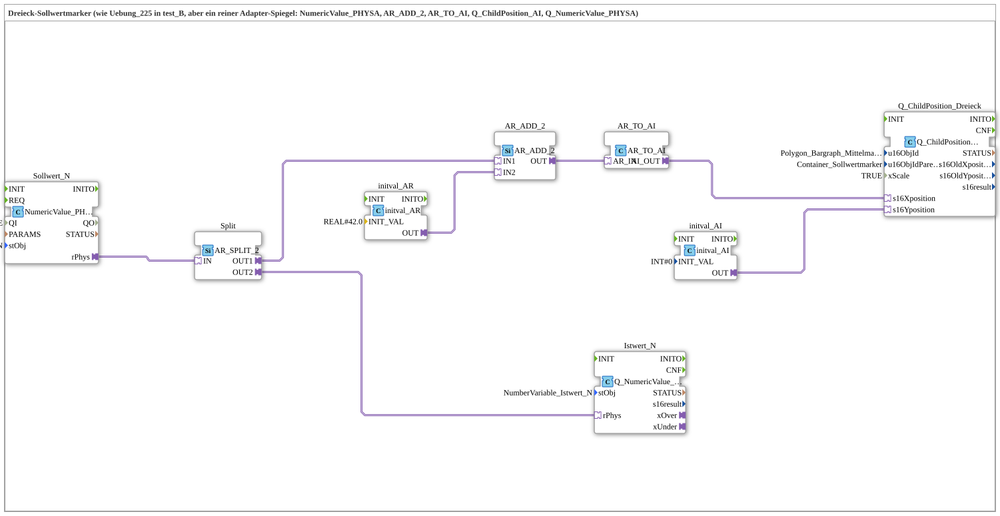

# Uebung_225_AX: Dreieck-Sollwertmarker als reine Adapter-Kette

* * * * * * * * * *

## Einleitung

Diese Übung ist die Adapter-Variante von [Übung 225](../../test_B/Uebungen_doc/Uebung_225.md) (test_B): identische Funktion — ein Dreieck-Marker folgt einem Sollwert um einen festen Mittelpunkt-Offset versetzt —, aber **vollständig** über Adapter verdrahtet. Es gibt in der gesamten SubApp kein einziges plain Event- oder DataConnection mehr; sowohl das Sollwert-Lesen und Istwert-Schreiben als auch die komplette Rechenkette zur Dreieck-Bewegung laufen über generische Adapter-Bausteine.

## Verwendete Funktionsbausteine (FBs)

- **Sollwert_N** (`isobus::UT::io::NumericValue::NumericValue_PHYSA`): AR-Adapter-Variante von `NumericValue_PHYS`.
    - **Parameter**: `QI = TRUE`, `stObj = NumberVariable_Sollwert_N`.
    - **Erklärung**: Liest den physischen Wert von `InputNumber_Sollwert` und stellt ihn statt über ein plain `rPhys`-Datum als AR-Adapter-Plug (`rPhys`) bereit.
- **Split** (`adapter::events::unidirectional::AR_SPLIT_2`): Adapter-Verteiler für einen REAL-Adapterwert.
    - **Parameter**: keine.
    - **Erklärung**: Ein AR-Adapter-Socket darf nur an genau eine Quelle angeschlossen werden, aber hier braucht der eine gelesene Sollwert zwei Abnehmer (Istwert-Rückschreibung und Center-Addition). `AR_SPLIT_2` verteilt den einen AR-Eingang sauber auf `OUT1`/`OUT2`.
- **AR_ADD_2** (`adapter::iec61131::arithmetic::AR_ADD_2`): Adapter-Version der IEC-61131-Addition.
    - **Parameter**: keine.
    - **Erklärung**: Addiert zwei REAL-Adapterwerte (`IN1`, `IN2`) und liefert die Summe als AR-Adapter-Ausgang `OUT`. Hier: Sollwert + Center-Offset.
- **initval_AR** (`adapter::types::unidirectional::AR::initval::initval_AR`): Konstantengeber für einen AR-Adapterwert.
    - **Parameter**: `INIT_VAL = REAL#42.0`.
    - **Erklärung**: Liefert dauerhaft den festen Center-Offset `42.0` als AR-Adapter-Ausgang — der Adapter-native Ersatz für eine plain REAL-Konstante.
- **AR_TO_AI** (`adapter::conversion::unidirectional::AR_TO_AI`): Adapter-Typkonverter REAL → INT.
    - **Parameter**: keine.
    - **Erklärung**: Wandelt den AR-Adapterwert (REAL) in einen AI-Adapterwert (INT) um — die Adapter-native Entsprechung von `F_REAL_TO_INT`.
- **initval_AI** (`adapter::types::unidirectional::AI::initval::initval_AI`): Konstantengeber für einen AI-Adapterwert.
    - **Parameter**: `INIT_VAL = 0`.
    - **Erklärung**: Liefert die feste Y-Position `0` als AI-Adapter-Ausgang.
- **Q_ChildPosition_Dreieck** (`isobus::UT::Q::Q_ChildPosition_AI`): Service-Baustein „Change Child Location“ (ISO 11783-6) mit AI-Adapter-Positionseingängen.
    - **Parameter**: `u16ObjId = Polygon_Bargraph_Mittelmarker`, `u16ObjIdParent = Container_Sollwertmarker`, `xScale = TRUE`.
    - **Erklärung**: Bewegt das Dreieck-Objekt innerhalb seines Containers. `s16Xposition` kommt aus der Rechenkette (`AR_TO_AI.AI_OUT`), `s16Yposition` ist über `initval_AI` fest auf `0` verdrahtet — beide als eigener AI-Adapter-Socket statt als plain INT-Eingang.
- **Istwert_N** (`isobus::UT::Q::Q_NumericValue_PHYSA`): AR-Adapter-Variante von `Q_NumericValue_PHYS`.
    - **Parameter**: `stObj = NumberVariable_Istwert_N`.
    - **Erklärung**: Schreibt den unveränderten Sollwert als Istwert zurück, komplett über den AR-Adapter-Socket `rPhys` statt über ein plain `REQ`/`rValue`-Paar.

### Sub-Bausteine: keine

Die Übung verwendet ausschließlich generische Adapter-Bausteine direkt auf der obersten Ebene der SubApp — keinen eigenen Composite-FB für die Dreieck-Bewegung, im Gegensatz zu den nachfolgenden Übungen 225b_AX/226_AX/227_AX/228_AX, die dafür `PositionMarkerFSA` bzw. `BargraphSplitFS_AR` einsetzen.

## Programmablauf und Verbindungen

1. **Sollwert lesen**: `Sollwert_N` liest `InputNumber_Sollwert` (über `NumberVariable_Sollwert_N`) und liefert ihn als AR-Plug `rPhys`.
2. **Verteilen**: `Sollwert_N.rPhys → Split.IN`. `Split` (`AR_SPLIT_2`) dupliziert den Wert auf zwei unabhängige Ausgänge, da ein Adapter-Socket nicht direkt mehrere Ziele bedienen darf.
3. **Istwert-Zweig**: `Split.OUT2 → Istwert_N.rPhys`. Der Sollwert wird unverändert als Istwert zurückgeschrieben.
4. **Center-Addition**: `Split.OUT1 → AR_ADD_2.IN1`, `initval_AR.OUT (42.0) → AR_ADD_2.IN2`. `AR_ADD_2.OUT` liefert `Sollwert + 42.0`.
5. **Typkonvertierung**: `AR_ADD_2.OUT → AR_TO_AI.AR_IN`. `AR_TO_AI` wandelt das REAL-Ergebnis in ein INT-Adapter-Signal um.
6. **Dreieck bewegen**: `AR_TO_AI.AI_OUT → Q_ChildPosition_Dreieck.s16Xposition` setzt die X-Position; `initval_AI.OUT (0) → Q_ChildPosition_Dreieck.s16Yposition` hält die Y-Position konstant. Das Dreieck (`Polygon_Bargraph_Mittelmarker`) verschiebt sich dadurch horizontal im Container `Container_Sollwertmarker`, um den Sollwert plus 42 Pixel Mittenversatz.
7. Alle Verbindungen laufen ausschließlich über `<AdapterConnections>` — es existiert keine einzige plain Event- oder DataConnection.

## Zusammenfassung

Übung 225_AX zeigt, dass sich eine komplette Signalverarbeitungskette — Lesen, Verteilen, Rechnen, Typkonvertieren, Schreiben — vollständig mit generischen Adapter-Bausteinen abbilden lässt, ohne einen einzigen eigenen Composite-Baustein zu schreiben. Funktional ist sie identisch zur klassischen Lösung in [Übung 225](../../test_B/Uebungen_doc/Uebung_225.md) (test_B), unterscheidet sich aber grundlegend im Verdrahtungsstil: Statt loser Event-/DataConnections zwischen einzelnen FBs entsteht eine durchgängige Adapter-Pipeline aus `AR_SPLIT_2`, `AR_ADD_2`, `initval_AR`, `AR_TO_AI` und `initval_AI`. Diese Übung bildet die Grundlage für 225b_AX, das dieselbe Aufgabe mit einem wiederverwendbaren Composite-Baustein (`PositionMarkerFSA`) statt der losen Adapter-Kette löst.

---

### 🌐 Passende Themen-Unterseiten auf ms-muc-docs.de

- [🌐 Eclipse 4diac IDE & Farb-Referenz auf ms-muc-docs.de](https://www.ms-muc-docs.de/iec-61499/eclipse-4diac/)
