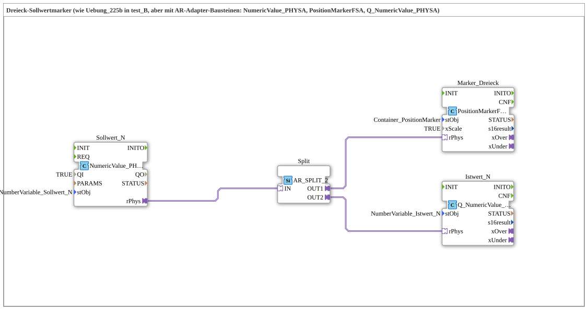

# Uebung_225b_AX: Dreieck-Sollwertmarker mit PositionMarkerFSA

* * * * * * * * * *

## Einleitung

Diese Übung ist die Adapter-Variante von [Übung 225b](../../test_B/Uebungen_doc/Uebung_225b.md) (test_B): identische Funktion — ein geklammerter Dreieck-Marker folgt einem Sollwert —, aber Sollwert-Lesen und Istwert-Schreiben laufen über die AR-Adapter-Bausteine `NumericValue_PHYSA`/`Q_NumericValue_PHYSA` statt über plain `REQ`/`IND`-Events. Die Dreieck-Bewegung selbst nutzt weiterhin den wiederverwendbaren Composite-Baustein `PositionMarkerFS`, jetzt aber über dessen neuen Adapter-Wrapper `PositionMarkerFSA` angesprochen.

## Verwendete Funktionsbausteine (FBs)

- **Sollwert_N** (`isobus::UT::io::NumericValue::NumericValue_PHYSA`): AR-Adapter-Variante von `NumericValue_PHYS`.
    - **Parameter**: `QI = TRUE`, `stObj = NumberVariable_Sollwert_N`.
    - **Erklärung**: Liest den physischen Wert von `InputNumber_Sollwert` und liefert ihn als AR-Adapter-Plug `rPhys`.
- **Split** (`adapter::events::unidirectional::AR_SPLIT_2`): Adapter-Verteiler für einen REAL-Adapterwert.
    - **Parameter**: keine.
    - **Erklärung**: Verteilt den einen gelesenen Sollwert sauber auf die zwei Verbraucher `Marker_Dreieck` und `Istwert_N` — ein Adapter darf nicht direkt auf mehrere Ziele zeigen.
- **Istwert_N** (`isobus::UT::Q::Q_NumericValue_PHYSA`): AR-Adapter-Variante von `Q_NumericValue_PHYS`.
    - **Parameter**: `stObj = NumberVariable_Istwert_N`.
    - **Erklärung**: Schreibt denselben Sollwert unverändert als Istwert zurück, komplett über den AR-Adapter-Socket `rPhys`.

### Sub-Bausteine: Marker_Dreieck (`isobus::UT::Q::PositionMarkerFSA`)

`PositionMarkerFS` selbst besitzt keine AR-Adapter-Schnittstelle. Genau wie `Q_NumericValue_PHYSA` den Baustein `Q_NumericValue_PHYS` um einen AR-Socket herum verpackt, kapselt `PositionMarkerFSA` (`isobus::UT::Q`) jetzt `PositionMarkerFS` auf dieselbe Weise:

- **Parameter der Instanz `Marker_Dreieck`**: `stObj = Container_PositionMarker`, `xScale = TRUE`.
- **Interne Verdrahtung** (im `.fbt` selbst, nicht in dieser Übung geändert): Der AR-Adapter-Socket `rPhys` liefert Event (`E1`) und Datum (`D1`) direkt an eine einzige innenliegende Instanz `Inner` vom Typ `PositionMarkerFS` (`rPhys.E1 → Inner.REQ`, `rPhys.D1 → Inner.rValue`) — die Klammer-Logik (min/max-Begrenzung, Center-Offset) wird also **nicht** dupliziert, sondern unverändert wiederverwendet. `Inner.xOver`/`Inner.xUnder` werden als eigene AX-Adapter-Plugs (`xOver`, `xUnder`) nach außen gereicht, exakt wie bei `Q_NumericValue_PHYSA`. `stObj` und `xScale` werden 1:1 an `Inner` durchgereicht.
- **Bausteindatei**: `Ventilsteuerung\4diacIDE-workspace\.lib\isobus-3.0.0\typelib\UT\Q\PositionMarkerFSA.fbt`.

Die bestehenden Bausteine `NumericValue_PHYSA`, `Q_NumericValue_PHYSA` und `PositionMarkerFS` selbst wurden für diesen Wrapper nicht verändert.

## Programmablauf und Verbindungen

1. **Sollwert lesen**: `Sollwert_N` liest `InputNumber_Sollwert` (über `NumberVariable_Sollwert_N`) und liefert ihn als AR-Plug `rPhys`.
2. **Verteilen**: `Sollwert_N.rPhys → Split.IN`. `Split` (`AR_SPLIT_2`) dupliziert den Wert auf `OUT1` und `OUT2`.
3. **Dreieck bewegen**: `Split.OUT1 → Marker_Dreieck.rPhys`. Intern klammert `PositionMarkerFSA` den Wert wie gewohnt (min/max, Center-Offset, `xScale`) und positioniert das Dreieck; bei Überschreitung meldet es dies über seine eigenen `xOver`/`xUnder`-Adapter-Plugs (in dieser Übung nicht weiterverdrahtet).
4. **Istwert zurückschreiben**: `Split.OUT2 → Istwert_N.rPhys`. Der unveränderte Sollwert wird als Istwert zurückgeschrieben.
5. Alles läuft ausschließlich über `<AdapterConnections>` — keine einzige plain Event- oder DataConnection, genau wie bei `Uebung_011b1_PHYSA`.

## Zusammenfassung

Übung 225b_AX führt die reine Adapter-Kette aus 225_AX auf die Wiederverwendung eines bewährten Composite-Bausteins zurück: Statt Center-Addition, Typkonvertierung und Positionierung als lose Adapter-Bausteine zu verdrahten, übernimmt `PositionMarkerFSA` die komplette Klammer-Logik von `PositionMarkerFS` und reicht sie über einen einzigen AR-Adapter-Socket nach außen. Funktional entspricht die Übung exakt [Übung 225b](../../test_B/Uebungen_doc/Uebung_225b.md) (test_B) — nur der Verdrahtungsstil (Adapter statt plain Events) unterscheidet sich. Das gleiche Wrapper-Muster wird in Übung 226_AX für den Split-Bargraph (`BargraphSplitFS_AR`) wiederverwendet.

---

### 🌐 Passende Themen-Unterseiten auf ms-muc-docs.de

- [🌐 Eclipse 4diac IDE & Farb-Referenz auf ms-muc-docs.de](https://www.ms-muc-docs.de/iec-61499/eclipse-4diac/)
