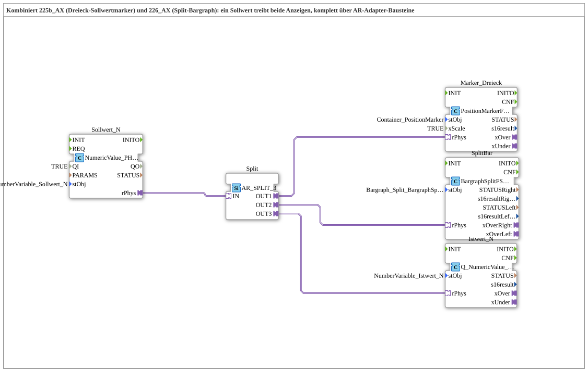

# Uebung_227_AX: Dreieck-Sollwertmarker und Split-Bargraph aus einer gemeinsamen Quelle

* * * * * * * * * *

## Einleitung

Diese Übung kombiniert [Übung 225b_AX](./Uebung_225b_AX.md) (Dreieck-Sollwertmarker) und [Übung 226_AX](./Uebung_226_AX.md) (Split-Bargraph): **ein** Sollwert treibt **beide** Anzeigen gleichzeitig sowie die Istwert-Rückschreibung. Anders als die beiden Einzelübungen läuft hier alles konsequent über AR-Adapter-Bausteine — da Übung 226_AX ihren Sollwert bereits nur über den AR-Adapter `NumericValue_PHYSA` liest, müssen für eine gemeinsame Quelle beide Verbraucher denselben Verdrahtungsstil (Adapter) verwenden.

## Verwendete Funktionsbausteine (FBs)

- **Sollwert_N** (`isobus::UT::io::NumericValue::NumericValue_PHYSA`): AR-Adapter-Variante von `NumericValue_PHYS`.
    - **Parameter**: `QI = TRUE`, `stObj = NumberVariable_Sollwert_N`.
    - **Erklärung**: Liest `NumberVariable_Sollwert_N` (die an `InputNumber_Sollwert`, VT-Objekt 9000, gebundene Variable) und liefert den Wert als AR-Adapter-Plug `rPhys`.
- **Split** (`adapter::events::unidirectional::AR_SPLIT_3`): Adapter-Verteiler für einen REAL-Adapterwert auf drei Ziele.
    - **Parameter**: keine.
    - **Erklärung**: Verteilt den einen gelesenen Sollwert sauber auf die drei Verbraucher `Marker_Dreieck`, `SplitBar` und `Istwert_N` — ein Adapter darf nicht direkt auf mehrere Ziele zeigen. Gegenüber `AR_SPLIT_2` in 225b_AX kommt hier ein dritter Ausgang hinzu.
- **Istwert_N** (`isobus::UT::Q::Q_NumericValue_PHYSA`): AR-Adapter-Variante von `Q_NumericValue_PHYS`.
    - **Parameter**: `stObj = NumberVariable_Istwert_N`.
    - **Erklärung**: Schreibt denselben Sollwert als Istwert auf `NumberVariable_Istwert` zurück — dies treibt sowohl `InputNumber_Istwert` als auch den bestehenden Einzel-Bargraph-Zeiger.

### Sub-Bausteine: Marker_Dreieck (`PositionMarkerFSA`) und SplitBar (`BargraphSplitFS_AR`)

Diese Übung führt keine neuen Bausteintypen ein, sondern kombiniert zwei bereits bekannte Wrapper aus den Vorübungen an derselben Quelle:

- **Marker_Dreieck** (`isobus::UT::Q::PositionMarkerFSA`, `stObj = Container_PositionMarker`, `xScale = TRUE`): bewegt das Dreieck genau wie in [Übung 225b_AX](./Uebung_225b_AX.md) beschrieben — intern eine einzige `PositionMarkerFS`-Instanz mit Klammerung und `xOver`/`xUnder`-Plugs.
- **SplitBar** (`isobus::UT::Q::BargraphSplitFS_AR`, `stObj = Bargraph_Split_BargraphSplit`): steuert den Split-Bargraphen genau wie in [Übung 226_AX](./Uebung_226_AX.md) beschrieben — intern eine einzige `BargraphSplitFS`-Instanz mit Klammerung und `xOverRight`/`xOverLeft`-Plugs.

## Programmablauf und Verbindungen

1. **Sollwert lesen**: `Sollwert_N` liest `NumberVariable_Sollwert_N` und liefert den Wert als AR-Plug `rPhys`.
2. **Verteilen**: `Sollwert_N.rPhys → Split.IN`. `Split` (`AR_SPLIT_3`) dupliziert den Wert auf drei unabhängige Ausgänge `OUT1`, `OUT2`, `OUT3`.
3. **Dreieck bewegen**: `Split.OUT1 → Marker_Dreieck.rPhys`. Das Dreieck (`Polygon_Bargraph_Mittelmarker` im Container `Container_PositionMarker`) folgt dem Sollwert mit Klammerung und Skalierung (`xScale = TRUE`).
4. **Split-Bargraph ansteuern**: `Split.OUT2 → SplitBar.rPhys`. Je nach Vorzeichen füllt sich der linke oder rechte Bargraph (`Bargraph_Split_links`/`_rechts`) passend zum Betrag.
5. **Istwert zurückschreiben**: `Split.OUT3 → Istwert_N.rPhys`. Derselbe Sollwert wird unverändert als Istwert auf `NumberVariable_Istwert` zurückgeschrieben; das treibt gleichzeitig `InputNumber_Istwert` und den bereits bestehenden Einzel-Bargraph-Zeiger.
6. Alles läuft ausschließlich über `<AdapterConnections>` — keine einzige plain Event- oder DataConnection.

Am echten Terminal zeigt sich das Zusammenspiel: Wird der Sollwert geändert, folgt das Dreieck, der Split-Bargraph füllt die passende Seite, und sowohl das Istwert-Feld als auch der bestehende Einzel-Bargraph-Zeiger zeigen denselben Wert an.

## Zusammenfassung

Übung 227_AX zeigt, wie sich mehrere unabhängige VT-Anzeigen ohne neue Bausteintypen aus einer einzigen Sollwertquelle speisen lassen, sobald alle Verbraucher konsequent über AR-Adapter angesprochen werden: `AR_SPLIT_3` verteilt den einen gelesenen Wert auf `PositionMarkerFSA`, `BargraphSplitFS_AR` und `Q_NumericValue_PHYSA`, ohne Duplizierung der Lese-Logik. Die Übung baut direkt auf 225b_AX und 226_AX auf und bildet die Grundlage für Übung 228_AX, die zusätzlich eine vierte Verwendung des Sollwerts — eine Farblogik für das Dreieck — einführt.

---

### 🌐 Passende Themen-Unterseiten auf ms-muc-docs.de

- [🌐 Eclipse 4diac IDE & Farb-Referenz auf ms-muc-docs.de](https://www.ms-muc-docs.de/iec-61499/eclipse-4diac/)
