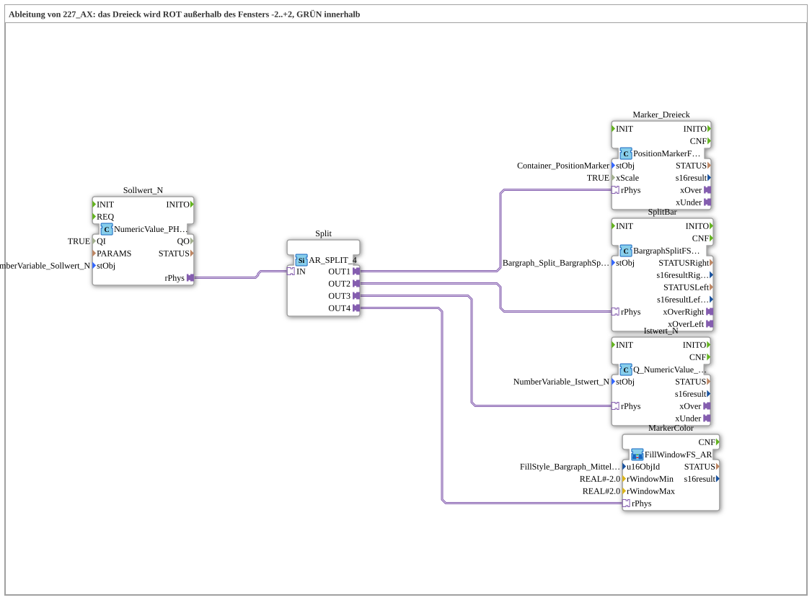

# Uebung_228_AX: Fenster-Farbrückmeldung am Dreieck (Change Fill Attributes, ISO 11783-6 F.32)

* * * * * * * * * *

## Einleitung

Diese Übung ist eine Ableitung von `Uebung_227_AX.md`: der Sollwert bewegt weiterhin ein Dreieck (Positionsmarker) und einen Split-Bargraph und wird als Istwert zurückgeschrieben, alles über AR-Adapter. Zusätzlich färbt sich das Dreieck selbst grün, solange der Sollwert im Fenster -2…+2 liegt, und rot, sobald er dieses Fenster verlässt. Die Übung demonstriert damit den Einsatz von Change Fill Attributes (ISO 11783-6, F.32) als einfache Statusanzeige auf dem VT-Terminal.

## Verwendete Funktionsbausteine (FBs)

- **Sollwert_N**: Terminal-Eingabe für den Sollwert
    - **Parameter**: `QI = TRUE`, `stObj = NumberVariable_Sollwert_N`
    - **Erklärung**: Liest den vom Bediener eingegebenen Sollwert vom VT-Terminal und stellt ihn als physikalischen Wert (`rPhys`, AR-Adapter) bereit.
- **Split**: Verteiler für den Sollwert
    - **Typ**: `adapter::events::unidirectional::AR_SPLIT_4`
    - **Parameter**: keine
    - **Erklärung**: Verteilt den einen eingehenden AR-Sollwert auf vier unabhängige Verbraucher (eine Stelle mehr als in `Uebung_227_AX.md`, das nur drei benötigte): Dreieck-Position, Split-Bargraph, Istwert-Rückschreibung und die neue Farblogik.
- **Marker_Dreieck**: Positionsmarker (Dreieck) auf dem Terminal
    - **Typ**: `isobus::UT::Q::PositionMarkerFSA`
    - **Parameter**: `stObj = Container_PositionMarker`, `xScale = TRUE`
    - **Erklärung**: Positioniert das Dreieck-Objekt entsprechend dem Sollwert.
- **SplitBar**: Split-Bargraph auf dem Terminal
    - **Typ**: `isobus::UT::Q::BargraphSplitFS_AR`
    - **Parameter**: `stObj = Bargraph_Split_BargraphSplit`
    - **Erklärung**: Stellt den Sollwert zusätzlich als geteilten Bargraph dar.
- **Istwert_N**: Terminal-Ausgabe des Istwerts
    - **Typ**: `isobus::UT::Q::Q_NumericValue_PHYSA`
    - **Parameter**: `stObj = NumberVariable_Istwert_N`
    - **Erklärung**: Schreibt den (unverändert durchgereichten) Sollwert als Istwert auf das Terminal zurück.
- **MarkerColor**: Fenster-Farblogik für das Dreieck
    - **Typ**: `isobus::UT::Q::FillWindowFS_AR` (SubApp-Instanz)
    - **Parameter**: `u16ObjId = FillStyle_Bargraph_Mittelmarker_Gruen`, `rWindowMin = REAL#-2.0`, `rWindowMax = REAL#2.0`
    - **Erklärung**: Erhält den Sollwert über einen AR-Socket und färbt das exklusiv vom Dreieck genutzte FillAttributes-Objekt `FillStyle_Bargraph_Mittelmarker_Gruen` per Change Fill Attributes (ISO 11783-6 F.32) grün, solange der Sollwert im Fenster -2…+2 liegt, sonst rot. Da dieses FillAttributes-Objekt exklusiv vom Dreieck (`Polygon_Bargraph_Mittelmarker`) verwendet wird, beeinflusst das Umfärben keine anderen Objekte auf dem Terminal.

### Sub-Bausteine: `FillWindowFS_AR` (SubAppType)

`FillWindowFS_AR` wurde nach dem Vorbild von `MyLib_AX-1.0.0\typelib\sys\GreenRedBackground1_AX.SUB` als eigener `SubAppType` gebaut, statt als `FBType` mit einer ST-Hilfsfunktion — ausschließlich aus vorhandenen generischen Adapter-Bausteinen, ohne eigene ST-Logik:

- **Split** (`AR_SPLIT_2`): verteilt den ankommenden AR-Sollwert auf zwei Vergleicher.
- **WindowMinConst**/**WindowMaxConst** (`initval_AR`): stellen die konstanten Fenstergrenzen (`rWindowMin`/`rWindowMax`) als AR-Werte bereit.
- **GE_Min** (`AR_GE`) prüft `Sollwert >= rWindowMin`, **LE_Max** (`AR_LE`) prüft `Sollwert <= rWindowMax`.
- **InWindow** (`AX_AND_2`) UND-verknüpft beide Vergleichsergebnisse zu einem Boolean "im Fenster?".
- **ColorSel** (`AX_SEL`, `IN0 = COLOR_RED`, `IN1 = COLOR_GREEN`) wählt anhand von `InWindow` zwischen Rot und Grün.
- **Inner** (`Q_FillAttributes`, `u8FillType = USINT#2`, `u16FillPatternId = ID_NULL`) sendet die gewählte Farbe als Change-Fill-Attributes-Kommando (feste Farbe, kein Muster) an das per `u16ObjId` referenzierte VT-Objekt.

## Programmablauf und Verbindungen

1. Der Bediener gibt am Terminal einen Sollwert ein, der über `Sollwert_N.rPhys` als AR-Adapterwert bereitgestellt wird.
2. Die Adapterverbindung `Sollwert_N.rPhys → Split.IN` speist den Sollwert in den Verteiler `AR_SPLIT_4`.
3. `Split.OUT1 → Marker_Dreieck.rPhys` bewegt das Dreieck entsprechend dem Sollwert.
4. `Split.OUT2 → SplitBar.rPhys` stellt denselben Sollwert zusätzlich als Split-Bargraph dar.
5. `Split.OUT3 → Istwert_N.rPhys` schreibt den Sollwert unverändert als Istwert auf das Terminal zurück.
6. `Split.OUT4 → MarkerColor.rPhys` speist denselben Sollwert zusätzlich in die neue Fenster-Farblogik.
7. Innerhalb von `MarkerColor` (`FillWindowFS_AR`) wird der Sollwert per `AR_SPLIT_2` auf `AR_GE` (`>= -2.0`) und `AR_LE` (`<= +2.0`) verteilt, die Ergebnisse werden mit `AX_AND_2` UND-verknüpft und bestimmen über `AX_SEL`, ob `COLOR_GREEN` oder `COLOR_RED` an `Q_FillAttributes` übergeben wird.
8. `Q_FillAttributes` sendet ein Change-Fill-Attributes-Kommando (ISO 11783-6 F.32) an das FillAttributes-Objekt `FillStyle_Bargraph_Mittelmarker_Gruen`, wodurch sich die Füllfarbe des Dreiecks live ändert — grün innerhalb, rot außerhalb des Fensters -2…+2.

## Zusammenfassung

Die Übung 228 erweitert den aus `Uebung_227_AX.md` bekannten Aufbau (Dreieck, Split-Bargraph, Istwert, alles über AR-Adapter) um eine vierte, unabhängige Verbrauchsstelle des Sollwerts: eine Fenster-basierte Farbrückmeldung, die das Dreieck selbst grün oder rot einfärbt. Sie zeigt, wie Change Fill Attributes (ISO 11783-6 F.32) genutzt werden kann, um ein einzelnes, exklusiv genutztes VT-Objekt als Statusanzeige umzufunktionieren, und wie sich eine solche Fensterlogik allein aus generischen Adapter-Bausteinen (Split, Vergleich, UND, Auswahl) zusammensetzen lässt, ohne eigene ST-Logik schreiben zu müssen.

---

### 🌐 Passende Themen-Unterseiten auf ms-muc-docs.de

- [🌐 Eclipse 4diac IDE & Farb-Referenz auf ms-muc-docs.de](https://www.ms-muc-docs.de/iec-61499/eclipse-4diac/)
