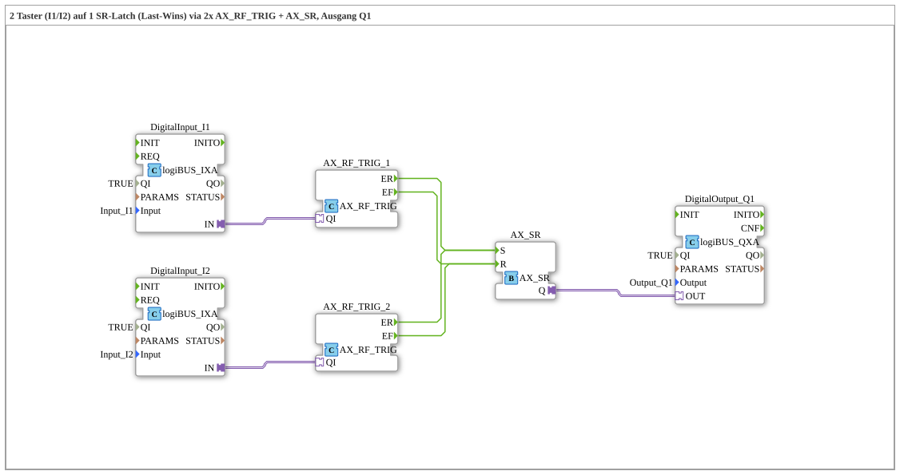

# Uebung_229_AX: Zwei Taster, ein SR-Latch (Last-Wins) mit AX_RF_TRIG

* * * * * * * * * *

## Einleitung

Diese Übung schaltet zwei tastende Taster (`I1`, `I2`) auf denselben digitalen Ausgang `Q1`. Da beide Taster tastend sind (kein Dauersignal), wird eine Set-Reset-Verriegelung (`AX_SR`) benötigt. Die Übung baut dabei bewusst eine "Last-Wins"-Verriegelung: nicht nur das Drücken, sondern auch das Loslassen beider Taster wirkt auf denselben Latch — welche Flanke zuletzt auftrat, bestimmt den Zustand von `Q1`.

## Verwendete Funktionsbausteine (FBs)

- **DigitalInput_I1**, **DigitalInput_I2**: logiBUS Digitaleingänge
    - **Typ**: `logiBUS::io::DI::logiBUS_IXA`
    - **Parameter**: `QI = TRUE`, `Input = Input_I1` bzw. `Input_I2`
    - **Erklärung**: Koppeln die beiden physischen Taster-Eingänge an die Adapterschnittstelle.
- **AX_RF_TRIG_1**, **AX_RF_TRIG_2**: Flankenerkennung je Taster
    - **Typ**: `adapter::events::unidirectional::AX_RF_TRIG`
    - **Parameter**: keine
    - **Erklärung**: Jeder physische Eingang wird von einer eigenen Instanz beobachtet. Jede Instanz meldet die steigende Flanke (`ER`, Taster gedrückt) und die fallende Flanke (`EF`, Taster losgelassen) als zwei separate Events.
- **AX_SR**: gemeinsame Set-Reset-Verriegelung
    - **Typ**: `adapter::events::unidirectional::AX_SR`
    - **Parameter**: keine
    - **Erklärung**: Set-dominante Verriegelung. Beide `AX_RF_TRIG`-Instanzen speisen denselben `AX_SR`: beide steigenden Flanken (`ER` von I1 und I2) laufen auf `AX_SR.S`, beide fallenden Flanken (`EF` von I1 und I2) auf `AX_SR.R`. Das ist in 4diac legal, da EventConnections — anders als DataConnections — mehrere Quellen auf ein Ziel erlauben; es entsteht eine reine ODER-Verknüpfung ohne zusätzlichen Baustein.
- **DigitalOutput_Q1**: logiBUS Digitalausgang
    - **Typ**: `logiBUS::io::DQ::logiBUS_QXA`
    - **Parameter**: `QI = TRUE`, `Output = Output_Q1`
    - **Erklärung**: Gibt den Zustand von `AX_SR.Q` an den physischen Ausgang `Q1` weiter.

### Sub-Bausteine: keine

Die Übung verwendet keine weiteren Unterbausteine, alle FBs sind direkt auf der obersten Ebene der SubApp angeordnet.

## Programmablauf und Verbindungen

1. `DigitalInput_I1.IN` → `AX_RF_TRIG_1.QI` und `DigitalInput_I2.IN` → `AX_RF_TRIG_2.QI` (AdapterConnections): die physischen Tasterzustände werden an die jeweilige Flankenerkennung übergeben.
2. `AX_RF_TRIG_1.ER` → `AX_SR.S` und `AX_RF_TRIG_2.ER` → `AX_SR.S` (EventConnections): die steigenden Flanken beider Taster setzen den Latch.
3. `AX_RF_TRIG_1.EF` → `AX_SR.R` und `AX_RF_TRIG_2.EF` → `AX_SR.R` (EventConnections): die fallenden Flanken beider Taster setzen den Latch zurück.
4. `AX_SR.Q` → `DigitalOutput_Q1.OUT` (AdapterConnection): der Latch-Zustand wird auf den physischen Ausgang `Q1` gelegt.

**Wichtig — Last-Wins, nicht "hält nach Loslassen"**: Der Ausgang `Q1` folgt nicht dem Zustand eines bestimmten Tasters, sondern immer der zuletzt aufgetretenen Flanke, egal an welchem Taster. Drückt man `I1`, geht `Q1` EIN. Lässt man `I1` wieder los, geht `Q1` sofort wieder AUS — auch wenn `I2` zu diesem Zeitpunkt noch gedrückt gehalten wird. Ebenso setzt `I2`s steigende Flanke `Q1` auf EIN, und `I2`s fallende Flanke schaltet `Q1` sofort wieder AUS, unabhängig vom Zustand von `I1`. Jedes Loslassen eines beliebigen der beiden Taster schaltet `Q1` also sofort AUS, selbst wenn der andere Taster noch gehalten wird — es handelt sich ausdrücklich nicht um ein Verhalten, bei dem `Q1` EIN bleibt, solange irgendein Taster gehalten wird.

## Zusammenfassung

Die Übung 229 demonstriert, wie zwei unabhängige Ereignisquellen über einfache EventConnections auf denselben Set- bzw. Reset-Eingang eines Latches geführt werden können, ohne einen zusätzlichen ODER-Baustein zu benötigen. Das Ergebnis ist eine bewusst als "Last-Wins" konzipierte Verriegelung, deren Zustand stets der zuletzt aufgetretenen Flanke folgt — ein Verhalten, das von einer klassischen Halte-Logik zu unterscheiden ist. Siehe `Uebung_230_AX.md` für dieselbe Funktion, umgesetzt mit ASR-Adapter-Bausteinen anstelle loser Event-Verkabelung.

---

### 🌐 Passende Themen-Unterseiten auf ms-muc-docs.de

- [🌐 Eclipse 4diac IDE & Farb-Referenz auf ms-muc-docs.de](https://www.ms-muc-docs.de/iec-61499/eclipse-4diac/)
