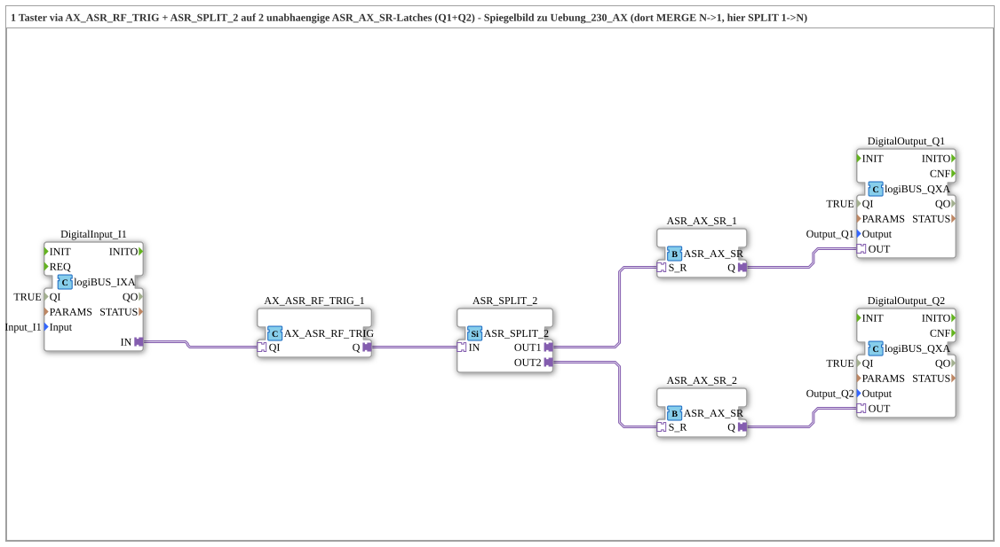

# Uebung_231_AX: Ein Taster über ASR_SPLIT_2 auf zwei unabhängige Latches (Fan-out)

* * * * * * * * * *

## Einleitung

Diese Übung ist das Spiegelbild von `Uebung_230_AX.md`: dort führte `ASR_MERGE_2` zwei Quellen zu einem gemeinsamen Latch zusammen (N→1, Fan-in). Hier steuert genau ein Taster (`I1`) über `ASR_SPLIT_2` zwei unabhängige Latches gleichzeitig (1→N, Fan-out). Die Übung demonstriert, dass ein Adapter-Plug strikt punkt-zu-punkt ist und deshalb — genau spiegelbildlich zum Merge-Fall — ein Split-Baustein nötig ist, um einen einzelnen ASR-Stream verlustfrei auf mehrere Ziele zu verteilen.

## Verwendete Funktionsbausteine (FBs)

- **DigitalInput_I1**: logiBUS Digitaleingang
    - **Typ**: `logiBUS::io::DI::logiBUS_IXA`
    - **Parameter**: `QI = TRUE`, `Input = Input_I1`
    - **Erklärung**: Koppelt den physischen Taster-Eingang an die Adapterschnittstelle.
- **AX_ASR_RF_TRIG_1**: Flankenerkennung mit ASR-Ausgang
    - **Typ**: `adapter::events::unidirectional::AX_ASR_RF_TRIG`
    - **Parameter**: keine
    - **Erklärung**: Taster drücken (steigende Flanke) → `SET`, loslassen (fallende Flanke) → `RESET`, als ein einziges gebündeltes `ASR`-Signal — derselbe Baustein wie in `Uebung_230_AX.md`.
- **ASR_SPLIT_2**: Verteiler für den einen ASR-Stream
    - **Typ**: `adapter::events::unidirectional::ASR_SPLIT_2`
    - **Parameter**: keine
    - **Erklärung**: Ein Adapter-Plug (`AX_ASR_RF_TRIG_1.Q`) ist strikt punkt-zu-punkt — er kann nicht direkt gleichzeitig an zwei `ASR_AX_SR.S_R`-Sockets angeschlossen werden. Genau dieselbe Grundregel, die in `Uebung_230_AX.md` `ASR_MERGE_2` nötig machte (mehrere Quellen können nicht direkt auf einen Adapter-Socket zeigen — anders als bei den rohen `EventConnections` in `Uebung_229_AX.md`, wo das erlaubt ist), erzwingt hier umgekehrt `ASR_SPLIT_2` (eine Quelle kann nicht direkt zwei Sockets gleichzeitig bedienen). `ASR_SPLIT_2` dupliziert den einen ASR-Stream verlustfrei auf zwei Ausgänge.
- **ASR_AX_SR_1**, **ASR_AX_SR_2**: zwei unabhängige Set-Reset-Verriegelungen
    - **Typ**: `adapter::events::unidirectional::ASR_AX_SR`
    - **Parameter**: keine
    - **Erklärung**: Zwei getrennte Instanzen desselben Latch-Bausteins wie in `Uebung_230_AX.md`. Beide erhalten über `ASR_SPLIT_2` exakt dieselben SET/RESET-Kommandos zur exakt gleichen Zeit und laufen daher synchron, obwohl sie zwei komplett unabhängige Bausteine mit je eigenem Ausgang sind — es gibt keine direkte Verbindung zwischen ihnen.
- **DigitalOutput_Q1**, **DigitalOutput_Q2**: logiBUS Digitalausgänge
    - **Typ**: `logiBUS::io::DQ::logiBUS_QXA`
    - **Parameter**: `QI = TRUE`, `Output = Output_Q1` bzw. `Output_Q2`
    - **Erklärung**: Geben die Zustände von `ASR_AX_SR_1.Q` bzw. `ASR_AX_SR_2.Q` an die physischen Ausgänge weiter.

### Sub-Bausteine: keine

Die Übung verwendet keine weiteren Unterbausteine, alle FBs sind direkt auf der obersten Ebene der SubApp angeordnet.

## Programmablauf und Verbindungen

1. `DigitalInput_I1.IN` → `AX_ASR_RF_TRIG_1.QI`: der physische Tasterzustand wird an die Flankenerkennung übergeben.
2. `AX_ASR_RF_TRIG_1.Q` → `ASR_SPLIT_2.IN`: das gebündelte SET/RESET-Signal läuft in den Verteiler.
3. `ASR_SPLIT_2.OUT1` → `ASR_AX_SR_1.S_R` und `ASR_SPLIT_2.OUT2` → `ASR_AX_SR_2.S_R`: derselbe ASR-Stream wird verlustfrei auf beide Latches dupliziert.
4. `ASR_AX_SR_1.Q` → `DigitalOutput_Q1.OUT` und `ASR_AX_SR_2.Q` → `DigitalOutput_Q2.OUT`: beide Latch-Zustände werden auf die jeweiligen physischen Ausgänge gelegt.

**Verhalten**: Wird `I1` gedrückt und gehalten, gehen `Q1` UND `Q2` gleichzeitig EIN. Lässt man `I1` los, gehen beide gleichzeitig AUS. `ASR_AX_SR_1` und `ASR_AX_SR_2` sind zwei getrennte Instanzen, die ausschließlich über den gemeinsamen `ASR_SPLIT_2`-Ursprung gekoppelt sind — es besteht keine direkte Verbindung zwischen ihnen.

## Zusammenfassung

Die Übung 231 zeigt die zu `Uebung_230_AX.md` spiegelbildliche Situation: während dort mehrere Quellen über `ASR_MERGE_2` auf einen gemeinsamen Latch zusammengeführt wurden (Fan-in), verteilt hier `ASR_SPLIT_2` eine einzelne Quelle auf mehrere unabhängige Latches (Fan-out). Beide Übungen zusammen verdeutlichen die grundlegende Punkt-zu-Punkt-Natur von Adapter-Plugs und -Sockets in 4diac und die dafür vorgesehenen Split-/Merge-Bausteine, mit denen sich diese Einschränkung sauber auflösen lässt.

---

### 🌐 Passende Themen-Unterseiten auf ms-muc-docs.de

- [🌐 Eclipse 4diac IDE & Farb-Referenz auf ms-muc-docs.de](https://www.ms-muc-docs.de/iec-61499/eclipse-4diac/)
