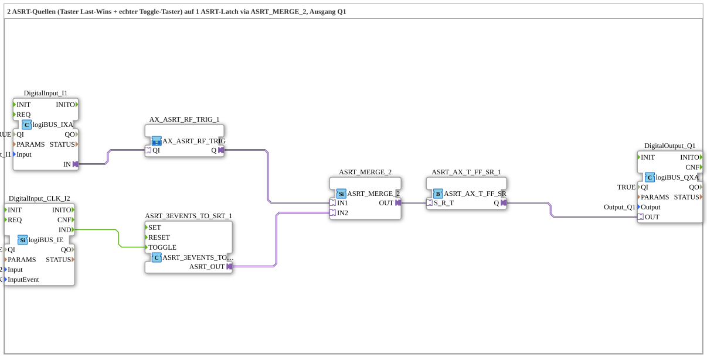

# Uebung_232_AX: Zwei ASRT-Quellen (Taster + echter Toggle-Taster) auf ein ASRT-Latch

* * * * * * * * * *

## Einleitung

Diese Übung ist ein direktes Geschwister zu `Uebung_229_AX.md`/`Uebung_230_AX.md`, verwendet jedoch durchgängig `ASRT` (Set/Reset/Toggle) statt `ASR` (nur Set/Reset): zwei unabhängige Quellen liefern je einen Teil der SET/RESET/TOGGLE-Semantik, `ASRT_MERGE_2` führt beide zu einem gemeinsamen `ASRT_AX_T_FF_SR`-Latch zusammen. Die Übung zeigt damit, wie sich ein klassischer Last-Wins-Taster und ein echter Toggle-Taster unabhängig voneinander auf denselben Ausgang wirken lassen.

## Verwendete Funktionsbausteine (FBs)

- **DigitalInput_I1**: logiBUS Digitaleingang für den klassischen Taster
    - **Typ**: `logiBUS::io::DI::logiBUS_IXA`
    - **Parameter**: `QI = TRUE`, `Input = Input_I1`
    - **Erklärung**: Koppelt den physischen Taster-Eingang `I1` an die Adapterschnittstelle.
- **DigitalInput_CLK_I2**: logiBUS Eingang mit Klick-Erkennung für den Toggle-Taster
    - **Typ**: `logiBUS::io::DI::logiBUS_IE`
    - **Parameter**: `QI = TRUE`, `Input = Input_I2`, `InputEvent = BUTTON_SINGLE_CLICK`
    - **Erklärung**: Erkennt einen einzelnen Klick auf `I2` und meldet ihn als Event `IND`.
- **AX_ASRT_RF_TRIG_1**: Quelle 1 — klassischer Taster mit Last-Wins-Verhalten
    - **Typ**: `MyLib::sys::AX_ASRT_RF_TRIG` (SubApp-Instanz)
    - **Parameter**: keine
    - **Erklärung**: Drücken (steigende Flanke) → `SET`, Loslassen (fallende Flanke) → `RESET`, ausgegeben als gebündeltes `ASRT`-Signal. `TOGGLE` feuert hier nie — nicht grundsätzlich, sondern weil `AX_ASRT_RF_TRIG`s `TOGGLE_IN` intern unverdrahtet bleibt (siehe "Sub-Bausteine" unten).
- **ASRT_3EVENTS_TO_SRT_1**: Quelle 2 — echter Toggle-Taster
    - **Typ**: `adapter::conversion::unidirectional::ASRT_3EVENTS_TO_SRT`
    - **Parameter**: keine
    - **Erklärung**: Nur der `TOGGLE`-Eingang ist verdrahtet (gespeist von `I2`s `BUTTON_SINGLE_CLICK`), `SET`/`RESET` bleiben unbenutzt. Erzeugt daraus ein gebündeltes `ASRT`-Signal, das ausschließlich die TOGGLE-Schiene trägt.
- **ASRT_MERGE_2**: Zusammenführung der beiden ASRT-Quellen
    - **Typ**: `adapter::events::unidirectional::ASRT_MERGE_2`
    - **Parameter**: keine
    - **Erklärung**: Vereinigt beide ASRT-Streams zu einem gemeinsamen Signal — dieselbe ODER-Zusammenführung wie bei `ASR_MERGE_2` in `Uebung_230_AX.md`, jetzt inklusive der dritten (Toggle-)Schiene.
- **ASRT_AX_T_FF_SR_1**: gemeinsame Set-Reset-Toggle-Verriegelung
    - **Typ**: `adapter::events::unidirectional::ASRT_AX_T_FF_SR`
    - **Parameter**: keine
    - **Erklärung**: Nimmt das zusammengeführte SET/RESET/TOGGLE-Signal über den `S_R_T`-Socket entgegen und steuert daraus den Ausgangszustand `Q`.
- **DigitalOutput_Q1**: logiBUS Digitalausgang
    - **Typ**: `logiBUS::io::DQ::logiBUS_QXA`
    - **Parameter**: `QI = TRUE`, `Output = Output_Q1`
    - **Erklärung**: Gibt den Zustand von `ASRT_AX_T_FF_SR_1.Q` an den physischen Ausgang `Q1` weiter.

### Sub-Bausteine: `AX_ASRT_RF_TRIG` (Composite-SubApp)

`AX_ASRT_RF_TRIG` liegt als Composite-SubApp in `MyLib_AX-1.0.0/typelib/sys/AX_ASRT_RF_TRIG.SUB` und wurde aus bereits vorhandenen Bausteinen zusammengesetzt statt als neuer Low-Level-FBType: dem bestehenden `AX_ASR_RF_TRIG` (Flankenerkennung mit ASR-Ausgang, siehe `Uebung_230_AX.md`) plus `ASRT_SR_AE_TO_SRT`, dessen `SR_IN` direkt aus dem ASR-Ausgang gespeist wird und dessen `TOGGLE_IN` unverdrahtet bleibt. So entsteht ein ASRT-Signal, das nur SET/RESET trägt und niemals TOGGLE feuert.

## Programmablauf und Verbindungen

1. `DigitalInput_I1.IN` → `AX_ASRT_RF_TRIG_1.QI` (AdapterConnection): der physische Tasterzustand von `I1` speist Quelle 1.
2. `DigitalInput_CLK_I2.IND` → `ASRT_3EVENTS_TO_SRT_1.TOGGLE` (EventConnection): jeder Einzelklick auf `I2` löst ein TOGGLE-Ereignis in Quelle 2 aus.
3. `AX_ASRT_RF_TRIG_1.Q` → `ASRT_MERGE_2.IN1` und `ASRT_3EVENTS_TO_SRT_1.ASRT_OUT` → `ASRT_MERGE_2.IN2` (AdapterConnections): beide ASRT-Quellen laufen in den Merge-Baustein.
4. `ASRT_MERGE_2.OUT` → `ASRT_AX_T_FF_SR_1.S_R_T`: das zusammengeführte SET/RESET/TOGGLE-Signal steuert die gemeinsame Verriegelung.
5. `ASRT_AX_T_FF_SR_1.Q` → `DigitalOutput_Q1.OUT`: der Latch-Zustand wird auf den physischen Ausgang `Q1` gelegt.

**Verhalten**: `I1` liefert weiterhin dasselbe Last-Wins-Verhalten wie in `Uebung_229_AX.md`/`Uebung_230_AX.md`: Drücken löst `SET` aus (`Q1` → EIN), Loslassen löst `RESET` aus (`Q1` → AUS). Der Toggle-Taster `I2` wirkt davon unabhängig: Jeder Klick auf `I2` togglet den aktuellen Zustand von `Q1` sofort um, unabhängig vom physischen Zustand von `I1`. Das bedeutet konkret: Hält man `I1` gedrückt (`Q1` also gerade durch `SET` auf EIN), kann ein Klick auf `I2` `Q1` trotzdem auf AUS umschalten, obwohl `I1` weiterhin gedrückt bleibt — `Q1` folgt hier also nicht permanent dem Haltezustand von `I1`, sondern jeweils dem zuletzt eingetroffenen SET-, RESET- oder TOGGLE-Ereignis, unabhängig davon, von welcher der beiden Quellen es stammt.

## Zusammenfassung

Die Übung 232 kombiniert zwei grundverschiedene Bedienphilosophien auf einem gemeinsamen Latch: einen klassischen Last-Wins-Taster (SET/RESET aus Flanken, wie in `Uebung_229_AX.md`/`Uebung_230_AX.md`) und einen echten Toggle-Taster (ausschließlich TOGGLE, ausgelöst durch einen Einzelklick), zusammengeführt über `ASRT_MERGE_2` auf `ASRT_AX_T_FF_SR`. Sie zeigt, dass sich die ASR-Adaptertechnik aus den Vorgänger-Übungen um eine dritte, unabhängige Toggle-Schiene erweitern lässt, ohne die bestehende Merge-Logik grundlegend zu ändern, und dass verschiedene Bedienkonzepte so sauber auf einen gemeinsamen Ausgang gebracht werden können.

---

### 🌐 Passende Themen-Unterseiten auf ms-muc-docs.de

- [🌐 Eclipse 4diac IDE & Farb-Referenz auf ms-muc-docs.de](https://www.ms-muc-docs.de/iec-61499/eclipse-4diac/)
