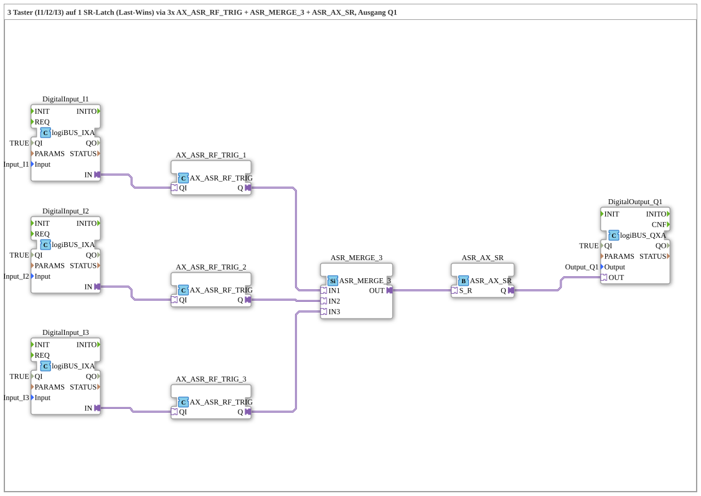

# Uebung_233_AX: 3 Taster über ASR_MERGE_3 auf 1 gemeinsames SR-Latch (Last-Wins)

* * * * * * * * * *

## Einleitung

Diese Übung ist die direkte Fortsetzung von `Uebung_230_AX` ("2 Taster, Last-Wins" via `ASR_MERGE_2`): hier werden **drei** unabhängige Taster über `ASR_MERGE_3` zu einem gemeinsamen Latch zusammengeführt. Sie zeigt, dass die MERGE-Familie (`ASR_MERGE_2..7`) kein reiner 2-Input-Spezialfall ist, sondern für beliebig viele Quellen skaliert.

## Verwendete Funktionsbausteine (FBs)

- **DigitalInput_I1**, **DigitalInput_I2**, **DigitalInput_I3**: `logiBUS::io::DI::logiBUS_IXA`
    - **Parameter**: `QI = TRUE`, `Input = Input_I1` / `Input_I2` / `Input_I3`
    - **Erklärung**: Koppeln die drei physischen Taster an die Adapterschnittstellen der nachfolgenden `AX_ASR_RF_TRIG`-Bausteine.
- **AX_ASR_RF_TRIG_1**, **AX_ASR_RF_TRIG_2**, **AX_ASR_RF_TRIG_3**: `adapter::events::unidirectional::AX_ASR_RF_TRIG`
    - **Parameter**: keine
    - **Erklärung**: Beobachten jeweils einen Taster und wandeln steigende Flanke (Drücken) und fallende Flanke (Loslassen) in ein gebündeltes `ASR`-Signal (`SET`/`RESET`) um.
- **ASR_MERGE_3**: `adapter::events::unidirectional::ASR_MERGE_3`
    - **Parameter**: keine
    - **Erklärung**: Führt alle drei `ASR`-Streams zu einem gemeinsamen zusammen — strukturell identisch zu `ASR_MERGE_2` aus `Uebung_230_AX`, nur mit einem dritten Socket (`IN3`). Die Verknüpfung bleibt eine reine ODER-Verknüpfung über alle Quellen.
- **ASR_AX_SR**: `adapter::events::unidirectional::ASR_AX_SR`
    - **Parameter**: keine
    - **Erklärung**: Latcht das gemergte Signal wie in 229/230/233 gehabt: Last-Wins — welcher der drei Taster zuletzt gedrückt oder losgelassen wurde, bestimmt den Zustand von `Q1`.
- **DigitalOutput_Q1**: `logiBUS::io::DQ::logiBUS_QXA`
    - **Parameter**: `QI = TRUE`, `Output = Output_Q1`
    - **Erklärung**: Gibt den Latch-Zustand als physisches Ausgangssignal aus.

### Sub-Bausteine: keine

Die Übung verwendet ausschließlich direkte FB-Instanzen, keine SubApp-Instanzen.

## Programmablauf und Verbindungen

1. `DigitalInput_I1.IN` → `AX_ASR_RF_TRIG_1.QI`, `DigitalInput_I2.IN` → `AX_ASR_RF_TRIG_2.QI`, `DigitalInput_I3.IN` → `AX_ASR_RF_TRIG_3.QI`: Die drei Taster speisen je einen eigenen Flankendetektor.
2. `AX_ASR_RF_TRIG_1.Q` → `ASR_MERGE_3.IN1`, `AX_ASR_RF_TRIG_2.Q` → `ASR_MERGE_3.IN2`, `AX_ASR_RF_TRIG_3.Q` → `ASR_MERGE_3.IN3`: Alle drei gebündelten `ASR`-Signale laufen im Merge-Baustein zusammen.
3. `ASR_MERGE_3.OUT` → `ASR_AX_SR.S_R`: Das zusammengeführte Signal steuert das gemeinsame SR-Latch.
4. `ASR_AX_SR.Q` → `DigitalOutput_Q1.OUT`: Der Latch-Zustand wird auf den physischen Ausgang `Output_Q1` geschaltet.
5. Ergebnis: Jeder der drei Taster kann `Q1` beliebig oft in beliebiger Reihenfolge ein- und ausschalten — Last-Wins, wie bereits in 229/230 beschrieben. Verglichen mit `Uebung_230_AX` ist das Muster identisch, nur um eine dritte Quelle erweitert.

## Zusammenfassung

`Uebung_233_AX` demonstriert, dass sich das aus 229/230 bekannte Last-Wins-Latch-Muster durch einfaches Austauschen von `ASR_MERGE_2` gegen `ASR_MERGE_3` (plus einem zusätzlichen `AX_ASR_RF_TRIG`) verlustfrei auf eine dritte unabhängige Quelle erweitern lässt. Die MERGE-Familie (`ASR_MERGE_2` bis `ASR_MERGE_7`) skaliert damit auf beliebig viele Quellen, ohne die zugrundeliegende ODER-Logik oder das Latch-Verhalten zu verändern — ein wichtiger Baustein für den Bau modularer, gut erweiterbarer Steuerungslogik.

---

### 🌐 Passende Themen-Unterseiten auf ms-muc-docs.de

- [🌐 Eclipse 4diac IDE & Farb-Referenz auf ms-muc-docs.de](https://www.ms-muc-docs.de/iec-61499/eclipse-4diac/)
