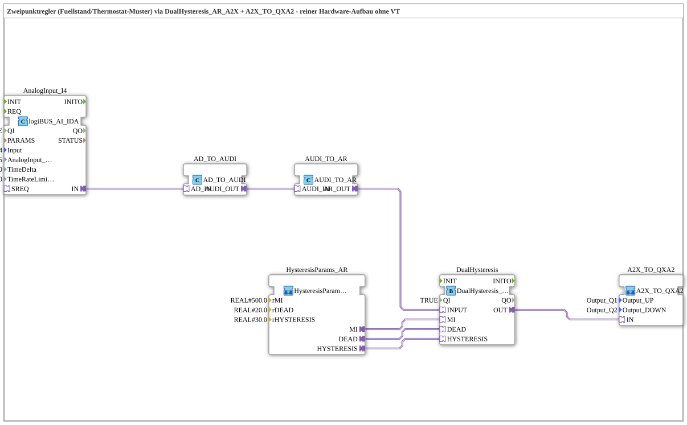

# Uebung_234_AX: Zweipunktregler mit Hysterese (reine Hardware-Übung, ohne VT)

* * * * * * * * * *

## Einleitung

Diese Übung implementiert ein klassisches Thermostat-/Füllstandsschalter-Muster: Ein analoger Messwert (z. B. Füllstand oder Temperatur) wird gegen einen Mittelwert `MI` mit Totzone (`DEAD`) und Hysterese (`HYSTERESIS`) geprüft und steuert darüber zwei entgegengesetzte Aktoren (z. B. Befüllen/Entleeren oder Heizen/Kühlen) an – nie beide gleichzeitig. Die Übung arbeitet ausschließlich mit physischer Hardware, ohne VT-Anzeige.

## Verwendete Funktionsbausteine (FBs)

- **AnalogInput_I4**: Analogeingang (Typ: `logiBUS::io::AI::logiBUS_AI_IDA`)
    - **Parameter**: QI = TRUE, Input = AnalogInput_I4, AnalogInput_hysteresis = 5, TimeDelta = 250, TimeRateLimit = 100
    - **Erklärung**: Liest den rohen Analogmesswert (DWORD, Typ AD) ein und filtert kleine Signalschwankungen über die eingangsseitige Hysterese von 5.
- **AD_TO_AUDI**: Konvertierung von AD (DWORD-Adapter) nach AUDI (UDINT-Adapter)
    - **Parameter**: keine
    - **Erklärung**: Erster Schritt der numerisch korrekten Umwandlung des rohen Messwerts in einen Zahlenwert.
- **AUDI_TO_AR**: Konvertierung von AUDI (UDINT-Adapter) nach AR (REAL-Adapter)
    - **Parameter**: keine
    - **Erklärung**: Zweiter Schritt der Umwandlung. Zusammen mit `AD_TO_AUDI` entsteht dieselbe zweistufige, numerisch korrekte Konvertierungskette, die auch `Uebung_028a_AR` von Hand aufbaut ("ein AD_TO_AR wäre wie ein reinterpret_cast").
- **HysteresisParams_AR**: Parameter-Baustein für die Hysterese-Schwellwerte
    - **Parameter**: rMI = 500.0, rDEAD = 20.0, rHYSTERESIS = 30.0
    - **Erklärung**: Stellt die drei Schwellwerte des Zweipunktreglers als feste Beispielwerte bereit. In echten Anlagen wären diese typischerweise per INI/OPC-UA parametrierbar.
- **DualHysteresis**: Zweipunktregler mit Totzone und Hysterese (Typ: `logiBUS::signalprocessing::hysteresis::DualHysteresis_AR_A2X`)
    - **Parameter**: QI = TRUE
    - **Erklärung**: Vergleicht den Messwert (`INPUT`) gegen `MI`: Steigt der Wert über `MI + DEAD + HYSTERESIS` (hier 550), schaltet `UP` ein; fällt er unter `MI - DEAD - HYSTERESIS` (hier 450), schaltet `DOWN` ein. Ausgeschaltet wird erst wieder, wenn der Wert in die reine Totzone `MI ± DEAD` (480–520) zurückkehrt – die Differenz zwischen Ein- und Ausschaltpunkt verhindert Flattern nahe der Schaltschwelle.

### Sub-Bausteine: A2X_TO_QXA2

- **A2X_TO_QXA2** (Typ: `MyLib::sys::A2X_TO_QXA2`)
    - **Parameter**: Output_UP = Output_Q1, Output_DOWN = Output_Q2
    - **Erklärung**: Entbündelt das eine `A2X`-Ausgangssignal (`UP`/`DOWN`) von `DualHysteresis` auf zwei physische logiBUS-Ausgänge (Q1 für UP, Q2 für DOWN).

## Programmablauf und Verbindungen

1. `AnalogInput_I4` liest den rohen Analogwert (Adaptertyp `AD`) ein.
2. `AD_TO_AUDI.AD_IN` ← `AnalogInput_I4.IN`: Der Rohwert wird zunächst in einen `AUDI`-Wert (vorzeichenloser Zahlenwert) gewandelt.
3. `AUDI_TO_AR.AUDI_IN` ← `AD_TO_AUDI.AUDI_OUT`: Anschließend erfolgt die Wandlung in einen `AR`-Wert (REAL-Adapter) – die numerisch korrekte, zweistufige Konvertierung.
4. `DualHysteresis.INPUT` ← `AUDI_TO_AR.AR_OUT`: Der aufbereitete Messwert gelangt an den Zweipunktregler.
5. `DualHysteresis.MI/DEAD/HYSTERESIS` ← `HysteresisParams_AR.MI/DEAD/HYSTERESIS`: Die Schwellwerte (500.0 / 20.0 / 30.0) werden fest vorgegeben.
6. `DualHysteresis.OUT` → `A2X_TO_QXA2.IN`: Das kombinierte UP/DOWN-Ergebnis wird an den Ausgabe-Baustein übergeben.
7. `A2X_TO_QXA2` schreibt UP auf `Output_Q1` und DOWN auf `Output_Q2` – die beiden Aktoren werden nie gleichzeitig aktiviert.

## Zusammenfassung

Die Übung 234_AX zeigt den klassischen Aufbau eines Zweipunktreglers mit Hysterese rein auf Hardware-Ebene: Ein Analogeingang wird über eine zweistufige, numerisch korrekte Adapterkette (`AD_TO_AUDI` → `AUDI_TO_AR`) aufbereitet, von `DualHysteresis_AR_A2X` gegen einen Mittelwert mit Totzone und Hysterese geprüft und über `A2X_TO_QXA2` auf zwei sich gegenseitig ausschließende Digitalausgänge geschaltet. Für dieselbe Funktion mit VT-Anzeige (Messwert als Zahlenfeld, UP/DOWN als Hintergrundfarbe statt physischer Ausgänge) siehe `Uebung_235_AX`.

---

### 🌐 Passende Themen-Unterseiten auf ms-muc-docs.de

- [🌐 Eclipse 4diac IDE & Farb-Referenz auf ms-muc-docs.de](https://www.ms-muc-docs.de/iec-61499/eclipse-4diac/)
