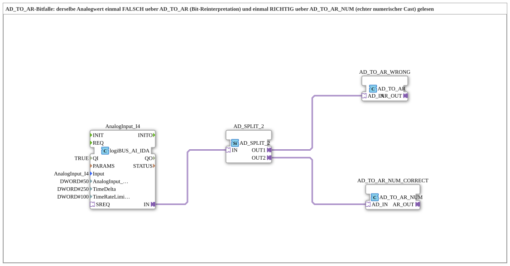

# Uebung_237_AX: AD_TO_AR-Bitfalle – Bit-Reinterpretation vs. numerischer Cast

* * * * * * * * * *

## Einleitung

Diese Übung ist bewusst als Vergleich zwischen einer **falschen** und einer **richtigen** Lösung aufgebaut: Derselbe rohe Analogwert wird auf zwei Arten von `AD` (DWORD-Adapter) nach `AR` (REAL-Adapter) konvertiert – einmal fälschlich über `AD_TO_AR` (Bit-Reinterpretation) und einmal korrekt über `AD_TO_AR_NUM` (echter numerischer Cast). Die Instanznamen `AD_TO_AR_WRONG` und `AD_TO_AR_NUM_CORRECT` sind bewusst so gewählt, um die Fallstricke bei der Konvertierung von Analogwerten sichtbar zu machen.

## Verwendete Funktionsbausteine (FBs)

- **AnalogInput_I4**: Analogeingang (Typ: `logiBUS::io::AI::logiBUS_AI_IDA`)
    - **Parameter**: QI = TRUE, Input = AnalogInput_I4, AnalogInput_hysteresis = 50, TimeDelta = 250, TimeRateLimit = 100
    - **Erklärung**: Liest den rohen Analogmesswert als `AD`-Adapter (DWORD) ein.
- **AD_SPLIT_2**: Verteilung eines AD-Signals auf zwei Ziele (Typ: `adapter::events::unidirectional::AD_SPLIT_2`)
    - **Parameter**: keine
    - **Erklärung**: Dupliziert den einen rohen Analogwert verlustfrei, damit er parallel über beide Konvertierungswege beobachtet werden kann.
- **AD_TO_AR_WRONG**: Konvertierung von AD nach AR – FALSCH (Typ: `adapter::conversion::unidirectional::AD_TO_AR`)
    - **Parameter**: keine
    - **Erklärung**: Sieht wie die naheliegende direkte Konvertierung aus, ist intern aber `F_DWORD_TO_REAL` – eine reine IEEE754-Bit-Reinterpretation. Ein roher Analogwert wie `DWORD#2048` wird dadurch **nicht** zu `REAL#2048.0`, sondern zu einer bedeutungslosen Zahl nahe Null.
- **AD_TO_AR_NUM_CORRECT**: Konvertierung von AD nach AR – RICHTIG (Typ: `adapter::conversion::unidirectional::AD_TO_AR_NUM`)
    - **Parameter**: keine
    - **Erklärung**: Macht denselben Job numerisch korrekt, über die Zwischenkette DWORD → UDINT → REAL – dieselbe Kette, die `Uebung_028a_AR` von Hand aus `AD_TO_AUDI` + `AUDI_TO_AR` zusammensetzt. `AD_TO_AR_NUM` ist das drop-in-kompatible Einzelbaustein-Äquivalent.

### Sub-Bausteine: keine

Die Übung verwendet keine weiteren Unterbausteine, alle FBs sind direkt auf der obersten Ebene der SubApp angeordnet.

## Programmablauf und Verbindungen

1. `AD_SPLIT_2.IN` ← `AnalogInput_I4.IN`: Der rohe Analogwert wird auf zwei Verbraucher verteilt.
2. `AD_TO_AR_WRONG.AD_IN` ← `AD_SPLIT_2.OUT1`: Der erste Zweig konvertiert per Bit-Reinterpretation (`F_DWORD_TO_REAL`) – das Ergebnis ist eine bedeutungslose Zahl nahe Null.
3. `AD_TO_AR_NUM_CORRECT.AD_IN` ← `AD_SPLIT_2.OUT2`: Der zweite Zweig konvertiert numerisch korrekt (DWORD → UDINT → REAL) – das Ergebnis entspricht dem tatsächlichen Messwert.
4. **Arbeitsauftrag**: Beide `AR_OUT.D1`-Pins im laufenden 4diac-Monitor beobachten (rechte Maustaste auf den Pin → Watch) und vergleichen: `AD_TO_AR_WRONG` zeigt eine kleine, mit dem tatsächlichen Analogwert scheinbar unzusammenhängende Zahl; `AD_TO_AR_NUM_CORRECT` zeigt den plausiblen, tatsächlichen Messwert.

**Wann ist `AD_TO_AR` trotzdem richtig?** Wenn `AD_IN` bereits ein Bitmuster ist, das als REAL gemeint war (z. B. das Ergebnis von `F_REAL_TO_DWORD` an anderer Stelle) – dann ist die Bit-Reinterpretation genau die richtige, verlustfreie Rückrichtung. Ein roher Analog-/Zählerwert wie in dieser Übung ist das Gegenbeispiel: Hier ist der numerische Cast (`AD_TO_AR_NUM`) richtig.

## Zusammenfassung

Die Übung 237_AX macht anhand zweier parallel verdrahteter Konvertierungswege sichtbar, dass `AD_TO_AR` und `AD_TO_AR_NUM` grundverschiedene Operationen sind: `AD_TO_AR` ist eine reine Bit-Reinterpretation (richtig nur, wenn der Eingang bereits ein absichtlich so kodiertes REAL-Bitmuster ist), `AD_TO_AR_NUM` ist der numerisch korrekte Cast für rohe Analog- oder Zählerwerte. Wer bei der Konvertierung eines Analogwerts den vermeintlich "direkten" Baustein `AD_TO_AR` wählt, erhält ein plausibel aussehendes, aber falsches Ergebnis – die Übung schult den bewussten Umgang mit dieser Verwechslungsgefahr.

---

### 🌐 Passende Themen-Unterseiten auf ms-muc-docs.de

- [🌐 Eclipse 4diac IDE & Farb-Referenz auf ms-muc-docs.de](https://www.ms-muc-docs.de/iec-61499/eclipse-4diac/)
