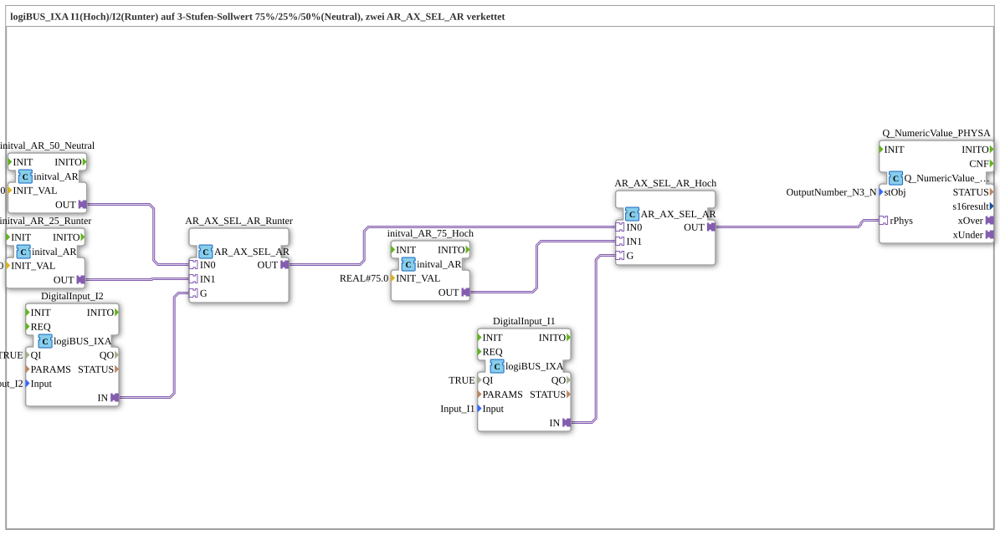

# Uebung_246_AX: logiBUS_IXA I1(Hoch)/I2(Runter) auf 3-Stufen-Sollwert 75%/25%/50%(Neutral), zwei AR_AX_SEL_AR verkettet

Dieser Artikel beschreibt die 4diac IDE Subapplikation Uebung_246_AX (logiBUS_IXA I1(Hoch)/I2(Runter) auf 3-Stufen-Sollwert 75%/25%/50%(Neutral), zwei AR_AX_SEL_AR verkettet).

----

## Ziel der Übung

Das Ziel dieser Übung ist die Umsetzung folgender Anforderung: **logiBUS_IXA I1(Hoch)/I2(Runter) auf 3-Stufen-Sollwert 75%/25%/50%(Neutral), zwei AR_AX_SEL_AR verkettet**

-----

## Beschreibung und Komponenten

Die Übung besteht aus der Subapplikation Uebung_246_AX.SUB, welche die folgende Bausteinstruktur verwendet:

### Verwendete Funktionsbausteine (FBs)

- **DigitalInput_I1**: Instanz des Typs logiBUS::io::DI::logiBUS_IXA.
  - Parameter QI = TRUE
  - Parameter Input = Input_I1
- **DigitalInput_I2**: Instanz des Typs logiBUS::io::DI::logiBUS_IXA.
  - Parameter QI = TRUE
  - Parameter Input = Input_I2
- **initval_AR_50_Neutral**: Instanz des Typs adapter::types::unidirectional::AR::initval::initval_AR.
  - Parameter INIT_VAL = REAL#50.0
- **initval_AR_25_Runter**: Instanz des Typs adapter::types::unidirectional::AR::initval::initval_AR.
  - Parameter INIT_VAL = REAL#25.0
- **initval_AR_75_Hoch**: Instanz des Typs adapter::types::unidirectional::AR::initval::initval_AR.
  - Parameter INIT_VAL = REAL#75.0
- **AR_AX_SEL_AR_Runter**: Instanz des Typs adapter::iec61131::selection::AR_AX_SEL_AR.
- **AR_AX_SEL_AR_Hoch**: Instanz des Typs adapter::iec61131::selection::AR_AX_SEL_AR.
- **Q_NumericValue_PHYSA**: Instanz des Typs isobus::UT::Q::Q_NumericValue_PHYSA.
  - Parameter stObj = OutputNumber_N3_N

### Verbindungen und Schnittstellen

**Adapterverbindungen:**
- initval_AR_50_Neutral.OUT -> AR_AX_SEL_AR_Runter.IN0
- initval_AR_25_Runter.OUT -> AR_AX_SEL_AR_Runter.IN1
- DigitalInput_I2.IN -> AR_AX_SEL_AR_Runter.G
- AR_AX_SEL_AR_Runter.OUT -> AR_AX_SEL_AR_Hoch.IN0
- initval_AR_75_Hoch.OUT -> AR_AX_SEL_AR_Hoch.IN1
- DigitalInput_I1.IN -> AR_AX_SEL_AR_Hoch.G
- AR_AX_SEL_AR_Hoch.OUT -> Q_NumericValue_PHYSA.rPhys

### Hinweise aus dem Modell

> Zwei verkettete Binaer-Selektoren statt eines 3-Wege-Selektors (den es fuer AR nicht gibt): innen waehlt I2 (Runter) zwischen Neutral(50) und Runter(25), aussen waehlt I1 (Hoch) zwischen diesem Ergebnis und Hoch(75). Werden I1 und I2 gleichzeitig gehalten, gewinnt I1 (Hoch), weil sein Selektor der aeussere ist - bewusste Prioritaet, siehe Beschreibung.

-----

## Programmablauf und Funktionsweise

1. **Initialisierung**: Beim Systemstart werden alle beteiligten Bausteine initialisiert.
2. **Ereignis- und Signalverarbeitung**: Zustandsänderungen an den Eingängen erzeugen Ereignisse, die über die definierten Verbindungen an die nachgelagerten Bausteine weitergeleitet werden.
3. **Ausgangsaktualisierung**: Die Zielbausteine verarbeiten die empfangenen Signale und aktualisieren entsprechend die Ausgänge.

-----

## Zusammenfassung

Die Übung Uebung_246_AX demonstriert anschaulich die modulare IEC 61499 Architektur in 4diac IDE.
