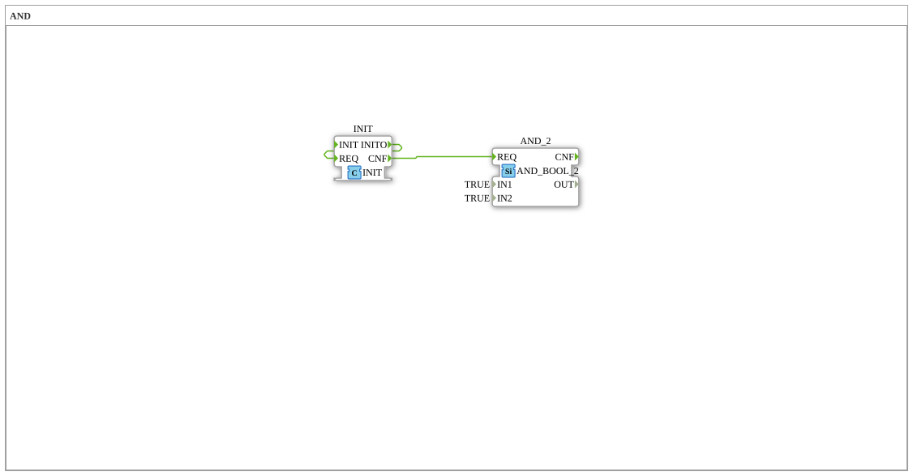

# Uebung_000b: AND

Dieser Artikel beschreibt die 4diac IDE Subapplikation Uebung_000b (AND).

----

## Ziel der Übung

Das Ziel dieser Übung ist die Umsetzung folgender Anforderung: **AND**

-----

## Beschreibung und Komponenten

Die Übung besteht aus der Subapplikation Uebung_000b.SUB, welche die folgende Bausteinstruktur verwendet:

### Verwendete Funktionsbausteine (FBs)

- **AND_2**: Instanz des Typs iec61131::booleanOperators::AND_BOOL_2.
  - Parameter IN1 = TRUE
  - Parameter IN2 = TRUE
- **INIT**: Instanz des Typs iec61131::booleanOperators::INIT.

### Verbindungen und Schnittstellen

**Ereignisverbindungen:**

- INIT.INITO -> INIT.REQ
- INIT.CNF -> AND_2.REQ

-----

## Programmablauf und Funktionsweise

1. **Initialisierung**: Beim Systemstart werden alle beteiligten Bausteine initialisiert.
2. **Ereignis- und Signalverarbeitung**: Zustandsänderungen an den Eingängen erzeugen Ereignisse, die über die definierten Verbindungen an die nachgelagerten Bausteine weitergeleitet werden.
3. **Ausgangsaktualisierung**: Die Zielbausteine verarbeiten die empfangenen Signale und aktualisieren entsprechend die Ausgänge.

-----

## Zusammenfassung

Die Übung Uebung_000b demonstriert anschaulich die modulare IEC 61499 Architektur in 4diac IDE.
