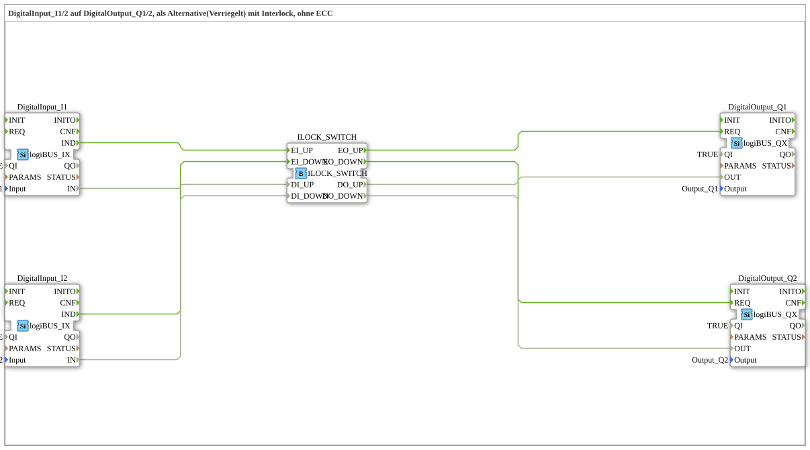

# Uebung_001d2: DigitalInput_I1/2 auf DigitalOutput_Q1/2, als Alternative(Verriegelt) mit Interlock, ohne ECC

Dieser Artikel beschreibt die 4diac IDE Subapplikation Uebung_001d2 (DigitalInput_I1/2 auf DigitalOutput_Q1/2, als Alternative(Verriegelt) mit Interlock, ohne ECC).

----

## Ziel der Übung

Das Ziel dieser Übung ist die Umsetzung folgender Anforderung: **DigitalInput_I1/2 auf DigitalOutput_Q1/2, als Alternative(Verriegelt) mit Interlock, ohne ECC**

-----

## Beschreibung und Komponenten

Die Übung besteht aus der Subapplikation Uebung_001d2.SUB, welche die folgende Bausteinstruktur verwendet:

### Verwendete Funktionsbausteine (FBs)

- **DigitalInput_I1**: Instanz des Typs logiBUS::io::DI::logiBUS_IX.
  - Parameter QI = TRUE
  - Parameter Input = Input_I1
- **DigitalInput_I2**: Instanz des Typs logiBUS::io::DI::logiBUS_IX.
  - Parameter QI = TRUE
  - Parameter Input = Input_I2
- **ILOCK_SWITCH**: Instanz des Typs logiBUS::signalprocessing::interlock::ILOCK_SWITCH.
- **DigitalOutput_Q1**: Instanz des Typs logiBUS::io::DQ::logiBUS_QX.
  - Parameter QI = TRUE
  - Parameter Output = Output_Q1
- **DigitalOutput_Q2**: Instanz des Typs logiBUS::io::DQ::logiBUS_QX.
  - Parameter QI = TRUE
  - Parameter Output = Output_Q2

### Verbindungen und Schnittstellen

**Ereignisverbindungen:**

- DigitalInput_I1.IND -> ILOCK_SWITCH.EI_UP
- DigitalInput_I2.IND -> ILOCK_SWITCH.EI_DOWN
- ILOCK_SWITCH.EO_UP -> DigitalOutput_Q1.REQ
- ILOCK_SWITCH.EO_DOWN -> DigitalOutput_Q2.REQ

**Datenverbindungen:**

- DigitalInput_I1.IN -> ILOCK_SWITCH.DI_UP
- DigitalInput_I2.IN -> ILOCK_SWITCH.DI_DOWN
- ILOCK_SWITCH.DO_UP -> DigitalOutput_Q1.OUT
- ILOCK_SWITCH.DO_DOWN -> DigitalOutput_Q2.OUT

-----

## Programmablauf und Funktionsweise

1. **Initialisierung**: Beim Systemstart werden alle beteiligten Bausteine initialisiert.
2. **Ereignis- und Signalverarbeitung**: Zustandsänderungen an den Eingängen erzeugen Ereignisse, die über die definierten Verbindungen an die nachgelagerten Bausteine weitergeleitet werden.
3. **Ausgangsaktualisierung**: Die Zielbausteine verarbeiten die empfangenen Signale und aktualisieren entsprechend die Ausgänge.

-----

## Zusammenfassung

Die Übung Uebung_001d2 demonstriert anschaulich die modulare IEC 61499 Architektur in 4diac IDE.
