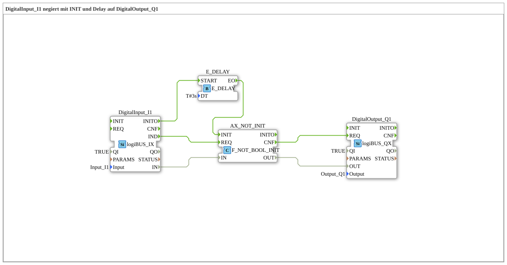

# Uebung_001g: DigitalInput_I1 negiert mit INIT und Delay auf DigitalOutput_Q1

Dieser Artikel beschreibt die 4diac IDE Subapplikation Uebung_001g (DigitalInput_I1 negiert mit INIT und Delay auf DigitalOutput_Q1).

----

## Ziel der Übung

Das Ziel dieser Übung ist die Umsetzung folgender Anforderung: **DigitalInput_I1 negiert mit INIT und Delay auf DigitalOutput_Q1**

-----

## Beschreibung und Komponenten

Die Übung besteht aus der Subapplikation Uebung_001g.SUB, welche die folgende Bausteinstruktur verwendet:

### Verwendete Funktionsbausteine (FBs)

- **DigitalOutput_Q1**: Instanz des Typs logiBUS::io::DQ::logiBUS_QX.
  - Parameter QI = TRUE
  - Parameter Output = Output_Q1
- **DigitalInput_I1**: Instanz des Typs logiBUS::io::DI::logiBUS_IX.
  - Parameter QI = TRUE
  - Parameter Input = Input_I1
- **AX_NOT_INIT**: Instanz des Typs iec61131::booleanOperators::F_NOT_BOOL_INIT.
- **E_DELAY**: Instanz des Typs iec61499::events::E_DELAY.
  - Parameter DT = T#3s

### Verbindungen und Schnittstellen

**Ereignisverbindungen:**

- DigitalInput_I1.INITO -> E_DELAY.START
- E_DELAY.EO -> AX_NOT_INIT.INIT
- AX_NOT_INIT.CNF -> DigitalOutput_Q1.REQ
- DigitalInput_I1.IND -> AX_NOT_INIT.REQ

**Datenverbindungen:**

- AX_NOT_INIT.OUT -> DigitalOutput_Q1.OUT
- DigitalInput_I1.IN -> AX_NOT_INIT.IN

### Hinweise aus dem Modell

> obwohl I1 nicht abgefragt wird beim BOOT, wird AX_NOT hier TRUE ausgeben.

-----

## Programmablauf und Funktionsweise

1. **Initialisierung**: Beim Systemstart werden alle beteiligten Bausteine initialisiert.
2. **Ereignis- und Signalverarbeitung**: Zustandsänderungen an den Eingängen erzeugen Ereignisse, die über die definierten Verbindungen an die nachgelagerten Bausteine weitergeleitet werden.
3. **Ausgangsaktualisierung**: Die Zielbausteine verarbeiten die empfangenen Signale und aktualisieren entsprechend die Ausgänge.

-----

## Zusammenfassung

Die Übung Uebung_001g demonstriert anschaulich die modulare IEC 61499 Architektur in 4diac IDE.
