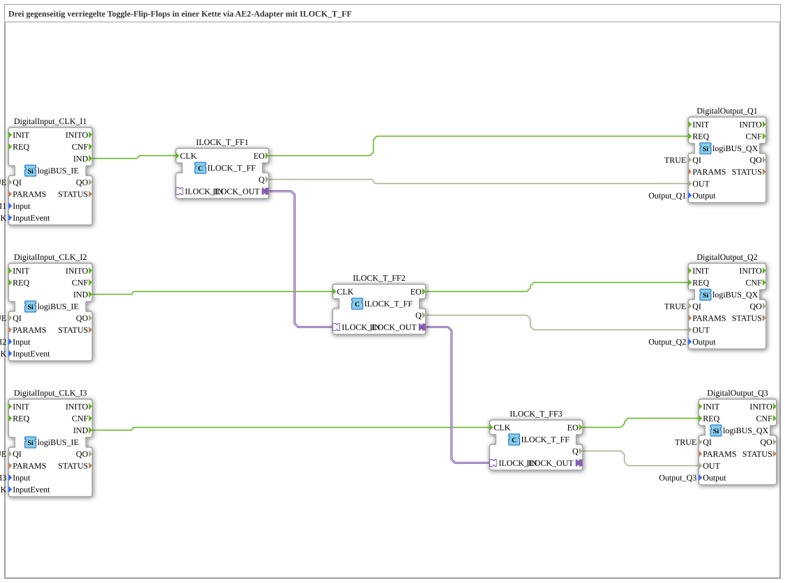

# Uebung_004b4d: Drei gegenseitig verriegelte Toggle-Flip-Flops in einer Kette via AE2-Adapter mit ILOCK_T_FF

Dieser Artikel beschreibt die 4diac IDE Subapplikation Uebung_004b4d (Drei gegenseitig verriegelte Toggle-Flip-Flops in einer Kette via AE2-Adapter mit ILOCK_T_FF).

----

## Ziel der Übung

Das Ziel dieser Übung ist die Umsetzung folgender Anforderung: **Drei gegenseitig verriegelte Toggle-Flip-Flops in einer Kette via AE2-Adapter mit ILOCK_T_FF**

-----

## Beschreibung und Komponenten

Die Übung besteht aus der Subapplikation Uebung_004b4d.SUB, welche die folgende Bausteinstruktur verwendet:

### Verwendete Funktionsbausteine (FBs)

- **DigitalOutput_Q1**: Instanz des Typs logiBUS::io::DQ::logiBUS_QX.
  - Parameter QI = TRUE
  - Parameter Output = Output_Q1
- **DigitalInput_CLK_I1**: Instanz des Typs logiBUS::io::DI::logiBUS_IE.
  - Parameter QI = TRUE
  - Parameter Input = Input_I1
  - Parameter InputEvent = BUTTON_SINGLE_CLICK
- **DigitalOutput_Q2**: Instanz des Typs logiBUS::io::DQ::logiBUS_QX.
  - Parameter QI = TRUE
  - Parameter Output = Output_Q2
- **DigitalInput_CLK_I2**: Instanz des Typs logiBUS::io::DI::logiBUS_IE.
  - Parameter QI = TRUE
  - Parameter Input = Input_I2
  - Parameter InputEvent = BUTTON_SINGLE_CLICK
- **ILOCK_T_FF1**: Instanz des Typs logiBUS::signalprocessing::interlock::ILOCK_T_FF.
- **ILOCK_T_FF2**: Instanz des Typs logiBUS::signalprocessing::interlock::ILOCK_T_FF.
- **ILOCK_T_FF3**: Instanz des Typs logiBUS::signalprocessing::interlock::ILOCK_T_FF.
- **DigitalOutput_Q3**: Instanz des Typs logiBUS::io::DQ::logiBUS_QX.
  - Parameter QI = TRUE
  - Parameter Output = Output_Q3
- **DigitalInput_CLK_I3**: Instanz des Typs logiBUS::io::DI::logiBUS_IE.
  - Parameter QI = TRUE
  - Parameter Input = Input_I3
  - Parameter InputEvent = BUTTON_SINGLE_CLICK

### Verbindungen und Schnittstellen

**Adapterverbindungen:**

- ILOCK_T_FF1.ILOCK_OUT -> ILOCK_T_FF2.ILOCK_IN
- ILOCK_T_FF2.ILOCK_OUT -> ILOCK_T_FF3.ILOCK_IN

**Ereignisverbindungen:**

- DigitalInput_CLK_I1.IND -> ILOCK_T_FF1.CLK
- DigitalInput_CLK_I2.IND -> ILOCK_T_FF2.CLK
- DigitalInput_CLK_I3.IND -> ILOCK_T_FF3.CLK
- ILOCK_T_FF1.EO -> DigitalOutput_Q1.REQ
- ILOCK_T_FF2.EO -> DigitalOutput_Q2.REQ
- ILOCK_T_FF3.EO -> DigitalOutput_Q3.REQ

**Datenverbindungen:**

- ILOCK_T_FF1.Q -> DigitalOutput_Q1.OUT
- ILOCK_T_FF2.Q -> DigitalOutput_Q2.OUT
- ILOCK_T_FF3.Q -> DigitalOutput_Q3.OUT

### Hinweise aus dem Modell

> durch den Einsatz eines Bidirektionalen Adapters: 1 Verbindung REICHT !

-----

## Programmablauf und Funktionsweise

1. **Initialisierung**: Beim Systemstart werden alle beteiligten Bausteine initialisiert.
2. **Ereignis- und Signalverarbeitung**: Zustandsänderungen an den Eingängen erzeugen Ereignisse, die über die definierten Verbindungen an die nachgelagerten Bausteine weitergeleitet werden.
3. **Ausgangsaktualisierung**: Die Zielbausteine verarbeiten die empfangenen Signale und aktualisieren entsprechend die Ausgänge.

-----

## Zusammenfassung

Die Übung Uebung_004b4d demonstriert anschaulich die modulare IEC 61499 Architektur in 4diac IDE.
