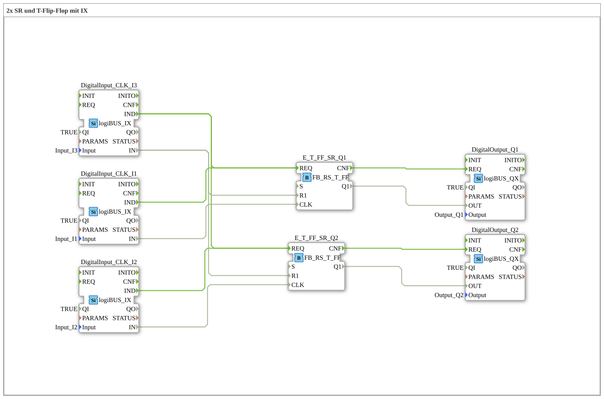

# Uebung_006a2b: 2x SR und T-Flip-Flop mit IX

Dieser Artikel beschreibt die 4diac IDE Subapplikation Uebung_006a2b (2x SR und T-Flip-Flop mit IX).

----

## Ziel der Übung

Das Ziel dieser Übung ist die Umsetzung folgender Anforderung: **2x SR und T-Flip-Flop mit IX**

-----

## Beschreibung und Komponenten

Die Übung besteht aus der Subapplikation Uebung_006a2b.SUB, welche die folgende Bausteinstruktur verwendet:

### Verwendete Funktionsbausteine (FBs)

- **DigitalOutput_Q1**: Instanz des Typs logiBUS::io::DQ::logiBUS_QX.
  - Parameter QI = TRUE
  - Parameter Output = Output_Q1
- **DigitalInput_CLK_I1**: Instanz des Typs logiBUS::io::DI::logiBUS_IX.
  - Parameter QI = TRUE
  - Parameter PARAMS = 
  - Parameter Input = Input_I1
- **DigitalInput_CLK_I2**: Instanz des Typs logiBUS::io::DI::logiBUS_IX.
  - Parameter QI = TRUE
  - Parameter PARAMS = 
  - Parameter Input = Input_I2
- **E_T_FF_SR_Q1**: Instanz des Typs logiBUS::bistableElements::FB_RS_T_FF.
- **DigitalInput_CLK_I3**: Instanz des Typs logiBUS::io::DI::logiBUS_IX.
  - Parameter QI = TRUE
  - Parameter PARAMS = 
  - Parameter Input = Input_I3
- **E_T_FF_SR_Q2**: Instanz des Typs logiBUS::bistableElements::FB_RS_T_FF.
- **DigitalOutput_Q2**: Instanz des Typs logiBUS::io::DQ::logiBUS_QX.
  - Parameter QI = TRUE
  - Parameter Output = Output_Q2

### Verbindungen und Schnittstellen

**Ereignisverbindungen:**
- DigitalInput_CLK_I1.IND -> E_T_FF_SR_Q1.REQ
- DigitalInput_CLK_I2.IND -> E_T_FF_SR_Q2.REQ
- DigitalInput_CLK_I3.IND -> E_T_FF_SR_Q1.REQ
- DigitalInput_CLK_I3.IND -> E_T_FF_SR_Q2.REQ
- E_T_FF_SR_Q1.CNF -> DigitalOutput_Q1.REQ
- E_T_FF_SR_Q2.CNF -> DigitalOutput_Q2.REQ

**Datenverbindungen:**
- DigitalInput_CLK_I1.IN -> E_T_FF_SR_Q1.CLK
- DigitalInput_CLK_I2.IN -> E_T_FF_SR_Q2.CLK
- DigitalInput_CLK_I3.IN -> E_T_FF_SR_Q1.R1
- DigitalInput_CLK_I3.IN -> E_T_FF_SR_Q2.R1
- E_T_FF_SR_Q1.Q1 -> DigitalOutput_Q1.OUT
- E_T_FF_SR_Q2.Q1 -> DigitalOutput_Q2.OUT

### Hinweise aus dem Modell

> Hausmeister-Aus (alles Aus mit einem Druck)

-----

## Programmablauf und Funktionsweise

1. **Initialisierung**: Beim Systemstart werden alle beteiligten Bausteine initialisiert.
2. **Ereignis- und Signalverarbeitung**: Zustandsänderungen an den Eingängen erzeugen Ereignisse, die über die definierten Verbindungen an die nachgelagerten Bausteine weitergeleitet werden.
3. **Ausgangsaktualisierung**: Die Zielbausteine verarbeiten die empfangenen Signale und aktualisieren entsprechend die Ausgänge.

-----

## Zusammenfassung

Die Übung Uebung_006a2b demonstriert anschaulich die modulare IEC 61499 Architektur in 4diac IDE.
