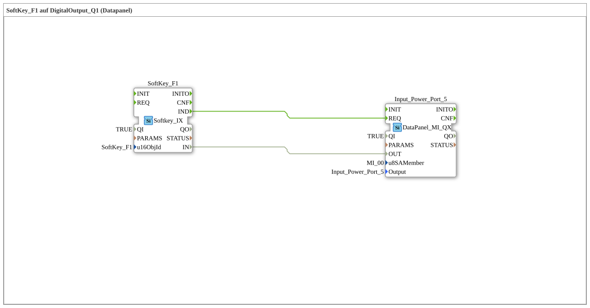

# Uebung_010a5: SoftKey_F1 auf DigitalOutput_Q1 (Datapanel)

Dieser Artikel beschreibt die logiBUS®-Übung `Uebung_010a5`. Ein Softkey auf dem ISOBUS-Terminal schaltet einen DataPanel-Ausgang.

----

## Ziel der Übung

Der Softkey `SoftKey_F1` auf dem VT-Terminal schaltet direkt einen digitalen Ausgang auf dem DataPanel-Erweiterungsmodul.

-----

## Beschreibung und Komponenten

- **`SoftKey_F1`**: `isobus::UT::io::Softkey::Softkey_IX`, liest den Zustand des Softkeys `SoftKey_F1` vom VT.
- **`Input_Power_Port_5`**: `DataPanel::io::MI::DQ::DataPanel_MI_QX`, digitaler Ausgang auf dem DataPanel (`u8SAMember = MI_00`).

-----

## Funktionsweise

1. Der Bediener betätigt `SoftKey_F1` auf dem VT-Terminal.
2. Der Zustand des Softkeys (`SoftKey_F1.IN`) wird direkt an den DataPanel-Ausgang (`Input_Power_Port_5.OUT`) durchgereicht.
3. Jede Zustandsänderung (`IND`) löst eine Anforderung (`REQ`) am Ausgang aus.
