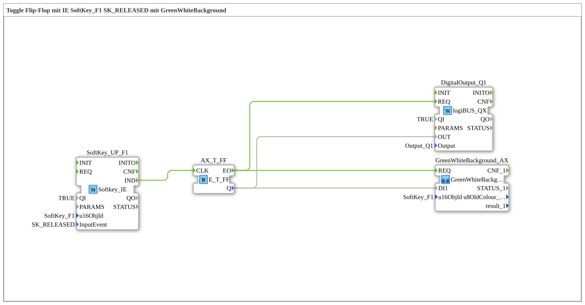

# Uebung_010d: Toggle Flip-Flop mit IE SoftKey_F1 SK_RELEASED mit GreenWhiteBackground

Dieser Artikel beschreibt die 4diac IDE Subapplikation Uebung_010d (Toggle Flip-Flop mit IE SoftKey_F1 SK_RELEASED mit GreenWhiteBackground).

----

## Ziel der Übung

Das Ziel dieser Übung ist die Umsetzung folgender Anforderung: **Toggle Flip-Flop mit IE SoftKey_F1 SK_RELEASED mit GreenWhiteBackground**

-----

## Beschreibung und Komponenten

Die Übung besteht aus der Subapplikation Uebung_010d.SUB, welche die folgende Bausteinstruktur verwendet:

### Verwendete Funktionsbausteine (FBs)

- **DigitalOutput_Q1**: Instanz des Typs logiBUS::io::DQ::logiBUS_QX.
  - Parameter QI = TRUE
  - Parameter Output = Output_Q1
- **SoftKey_UP_F1**: Instanz des Typs isobus::UT::io::Softkey::Softkey_IE.
  - Parameter QI = TRUE
  - Parameter u16ObjId = SoftKey_F1
  - Parameter InputEvent = SK_RELEASED
- **AX_T_FF**: Instanz des Typs iec61499::events::E_T_FF.

### Verbindungen und Schnittstellen

**Ereignisverbindungen:**
- SoftKey_UP_F1.IND -> AX_T_FF.CLK
- AX_T_FF.EO -> DigitalOutput_Q1.REQ
- AX_T_FF.EO -> GreenWhiteBackground_AX.REQ

**Datenverbindungen:**
- AX_T_FF.Q -> DigitalOutput_Q1.OUT
- AX_T_FF.Q -> GreenWhiteBackground_AX.DI1

-----

## Programmablauf und Funktionsweise

1. **Initialisierung**: Beim Systemstart werden alle beteiligten Bausteine initialisiert.
2. **Ereignis- und Signalverarbeitung**: Zustandsänderungen an den Eingängen erzeugen Ereignisse, die über die definierten Verbindungen an die nachgelagerten Bausteine weitergeleitet werden.
3. **Ausgangsaktualisierung**: Die Zielbausteine verarbeiten die empfangenen Signale und aktualisieren entsprechend die Ausgänge.

-----

## Zusammenfassung

Die Übung Uebung_010d demonstriert anschaulich die modulare IEC 61499 Architektur in 4diac IDE.
