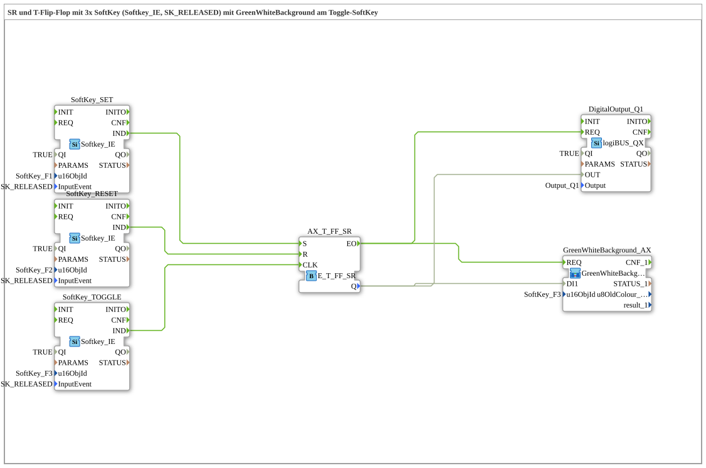

# Uebung_010e: SR und T-Flip-Flop mit 3x SoftKey (Softkey_IE, SK_RELEASED) mit GreenWhiteBackground am Toggle-SoftKey

Dieser Artikel beschreibt die 4diac IDE Subapplikation Uebung_010e (SR und T-Flip-Flop mit 3x SoftKey (Softkey_IE, SK_RELEASED) mit GreenWhiteBackground am Toggle-SoftKey).

----

## Ziel der Übung

Das Ziel dieser Übung ist die Umsetzung folgender Anforderung: **SR und T-Flip-Flop mit 3x SoftKey (Softkey_IE, SK_RELEASED) mit GreenWhiteBackground am Toggle-SoftKey**

-----

## Beschreibung und Komponenten

Die Übung besteht aus der Subapplikation Uebung_010e.SUB, welche die folgende Bausteinstruktur verwendet:

### Verwendete Funktionsbausteine (FBs)

- **DigitalOutput_Q1**: Instanz des Typs logiBUS::io::DQ::logiBUS_QX.
  - Parameter QI = TRUE
  - Parameter Output = Output_Q1
- **SoftKey_SET**: Instanz des Typs isobus::UT::io::Softkey::Softkey_IE.
  - Parameter QI = TRUE
  - Parameter u16ObjId = SoftKey_F1
  - Parameter InputEvent = SK_RELEASED
- **SoftKey_RESET**: Instanz des Typs isobus::UT::io::Softkey::Softkey_IE.
  - Parameter QI = TRUE
  - Parameter u16ObjId = SoftKey_F2
  - Parameter InputEvent = SK_RELEASED
- **SoftKey_TOGGLE**: Instanz des Typs isobus::UT::io::Softkey::Softkey_IE.
  - Parameter QI = TRUE
  - Parameter u16ObjId = SoftKey_F3
  - Parameter InputEvent = SK_RELEASED
- **AX_T_FF_SR**: Instanz des Typs iec61499::events::E_T_FF_SR.

### Verbindungen und Schnittstellen

**Ereignisverbindungen:**

- SoftKey_SET.IND -> AX_T_FF_SR.S
- SoftKey_RESET.IND -> AX_T_FF_SR.R
- SoftKey_TOGGLE.IND -> AX_T_FF_SR.CLK
- AX_T_FF_SR.EO -> DigitalOutput_Q1.REQ
- AX_T_FF_SR.EO -> GreenWhiteBackground_AX.REQ

**Datenverbindungen:**

- AX_T_FF_SR.Q -> DigitalOutput_Q1.OUT
- AX_T_FF_SR.Q -> GreenWhiteBackground_AX.DI1

-----

## Programmablauf und Funktionsweise

1. **Initialisierung**: Beim Systemstart werden alle beteiligten Bausteine initialisiert.
2. **Ereignis- und Signalverarbeitung**: Zustandsänderungen an den Eingängen erzeugen Ereignisse, die über die definierten Verbindungen an die nachgelagerten Bausteine weitergeleitet werden.
3. **Ausgangsaktualisierung**: Die Zielbausteine verarbeiten die empfangenen Signale und aktualisieren entsprechend die Ausgänge.

-----

## Zusammenfassung

Die Übung Uebung_010e demonstriert anschaulich die modulare IEC 61499 Architektur in 4diac IDE.
