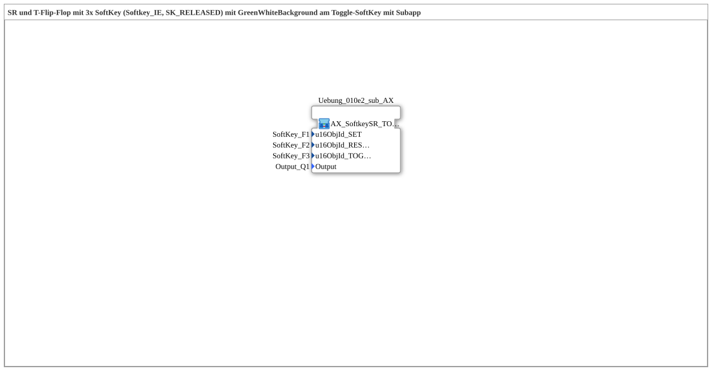

# Uebung_010e2: SR und T-Flip-Flop mit 3x SoftKey (Softkey_IE, SK_RELEASED) mit GreenWhiteBackground am Toggle-SoftKey mit Subapp

Dieser Artikel beschreibt die 4diac IDE Subapplikation Uebung_010e2 (SR und T-Flip-Flop mit 3x SoftKey (Softkey_IE, SK_RELEASED) mit GreenWhiteBackground am Toggle-SoftKey mit Subapp).

----

## Ziel der Übung

Das Ziel dieser Übung ist die Umsetzung folgender Anforderung: **SR und T-Flip-Flop mit 3x SoftKey (Softkey_IE, SK_RELEASED) mit GreenWhiteBackground am Toggle-SoftKey mit Subapp**

-----

## Beschreibung und Komponenten

Die Übung besteht aus der Subapplikation Uebung_010e2.SUB, welche die folgende Bausteinstruktur verwendet:

-----

## Programmablauf und Funktionsweise

1. **Initialisierung**: Beim Systemstart werden alle beteiligten Bausteine initialisiert.
2. **Signalweiterleitung**: Die Bausteine verarbeiten Daten- und Steuersignale gemäß ihrer Konfiguration.

-----

## Zusammenfassung

Die Übung Uebung_010e2 demonstriert anschaulich die modulare IEC 61499 Architektur in 4diac IDE.
