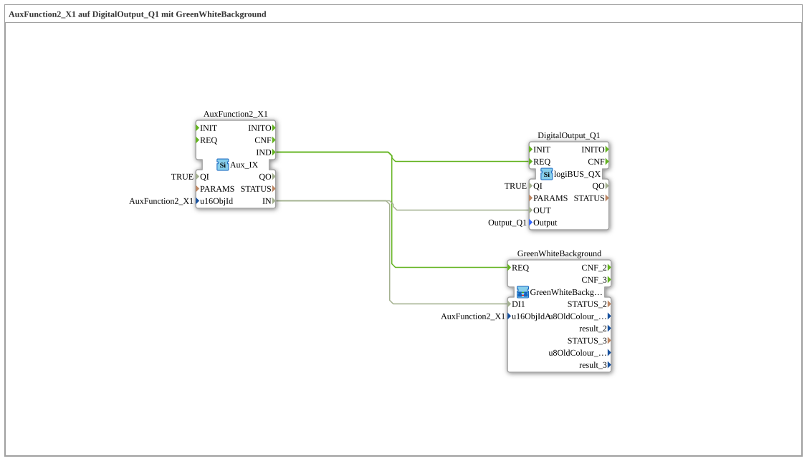

# Uebung_010f: AuxFunction2_X1 auf DigitalOutput_Q1 mit GreenWhiteBackground

* * * * * * * * * *

## Einleitung

Diese Übung ist die klassische (nicht über AX-Adapter verdrahtete) Variante von `Uebung_010f_AX`, aufbauend auf `Uebung_010b1`: Zusätzlich zur Ansteuerung von `DigitalOutput_Q1` wird der Zustand von `AuxFunction2_X1` als Hintergrundfarbe (grün = EIN, weiß = AUS) zurückgemeldet.

## Verwendete Funktionsbausteine (FBs)

- **AuxFunction2_X1**: Auxiliary-Function-Eingang (Typ: `isobus::UT::io::Auxiliary::IN::Aux_IX`)
    - **Parameter**: `QI = TRUE`, `u16ObjId = AuxFunction2_X1`
    - **Erklärung**: Liefert den booleschen Zustand des zugewiesenen physischen Aux-Tasters/Joysticks über die Ereignis-/Datenschnittstelle `IND`/`IN`.
- **DigitalOutput_Q1**: logiBUS-Digitalausgang (Typ: `logiBUS::io::DQ::logiBUS_QX`)
    - **Parameter**: `QI = TRUE`, `Output = Output_Q1` (im Netzwerk als unsichtbarer Parameter hinterlegt)
    - **Erklärung**: Schaltet den physischen Ausgang Q1 entsprechend dem Aux-Zustand.

### Sub-Bausteine:

- **GreenWhiteBackground** (Typ: `MyLib::sys::GreenWhiteBackground2`)
    - **Parameter**: `u16ObjIdA = AuxFunction2_X1`
    - **Erklärung**: Setzt die Hintergrundfarbe des Aux-Objekts abhängig vom booleschen Eingang `DI1` (grün = EIN, weiß = AUS). Da `AuxFunction2_X1` ein Auxiliary-Function-Type-2-Objekt ist, muss die Zuweisung sowohl auf dem VT-Bildschirm als auch am Aux-Handle (Joystick) selbst angezeigt werden – beide Anzeigen hängen an getrennten Verbindungen und werden daher intern über zwei Kommandos gesetzt (`Q_BackgroundColour` für das VT, `Q_BackgroundColourAux` für das Aux-Handle). Deshalb muss hier `GreenWhiteBackground2` (nicht `GreenWhiteBackground1`) verwendet werden.

## Programmablauf und Verbindungen

1. `AuxFunction2_X1.IND` (Ereignis bei Zustandsänderung des Aux-Tasters) ist über zwei parallele EventConnections direkt mit `DigitalOutput_Q1.REQ` **und** `GreenWhiteBackground.REQ` verbunden.
2. Der zugehörige Datenwert `AuxFunction2_X1.IN` wird ebenfalls parallel auf `DigitalOutput_Q1.OUT` und `GreenWhiteBackground.DI1` geführt.
3. Da klassische Event-/DataConnections – anders als AX-Adapter-Plugs – mehrere Ziele aus einer Quelle erlauben, ist hierfür kein expliziter Split-Baustein nötig (im Unterschied zur AX-Adapter-Variante `Uebung_010f_AX`, die dafür `AX_SPLIT_2` benötigt).
4. `GreenWhiteBackground` färbt daraufhin sowohl das VT-Objekt als auch das Aux-Handle grün bzw. weiß, je nach aktuellem Zustand.

## Zusammenfassung

Die Übung zeigt, wie ein physischer Aux-Taster gleichzeitig einen digitalen Ausgang schaltet und über eine passende Hintergrundfarben-Rückmeldung auf VT-Bildschirm und Aux-Handle sichtbar gemacht wird. Im Gegensatz zur Adapter-Variante `Uebung_010f_AX` kommt die klassische Verdrahtung ohne Split-Baustein aus, da normale Event-/DataConnections beliebig viele Ziele erlauben. Wichtig bleibt die Wahl von `GreenWhiteBackground2` statt `GreenWhiteBackground1`, da Auxiliary-Function-Type-2-Objekte zwei getrennte Farbrückmeldungen benötigen.

---

### 🌐 Passende Themen-Unterseiten auf ms-muc-docs.de

- [🌐 Eclipse 4diac IDE & Farb-Referenz auf ms-muc-docs.de](https://www.ms-muc-docs.de/iec-61499/eclipse-4diac/)
