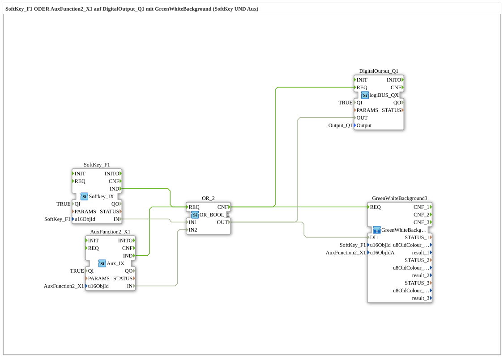

# Uebung_010f3: SoftKey_F1 ODER AuxFunction2_X1 auf DigitalOutput_Q1 mit GreenWhiteBackground (SoftKey UND Aux)

Dieser Artikel beschreibt die 4diac IDE Subapplikation Uebung_010f3 (SoftKey_F1 ODER AuxFunction2_X1 auf DigitalOutput_Q1 mit GreenWhiteBackground (SoftKey UND Aux)).

----

## Ziel der Übung

Das Ziel dieser Übung ist die Umsetzung folgender Anforderung: **SoftKey_F1 ODER AuxFunction2_X1 auf DigitalOutput_Q1 mit GreenWhiteBackground (SoftKey UND Aux)**

-----

## Beschreibung und Komponenten

Die Übung besteht aus der Subapplikation Uebung_010f3.SUB, welche die folgende Bausteinstruktur verwendet:

### Verwendete Funktionsbausteine (FBs)

- **DigitalOutput_Q1**: Instanz des Typs logiBUS::io::DQ::logiBUS_QX.
  - Parameter QI = TRUE
  - Parameter PARAMS = 
  - Parameter Output = Output_Q1
- **SoftKey_F1**: Instanz des Typs isobus::UT::io::Softkey::Softkey_IX.
  - Parameter QI = TRUE
  - Parameter u16ObjId = SoftKey_F1
- **AuxFunction2_X1**: Instanz des Typs isobus::UT::io::Auxiliary::IN::Aux_IX.
  - Parameter QI = TRUE
  - Parameter u16ObjId = AuxFunction2_X1
- **OR_2**: Instanz des Typs iec61131::booleanOperators::OR_BOOL_2.

### Verbindungen und Schnittstellen

**Ereignisverbindungen:**
- SoftKey_F1.IND -> OR_2.REQ
- AuxFunction2_X1.IND -> OR_2.REQ
- OR_2.CNF -> DigitalOutput_Q1.REQ
- OR_2.CNF -> GreenWhiteBackground3.REQ

**Datenverbindungen:**
- SoftKey_F1.IN -> OR_2.IN1
- AuxFunction2_X1.IN -> OR_2.IN2
- OR_2.OUT -> DigitalOutput_Q1.OUT
- OR_2.OUT -> GreenWhiteBackground3.DI1

### Hinweise aus dem Modell

> SoftKey_F1 (VT) und AuxFunction2_X1 (Joystick) steuern denselben Q1 - ODER-verknuepft ueber OR_2. 
GreenWhiteBackground3 (nicht 1/2 einzeln!) bedient beide Hintergruende aus einem Baustein: u16ObjId=SoftKey (VT) und u16ObjIdA=Aux (VT+Aux-Handle).

-----

## Programmablauf und Funktionsweise

1. **Initialisierung**: Beim Systemstart werden alle beteiligten Bausteine initialisiert.
2. **Ereignis- und Signalverarbeitung**: Zustandsänderungen an den Eingängen erzeugen Ereignisse, die über die definierten Verbindungen an die nachgelagerten Bausteine weitergeleitet werden.
3. **Ausgangsaktualisierung**: Die Zielbausteine verarbeiten die empfangenen Signale und aktualisieren entsprechend die Ausgänge.

-----

## Zusammenfassung

Die Übung Uebung_010f3 demonstriert anschaulich die modulare IEC 61499 Architektur in 4diac IDE.
