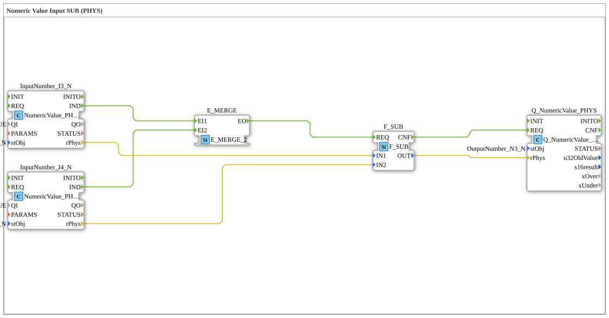

# Uebung_011b3_PHYS: Numeric Value Input SUB (PHYS)

Dieser Artikel beschreibt die logiBUS®-Übung `Uebung_011b3_PHYS`. Zwei am VT-Terminal eingegebene physikalische Zahlenwerte werden voneinander subtrahiert und das Ergebnis wieder angezeigt.

----

## Ziel der Übung

Zwei Zahlenfelder (`InputNumber_I3_N`, `InputNumber_I4_N`) am VT-Terminal entgegennehmen, die Differenz bilden und das Ergebnis in einem dritten Zahlenfeld anzeigen.

-----

## Beschreibung und Komponenten

- **`InputNumber_I3_N`**, **`InputNumber_I4_N`**: `isobus::UT::io::NumericValue::NumericValue_PHYS`, physikalische Zahlenfelder auf dem VT.
- **`F_SUB`**: `iec61131::arithmetic::F_SUB`, subtrahiert die beiden eingegebenen Werte.
- **`E_MERGE`**: `iec61499::events::E_MERGE_2`, löst die Berechnung aus, sobald eines der beiden Felder geändert wurde.
- **`Q_NumericValue_PHYS`**: zeigt das Ergebnis der Subtraktion an (`OutputNumber_N3_N`).

-----

## Funktionsweise

1. Der Bediener ändert eines der beiden Zahlenfelder `InputNumber_I3_N`/`InputNumber_I4_N`.
2. `E_MERGE` löst daraufhin `F_SUB` aus, das die Differenz `IN1 - IN2` berechnet.
3. Das Ergebnis wird in `Q_NumericValue_PHYS` angezeigt.
