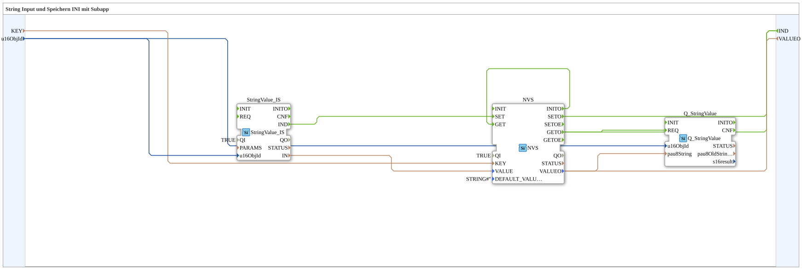

# Uebung_012m_sub: String Input und Speichern INI mit Subapp

Dieser Artikel beschreibt die logiBUS®-Übung `Uebung_012m_sub`. Ein am VT-Terminal eingegebener Text wird dauerhaft in einer INI-Datei gespeichert und beim Neustart wieder angezeigt.

----

## Ziel der Übung

Einen String-Wert vom VT-Terminal entgegennehmen, in einer INI-Datei speichern und nach einem Neustart des Controllers wieder aus der INI-Datei laden und anzeigen.

-----

## Beschreibung und Komponenten

- **`StringValue_IS`**: `isobus::UT::io::StringValue::StringValue_IS`, Text-Eingabefeld auf dem VT.
- **`NVS`**: `logiBUS::storage::esp32_nvs::NVS`, generischer Speicherbaustein (hier trotz des Namens für die INI-Datei-Speicherung parametriert, über `KEY`/`SECTION`).
- **`Q_StringValue`**: `isobus::UT::Q::Q_StringValue`, zeigt den gespeicherten Text auf dem VT-Terminal an.

-----

## Funktionsweise

1. Beim Start (`NVS.INITO`) liest der Speicherbaustein den zuletzt gespeicherten Wert (`NVS.GET`) und zeigt ihn in `Q_StringValue` an.
2. Ändert der Bediener den Text in `StringValue_IS`, wird der neue Wert sofort gespeichert (`NVS.SET`).
3. Nach jeder Speicherung (`SETO`) und jedem Lesen (`GETO`) wird der aktuelle Wert erneut zur Anzeige weitergereicht (`IND`).
4. Der Text übersteht einen Neustart des Controllers.
