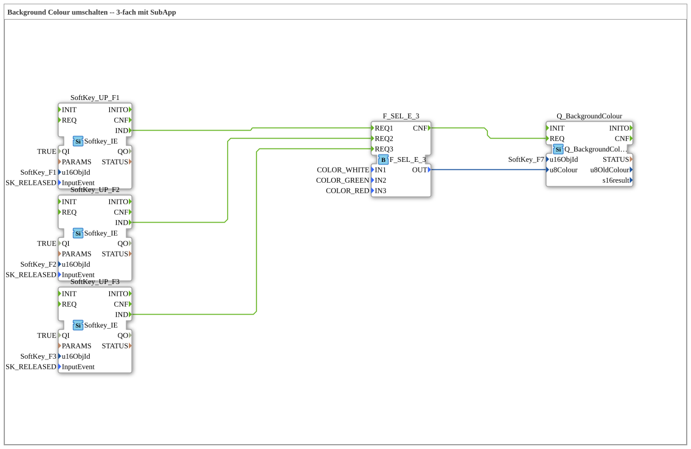

# Uebung_016b: Background Colour umschalten -- 3-fach mit SubApp

Dieser Artikel beschreibt die 4diac IDE Subapplikation Uebung_016b (Background Colour umschalten -- 3-fach mit SubApp).

----

## Ziel der Übung

Das Ziel dieser Übung ist die Umsetzung folgender Anforderung: **Background Colour umschalten -- 3-fach mit SubApp**

-----

## Beschreibung und Komponenten

Die Übung besteht aus der Subapplikation Uebung_016b.SUB, welche die folgende Bausteinstruktur verwendet:

### Verwendete Funktionsbausteine (FBs)

- **SoftKey_UP_F1**: Instanz des Typs isobus::UT::io::Softkey::Softkey_IE.
  - Parameter QI = TRUE
  - Parameter u16ObjId = SoftKey_F1
  - Parameter InputEvent = SK_RELEASED
- **SoftKey_UP_F2**: Instanz des Typs isobus::UT::io::Softkey::Softkey_IE.
  - Parameter QI = TRUE
  - Parameter u16ObjId = SoftKey_F2
  - Parameter InputEvent = SK_RELEASED
- **SoftKey_UP_F3**: Instanz des Typs isobus::UT::io::Softkey::Softkey_IE.
  - Parameter QI = TRUE
  - Parameter u16ObjId = SoftKey_F3
  - Parameter InputEvent = SK_RELEASED
- **F_SEL_E_3**: Instanz des Typs eclipse4diac::utils::selection::F_SEL_E_3.
  - Parameter IN1 = COLOR_WHITE
  - Parameter IN2 = COLOR_GREEN
  - Parameter IN3 = COLOR_RED
- **Q_BackgroundColour**: Instanz des Typs isobus::UT::Q::Q_BackgroundColour.
  - Parameter u16ObjId = SoftKey_F7

### Verbindungen und Schnittstellen

**Ereignisverbindungen:**
- F_SEL_E_3.CNF -> Q_BackgroundColour.REQ
- SoftKey_UP_F1.IND -> F_SEL_E_3.REQ1
- SoftKey_UP_F2.IND -> F_SEL_E_3.REQ2
- SoftKey_UP_F3.IND -> F_SEL_E_3.REQ3

**Datenverbindungen:**
- F_SEL_E_3.OUT -> Q_BackgroundColour.u8Colour

-----

## Programmablauf und Funktionsweise

1. **Initialisierung**: Beim Systemstart werden alle beteiligten Bausteine initialisiert.
2. **Ereignis- und Signalverarbeitung**: Zustandsänderungen an den Eingängen erzeugen Ereignisse, die über die definierten Verbindungen an die nachgelagerten Bausteine weitergeleitet werden.
3. **Ausgangsaktualisierung**: Die Zielbausteine verarbeiten die empfangenen Signale und aktualisieren entsprechend die Ausgänge.

-----

## Zusammenfassung

Die Übung Uebung_016b demonstriert anschaulich die modulare IEC 61499 Architektur in 4diac IDE.
