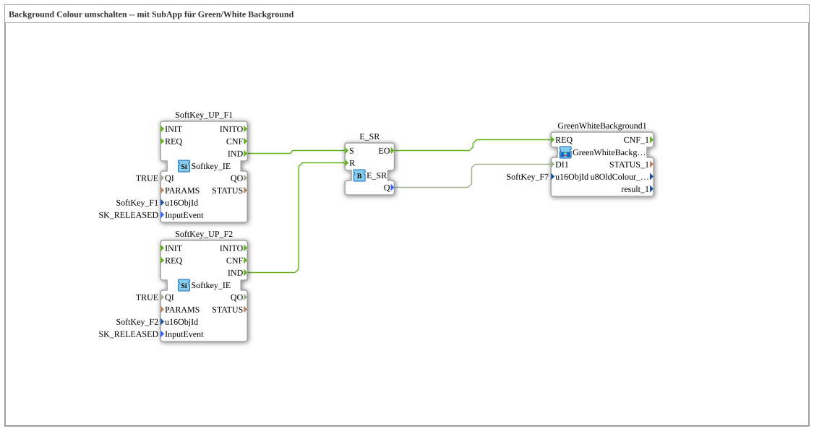

# Uebung_016c: Background Colour umschalten -- mit SubApp für Green/White Background

Dieser Artikel beschreibt die 4diac IDE Subapplikation Uebung_016c (Background Colour umschalten -- mit SubApp für Green/White Background).

----

## Ziel der Übung

Das Ziel dieser Übung ist die Umsetzung folgender Anforderung: **Background Colour umschalten -- mit SubApp für Green/White Background**

-----

## Beschreibung und Komponenten

Die Übung besteht aus der Subapplikation Uebung_016c.SUB, welche die folgende Bausteinstruktur verwendet:

### Verwendete Funktionsbausteine (FBs)

- **SoftKey_UP_F1**: Instanz des Typs isobus::UT::io::Softkey::Softkey_IE.
  - Parameter QI = TRUE
  - Parameter u16ObjId = SoftKey_F1
  - Parameter InputEvent = SK_RELEASED
- **SoftKey_UP_F2**: Instanz des Typs isobus::UT::io::Softkey::Softkey_IE.
  - Parameter QI = TRUE
  - Parameter u16ObjId = SoftKey_F2
  - Parameter InputEvent = SK_RELEASED
- **E_SR**: Instanz des Typs iec61499::events::E_SR.

### Verbindungen und Schnittstellen

**Ereignisverbindungen:**
- SoftKey_UP_F1.IND -> E_SR.S
- SoftKey_UP_F2.IND -> E_SR.R
- E_SR.EO -> GreenWhiteBackground1.REQ

**Datenverbindungen:**
- E_SR.Q -> GreenWhiteBackground1.DI1

-----

## Programmablauf und Funktionsweise

1. **Initialisierung**: Beim Systemstart werden alle beteiligten Bausteine initialisiert.
2. **Ereignis- und Signalverarbeitung**: Zustandsänderungen an den Eingängen erzeugen Ereignisse, die über die definierten Verbindungen an die nachgelagerten Bausteine weitergeleitet werden.
3. **Ausgangsaktualisierung**: Die Zielbausteine verarbeiten die empfangenen Signale und aktualisieren entsprechend die Ausgänge.

-----

## Zusammenfassung

Die Übung Uebung_016c demonstriert anschaulich die modulare IEC 61499 Architektur in 4diac IDE.
