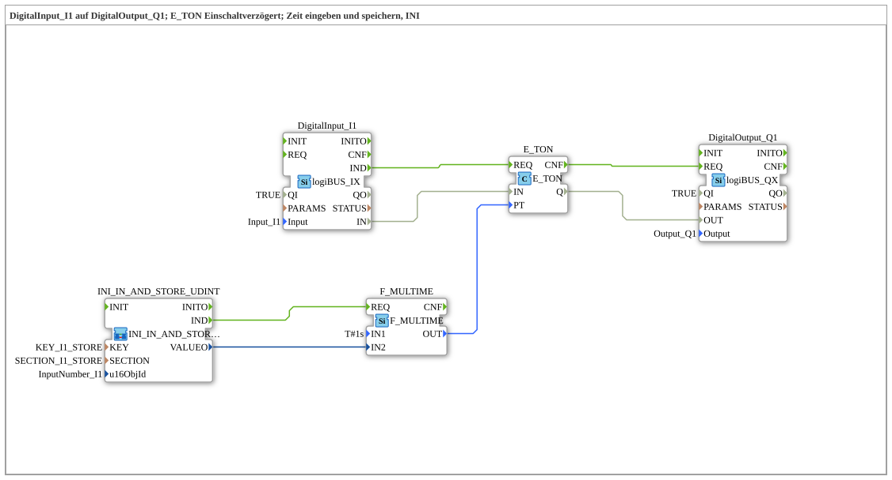

# Uebung_020c4: Einschaltverzögerung mit einstellbarer, INI-gespeicherter Zeit

Dieser Artikel beschreibt die logiBUS®-Übung `Uebung_020c4`. Direkte (nicht-AX-Adapter-) Variante von `Uebung_020c4_AX` - siehe dort für die konzeptionell identische Funktionsweise.

----

## Ziel der Übung

`DigitalInput_I1` schaltet `DigitalOutput_Q1` erst nach einer einstellbaren Verzögerung (`E_TON`). Die Verzögerungszeit ist über das VT-Terminal einstellbar und wird in einer INI-Datei (Abschnitt `SECTION_I1_STORE`, Schlüssel `KEY_I1_STORE`) dauerhaft gespeichert.

-----

## Beschreibung und Komponenten

- **`DigitalInput_I1`**: `logiBUS::io::DI::logiBUS_IX`.
- **`E_TON`**: `iec61499::events::timers::E_TON`, Einschaltverzögerungs-Timer.
- **`F_MULTIME`**: `iec61131::arithmetic::F_MULTIME`, berechnet die tatsächliche `PT` (Preset Time) aus dem gespeicherten Wert.
- **`INI_IN_AND_STORE_UDINT`**: liest den vom Bediener eingegebenen Wert und speichert ihn in der INI-Datei.
- **`DigitalOutput_Q1`**: `logiBUS::io::DQ::logiBUS_QX`.

-----

## Funktionsweise

1. Der Bediener gibt am ISOBUS-Terminal einen Zahlenwert ein, der über `INI_IN_AND_STORE_UDINT` sofort in die INI-Datei geschrieben wird.
2. `F_MULTIME` berechnet daraus die tatsächliche Verzögerungszeit (`PT`) für `E_TON`.
3. Sobald `DigitalInput_I1` aktiv wird (`IND`), startet `E_TON` die Verzögerung.
4. Nach Ablauf der gespeicherten Zeit schaltet `DigitalOutput_Q1` ein (`REQ`).
5. Die gespeicherte Zeit übersteht einen Neustart des Controllers.
