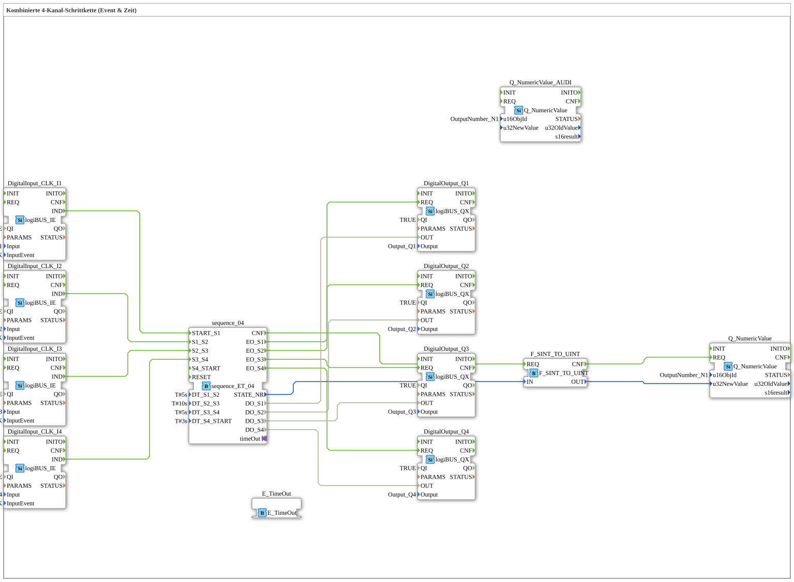

# Uebung_036b: Kombinierte 4-Kanal-Schrittkette (Event & Zeit)

Dieser Artikel beschreibt die 4diac IDE Subapplikation Uebung_036b (Kombinierte 4-Kanal-Schrittkette (Event & Zeit)).

----

## Ziel der Übung

Das Ziel dieser Übung ist die Umsetzung folgender Anforderung: **Kombinierte 4-Kanal-Schrittkette (Event & Zeit)**

-----

## Beschreibung und Komponenten

Die Übung besteht aus der Subapplikation Uebung_036b.SUB, welche die folgende Bausteinstruktur verwendet:

### Verwendete Funktionsbausteine (FBs)

- **DigitalOutput_Q1**: Instanz des Typs logiBUS::io::DQ::logiBUS_QX.
  - Parameter QI = TRUE
  - Parameter Output = Output_Q1
- **DigitalOutput_Q2**: Instanz des Typs logiBUS::io::DQ::logiBUS_QX.
  - Parameter QI = TRUE
  - Parameter Output = Output_Q2
- **DigitalOutput_Q3**: Instanz des Typs logiBUS::io::DQ::logiBUS_QX.
  - Parameter QI = TRUE
  - Parameter Output = Output_Q3
- **DigitalOutput_Q4**: Instanz des Typs logiBUS::io::DQ::logiBUS_QX.
  - Parameter QI = TRUE
  - Parameter Output = Output_Q4
- **DigitalInput_CLK_I1**: Instanz des Typs logiBUS::io::DI::logiBUS_IE.
  - Parameter QI = TRUE
  - Parameter Input = Input_I1
  - Parameter InputEvent = BUTTON_SINGLE_CLICK
- **DigitalInput_CLK_I2**: Instanz des Typs logiBUS::io::DI::logiBUS_IE.
  - Parameter QI = TRUE
  - Parameter Input = Input_I2
  - Parameter InputEvent = BUTTON_SINGLE_CLICK
- **DigitalInput_CLK_I3**: Instanz des Typs logiBUS::io::DI::logiBUS_IE.
  - Parameter QI = TRUE
  - Parameter Input = Input_I3
  - Parameter InputEvent = BUTTON_SINGLE_CLICK
- **DigitalInput_CLK_I4**: Instanz des Typs logiBUS::io::DI::logiBUS_IE.
  - Parameter QI = TRUE
  - Parameter Input = Input_I4
  - Parameter InputEvent = BUTTON_SINGLE_CLICK
- **Q_NumericValue_AUDI**: Instanz des Typs isobus::UT::Q::Q_NumericValue.
  - Parameter u16ObjId = OutputNumber_N1
- **E_TimeOut**: Instanz des Typs iec61499::events::E_TimeOut.
- **sequence_04**: Instanz des Typs logiBUS::utils::sequence::combi::sequence_ET_04.
  - Parameter DT_S1_S2 = T#5s
  - Parameter DT_S2_S3 = T#10s
  - Parameter DT_S3_S4 = T#5s
  - Parameter DT_S4_START = T#3s
- **Q_NumericValue**: Instanz des Typs isobus::UT::Q::Q_NumericValue.
  - Parameter u16ObjId = OutputNumber_N1
- **F_SINT_TO_UINT**: Instanz des Typs iec61131::conversion::F_SINT_TO_UINT.

### Verbindungen und Schnittstellen

**Adapterverbindungen:**
- sequence_04.timeOut -> E_TimeOut.TimeOutSocket

**Ereignisverbindungen:**
- DigitalInput_CLK_I1.IND -> sequence_04.START_S1
- DigitalInput_CLK_I2.IND -> sequence_04.S1_S2
- DigitalInput_CLK_I3.IND -> sequence_04.S2_S3
- DigitalInput_CLK_I4.IND -> sequence_04.S3_S4
- F_SINT_TO_UINT.CNF -> Q_NumericValue.REQ
- sequence_04.CNF -> F_SINT_TO_UINT.REQ
- sequence_04.EO_S1 -> DigitalOutput_Q1.REQ
- sequence_04.EO_S2 -> DigitalOutput_Q2.REQ
- sequence_04.EO_S3 -> DigitalOutput_Q3.REQ
- sequence_04.EO_S4 -> DigitalOutput_Q4.REQ

**Datenverbindungen:**
- sequence_04.STATE_NR -> F_SINT_TO_UINT.IN
- sequence_04.DO_S1 -> DigitalOutput_Q1.OUT
- sequence_04.DO_S2 -> DigitalOutput_Q2.OUT
- sequence_04.DO_S3 -> DigitalOutput_Q3.OUT
- sequence_04.DO_S4 -> DigitalOutput_Q4.OUT
- F_SINT_TO_UINT.OUT -> Q_NumericValue.u32NewValue

-----

## Programmablauf und Funktionsweise

1. **Initialisierung**: Beim Systemstart werden alle beteiligten Bausteine initialisiert.
2. **Ereignis- und Signalverarbeitung**: Zustandsänderungen an den Eingängen erzeugen Ereignisse, die über die definierten Verbindungen an die nachgelagerten Bausteine weitergeleitet werden.
3. **Ausgangsaktualisierung**: Die Zielbausteine verarbeiten die empfangenen Signale und aktualisieren entsprechend die Ausgänge.

-----

## Zusammenfassung

Die Übung Uebung_036b demonstriert anschaulich die modulare IEC 61499 Architektur in 4diac IDE.
