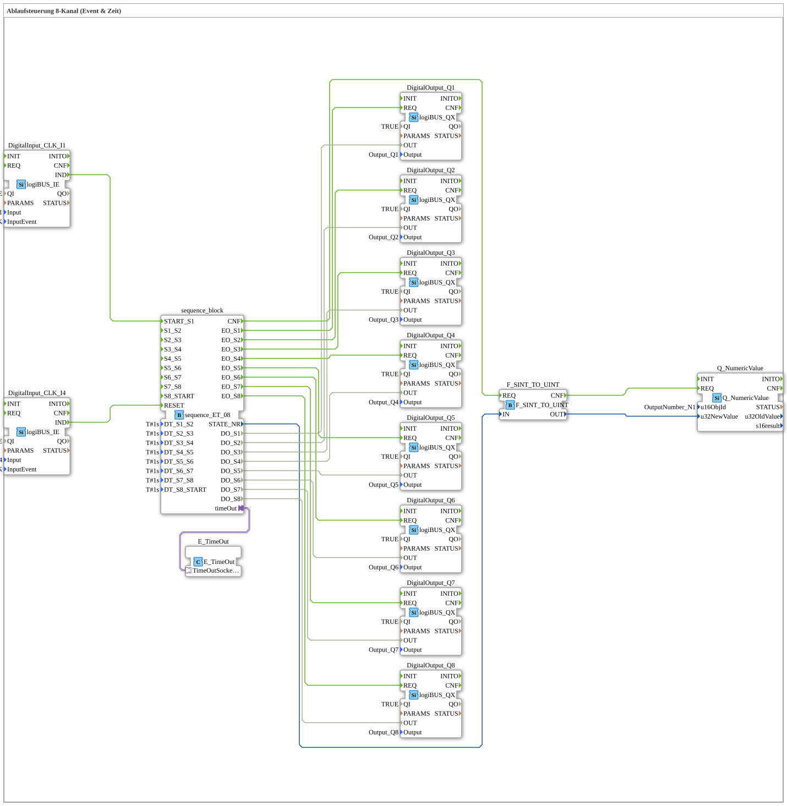

# Uebung_045: Ablaufsteuerung 8-Kanal (Event & Zeit)

Dieser Artikel beschreibt die logiBUS®-Übung `Uebung_045`. Wir bauen eine kombinierte Event- und Zeit-Schrittkette.

----

## Ziel der Übung

Realisierung einer Abfolge von 8 Ausgängen (Q1, Q2, Q3, Q4, Q5, Q6, Q7, Q8), gestartet und zurückgesetzt über Ereignisse (Taster), wobei die einzelnen Schritte zusätzlich über feste Zeiten (`DT_Sx_Sy`, je `T#1s`) weitergeschaltet werden - eine Kombination aus Start/Reset per Taster und automatischem Zeittakt zwischen den Schritten.

-----

## Beschreibung und Komponenten

Die Subapplikation `Uebung_045` nutzt den kombinierten Sequenzer `sequence_ET_08`.

- **`sequence_ET_08`**: Startet auf Ereignis (`I1`), schaltet die 8 Schritte danach zeitgesteuert weiter.
- **`Q_NumericValue`**: Zeigt die aktuelle Schrittnummer auf dem ISOBUS-Terminal an.

-----

## Funktionsweise

1. Start durch Taster `I1` -> Sequenz springt zu `S1`.
2. Jeder Ausgang (`Q1, Q2, Q3, Q4, Q5, Q6, Q7, Q8`) wird für die eingestellte Zeit aktiv geschaltet, bevor automatisch zum nächsten Schritt gewechselt wird.
3. Nach dem letzten Schritt endet die Sequenz.
4. Reset durch Taster `I4` -> Alles aus.
